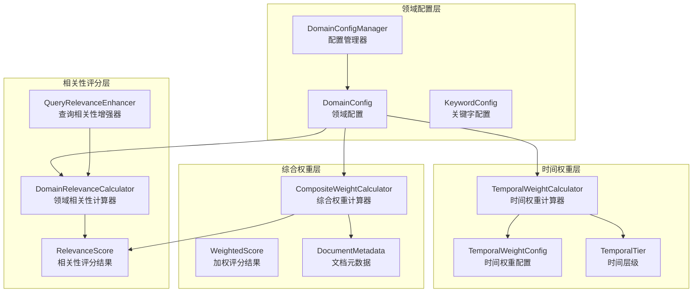
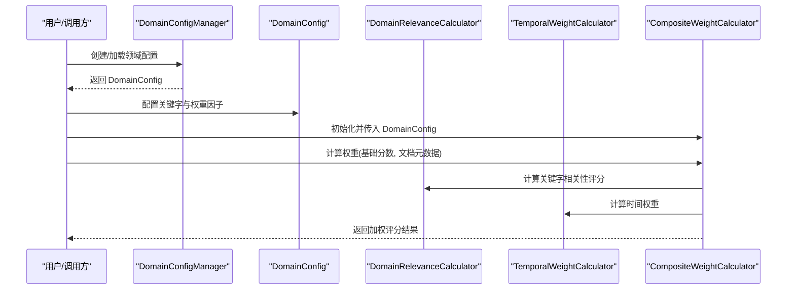
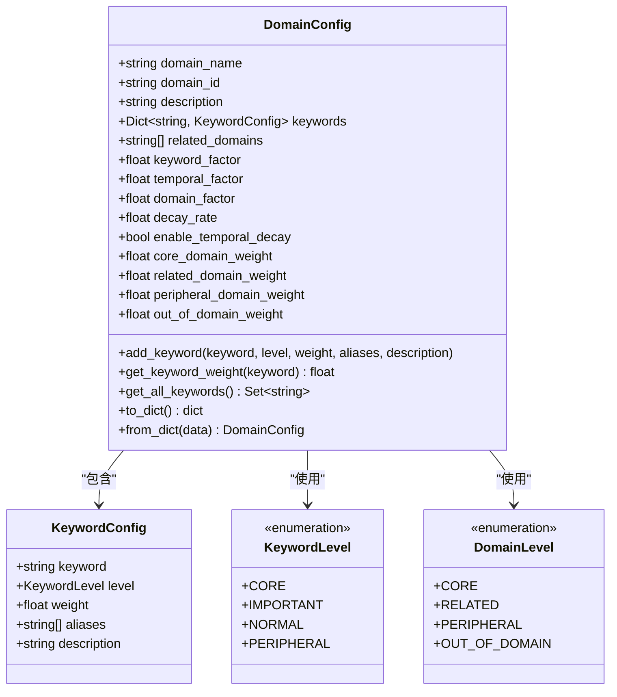
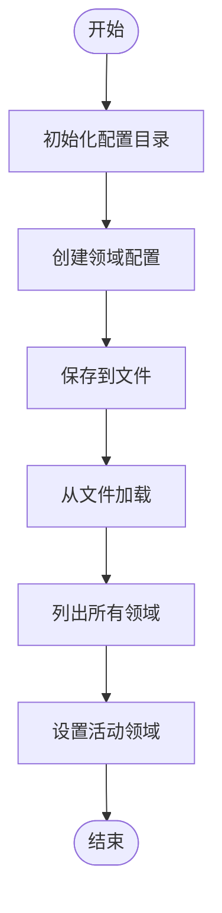
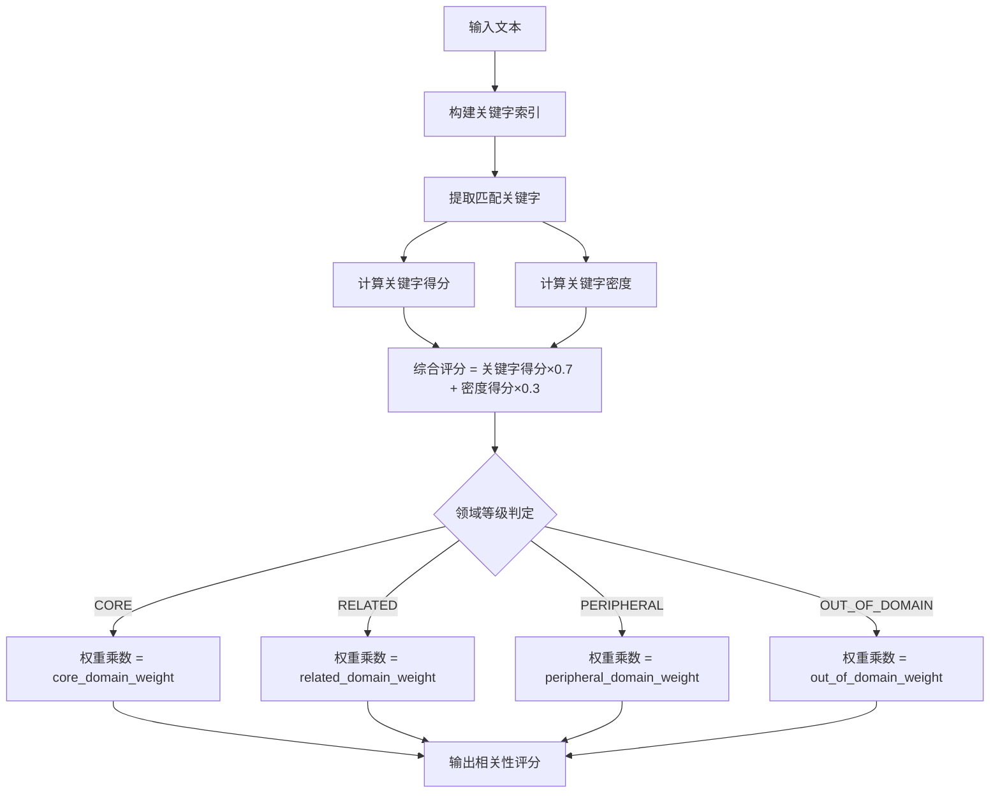
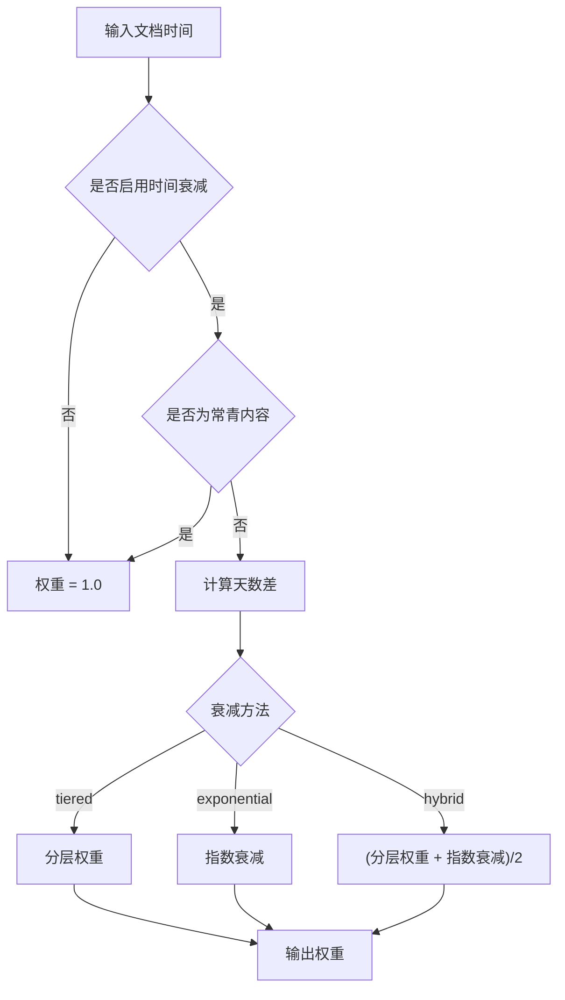
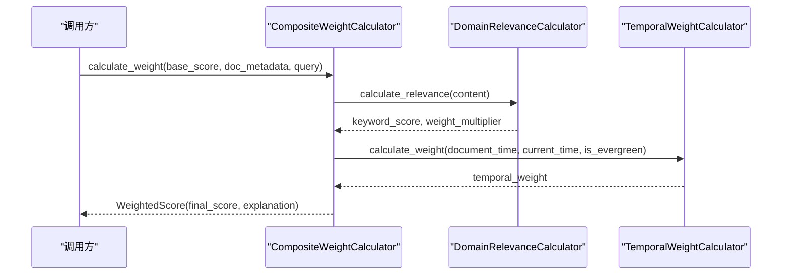
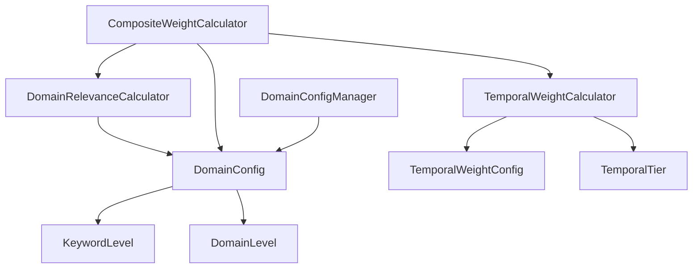

# 领域配置管理

<cite>
**本文档引用的文件**
- [src/domain/config.py](file://src/domain/config.py)
- [src/domain/relevance.py](file://src/domain/relevance.py)
- [src/domain/weight_calculator.py](file://src/domain/weight_calculator.py)
- [src/domain/temporal_weight.py](file://src/domain/temporal_weight.py)
- [src/domain/__init__.py](file://src/domain/__init__.py)
- [example/domain_weight_example.py](file://example/domain_weight_example.py)
- [design/design.md](file://design/design.md)
- [README.md](file://README.md)
</cite>

## 目录
1. [简介](#简介)
2. [项目结构](#项目结构)
3. [核心组件](#核心组件)
4. [架构总览](#架构总览)
5. [详细组件分析](#详细组件分析)
6. [依赖关系分析](#依赖关系分析)
7. [性能考量](#性能考量)
8. [故障排查指南](#故障排查指南)
9. [结论](#结论)
10. [附录](#附录)

## 简介
本文件聚焦于领域配置管理模块，系统性阐述 DomainConfig 类的设计理念与实现细节，覆盖关键字配置、领域相关性等级、权重系数配置等核心功能；并深入解析 DomainConfigManager 的配置管理机制，包括配置文件的创建、保存、加载与管理流程。文档还提供关键字权重等级（CORE、IMPORTANT、NORMAL、PERIPHERAL）的具体含义与使用场景，解释领域权重因子系数（keyword_factor、temporal_factor、domain_factor）的作用与调节方法，以及时间衰减配置与领域权重配置的详细说明。最后给出完整的配置示例与最佳实践指导，帮助读者高效落地领域化的检索增强与权重计算。

## 项目结构
领域配置管理模块位于 src/domain 目录，围绕“领域配置 + 相关性评分 + 时间权重 + 综合权重”四个层次构建，形成从关键字词典到最终检索权重的完整闭环。

**图表来源**
- [src/domain/config.py:54-160](file://src/domain/config.py#L54-L160)
- [src/domain/relevance.py:29-241](file://src/domain/relevance.py#L29-L241)
- [src/domain/temporal_weight.py:47-195](file://src/domain/temporal_weight.py#L47-L195)
- [src/domain/weight_calculator.py:56-205](file://src/domain/weight_calculator.py#L56-L205)

**章节来源**
- [src/domain/config.py:1-285](file://src/domain/config.py#L1-L285)
- [src/domain/relevance.py:1-328](file://src/domain/relevance.py#L1-L328)
- [src/domain/weight_calculator.py:1-318](file://src/domain/weight_calculator.py#L1-L318)
- [src/domain/temporal_weight.py:1-271](file://src/domain/temporal_weight.py#L1-L271)

## 核心组件
- DomainConfig：定义领域名称、ID、关键字词典、相关领域列表，以及权重因子系数（keyword_factor、temporal_factor、domain_factor）、时间衰减配置（decay_rate、enable_temporal_decay）与领域权重配置（core_domain_weight、related_domain_weight、peripheral_domain_weight、out_of_domain_weight）。提供关键字增删查、序列化/反序列化、权重范围自动修正等能力。
- DomainConfigManager：负责领域配置的创建、保存、加载、批量加载与活动领域切换，提供配置持久化与目录管理能力。
- DomainRelevanceCalculator：基于关键字与文本特征计算领域相关性评分，支持关键字密度、领域等级判定与权重乘数获取。
- TemporalWeightCalculator：基于时间层级与指数衰减计算时间权重，支持 tiered/exponential/hybrid 三种计算方法。
- CompositeWeightCalculator：整合关键字权重、时间权重与领域权重，计算最终检索权重，支持批量重排序与因子系数动态调节。

**章节来源**
- [src/domain/config.py:54-160](file://src/domain/config.py#L54-L160)
- [src/domain/config.py:163-241](file://src/domain/config.py#L163-L241)
- [src/domain/relevance.py:29-241](file://src/domain/relevance.py#L29-L241)
- [src/domain/temporal_weight.py:47-195](file://src/domain/temporal_weight.py#L47-L195)
- [src/domain/weight_calculator.py:56-205](file://src/domain/weight_calculator.py#L56-L205)

## 架构总览
领域配置管理模块通过 DomainConfig 统一承载关键字词典与权重配置，DomainRelevanceCalculator 与 TemporalWeightCalculator 分别提供领域相关性评分与时间权重计算，最终由 CompositeWeightCalculator 将三者融合，得到可用于检索重排序的综合权重。

**图表来源**
- [src/domain/config.py:163-241](file://src/domain/config.py#L163-L241)
- [src/domain/relevance.py:198-241](file://src/domain/relevance.py#L198-L241)
- [src/domain/temporal_weight.py:160-195](file://src/domain/temporal_weight.py#L160-L195)
- [src/domain/weight_calculator.py:81-146](file://src/domain/weight_calculator.py#L81-L146)

## 详细组件分析

### DomainConfig 类设计与实现
- 关键字等级与权重范围
  - CORE：权重范围 1.5-2.0，用于领域最核心的概念与术语
  - IMPORTANT：权重范围 1.2-1.5，用于领域常用但非核心的词汇
  - NORMAL：权重范围 0.9-1.1，权重为 1.0，用于一般性领域相关词汇
  - PERIPHERAL：权重范围 0.5-0.8，用于领域边缘或跨领域词汇
  - 关键字配置对象 KeywordConfig 包含 keyword、level、weight、aliases、description，并在初始化后自动修正超出范围的权重值。
- 领域相关性等级
  - CORE：权重乘数 1.5，完全属于目标领域
  - RELATED：权重乘数 1.0-1.2，与目标领域有交集
  - PERIPHERAL：权重乘数 0.6-0.8，弱相关
  - OUT_OF_DOMAIN：权重乘数 0.2-0.4，基本无关
- 权重因子系数
  - keyword_factor（α）：关键字权重因子系数
  - temporal_factor（β）：时间权重因子系数
  - domain_factor（γ）：领域相关性权重因子系数
- 时间衰减配置
  - decay_rate（λ）：每日衰减系数
  - enable_temporal_decay：是否启用时间衰减
- 领域权重配置
  - core_domain_weight、related_domain_weight、peripheral_domain_weight、out_of_domain_weight：分别对应领域等级的权重乘数
- 关键字管理
  - add_keyword：添加关键字，支持别名索引
  - get_keyword_weight：按关键字获取权重
  - get_all_keywords：获取所有关键字（包括别名）
  - to_dict/from_dict：序列化/反序列化，保存原始关键字而非别名
- 示例领域创建
  - create_example_domain：内置示例 AI/机器学习领域，包含核心、重要、普通关键字

**图表来源**
- [src/domain/config.py:14-27](file://src/domain/config.py#L14-L27)
- [src/domain/config.py:30-160](file://src/domain/config.py#L30-L160)

**章节来源**
- [src/domain/config.py:14-27](file://src/domain/config.py#L14-L27)
- [src/domain/config.py:30-160](file://src/domain/config.py#L30-L160)
- [src/domain/config.py:243-285](file://src/domain/config.py#L243-L285)

### DomainConfigManager 配置管理机制
- 目录管理
  - 默认配置目录为模块所在目录下的 configs 子目录，不存在时自动创建
- 域管理
  - create_domain：创建新领域配置并加入内存缓存
  - get_domain：按 domain_id 获取领域配置
  - set_active_domain/get_active_domain：设置与获取当前活动领域
- 文件持久化
  - save_domain：将领域配置序列化为 JSON 文件
  - load_domain：从 JSON 文件反序列化为 DomainConfig
  - load_all_domains：扫描配置目录，批量加载所有领域配置
  - list_domains：列出所有已加载的领域 ID

**图表来源**
- [src/domain/config.py:166-241](file://src/domain/config.py#L166-L241)

**章节来源**
- [src/domain/config.py:163-241](file://src/domain/config.py#L163-L241)

### 领域相关性评分与权重乘数
- 关键字提取与匹配
  - 构建关键字索引，支持原始关键字与别名匹配
  - 英文关键字添加单词边界，中文直接匹配
- 关键字得分计算
  - 公式：Σ(keyword_weight[i] × keyword_frequency[i]) / total_keywords
  - 归一化至 [0, 2]，再限制在合理范围
- 关键字密度计算
  - 基于英文单词分割，密度 = 关键字出现次数 / 总词数
  - 归一化到 [0, 1]，假设 20% 密度为满分
- 领域等级判定
  - 综合得分 = keyword_score × 0.7 + density_score × 0.3
  - CORE: ≥1.2；RELATED: ≥0.8；PERIPHERAL: ≥0.4；OUT_OF_DOMAIN: <0.4
- 权重乘数获取
  - 根据领域等级映射到 core_domain_weight、related_domain_weight、peripheral_domain_weight、out_of_domain_weight

**图表来源**
- [src/domain/relevance.py:42-196](file://src/domain/relevance.py#L42-L196)

**章节来源**
- [src/domain/relevance.py:16-241](file://src/domain/relevance.py#L16-L241)

### 时间权重计算与衰减配置
- 时间层级划分
  - RECENT: 0-30天；NEAR: 30-90天；MEDIUM: 90-365天；DISTANT: 1-3年；HISTORICAL: >3年；EVERGREEN: 不受时间衰减影响
- 分层权重计算
  - 在各层级范围内线性插值，确保权重连续性
- 指数衰减计算
  - weight = e^(-λ × days_diff)
- 混合方法
  - 分层权重与指数衰减取平均，兼顾层级感与连续衰减
- 预设衰减配置
  - fast_changing_domain：快速变化领域（如新闻、科技）
  - normal_domain：正常变化领域（如学术、技术文档）
  - slow_changing_domain：缓慢变化领域（如历史、法律）
  - evergreen_domain：常青领域（禁用时间衰减）

**图表来源**
- [src/domain/temporal_weight.py:53-195](file://src/domain/temporal_weight.py#L53-L195)

**章节来源**
- [src/domain/temporal_weight.py:14-271](file://src/domain/temporal_weight.py#L14-L271)

### 综合权重计算与重排序
- 权重计算公式
  - final_weight = base_score × α × keyword_weight × β × temporal_weight × γ × domain_weight × custom_weight
  - 其中 keyword_weight 限制在 [0.5, 2.0]，custom_weight 为文档自定义权重加成
- 批量重排序
  - 支持按最终分数降序排序，可选择 top_k
- 因子系数动态调节
  - update_factors：按需更新 α、β、γ

**图表来源**
- [src/domain/weight_calculator.py:81-146](file://src/domain/weight_calculator.py#L81-L146)

**章节来源**
- [src/domain/weight_calculator.py:56-205](file://src/domain/weight_calculator.py#L56-L205)

## 依赖关系分析
- DomainConfig 依赖 KeywordLevel、DomainLevel 枚举，提供权重范围验证与领域权重映射
- DomainRelevanceCalculator 依赖 DomainConfig，内部构建关键字索引并计算相关性
- TemporalWeightCalculator 依赖 TemporalWeightConfig 与 TemporalTier，提供多种时间权重计算方法
- CompositeWeightCalculator 依赖 DomainConfig、DomainRelevanceCalculator、TemporalWeightCalculator，整合三类权重
- DomainConfigManager 依赖 DomainConfig，提供配置持久化与活动领域管理

**图表来源**
- [src/domain/config.py:14-27](file://src/domain/config.py#L14-L27)
- [src/domain/relevance.py:13-13](file://src/domain/relevance.py#L13-L13)
- [src/domain/temporal_weight.py:14-22](file://src/domain/temporal_weight.py#L14-L22)
- [src/domain/weight_calculator.py:11-13](file://src/domain/weight_calculator.py#L11-L13)
- [src/domain/config.py:163-241](file://src/domain/config.py#L163-L241)

**章节来源**
- [src/domain/__init__.py:7-37](file://src/domain/__init__.py#L7-L37)

## 性能考量
- 关键字匹配
  - 正则表达式匹配在大量关键字时可能成为瓶颈，建议控制关键字数量与别名数量，或采用更高效的索引结构（如前缀树）替代正则
- 时间权重计算
  - 指数衰减计算开销较小，但在高频批量计算时仍需注意
- 批量重排序
  - 使用 sort(key=lambda x: x.final_score, reverse=True) 进行排序，注意大数据量时的稳定性与内存占用
- 配置持久化
  - JSON 序列化/反序列化为磁盘 IO 密集操作，建议在频繁变更场景下采用缓存策略或延迟写入

[本节为通用性能讨论，无需具体文件分析]

## 故障排查指南
- 关键字权重越界
  - 现象：关键字权重不在等级范围内
  - 处理：构造函数会自动修正到范围内，建议在配置时明确等级与权重
- 领域等级判定异常
  - 现象：关键字得分与密度极低导致判定为 OUT_OF_DOMAIN
  - 处理：检查关键字词典是否覆盖充分，适当降低阈值或调整领域权重
- 时间权重恒为 1.0
  - 现象：启用时间衰减但权重未下降
  - 处理：确认 enable_temporal_decay 为 True，且文档时间早于当前时间
- 配置加载失败
  - 现象：load_domain 返回 None
  - 处理：检查配置文件是否存在、JSON 格式是否正确、字段是否完整

**章节来源**
- [src/domain/config.py:39-50](file://src/domain/config.py#L39-L50)
- [src/domain/relevance.py:168-178](file://src/domain/relevance.py#L168-L178)
- [src/domain/temporal_weight.py:176-178](file://src/domain/temporal_weight.py#L176-L178)
- [src/domain/config.py:213-224](file://src/domain/config.py#L213-L224)

## 结论
领域配置管理模块通过 DomainConfig 统一承载关键字词典与权重配置，结合 DomainRelevanceCalculator 的相关性评分与 TemporalWeightCalculator 的时间权重计算，最终由 CompositeWeightCalculator 实现多因子融合的综合权重，为检索重排序提供精确、可控、可解释的权重依据。DomainConfigManager 则提供了完善的配置持久化与活动领域管理能力，便于在实际应用中灵活配置与维护领域知识体系。

[本节为总结性内容，无需具体文件分析]

## 附录

### 关键字权重等级与使用场景
- CORE（核心关键字）
  - 权重范围：1.5-2.0
  - 场景：领域最核心的概念与术语，如“深度学习”、“神经网络”、“大语言模型”
- IMPORTANT（重要关键字）
  - 权重范围：1.2-1.5
  - 场景：领域常用但非核心的词汇，如“向量数据库”、“嵌入模型”、“知识图谱”
- NORMAL（普通关键字）
  - 权重范围：0.9-1.1（默认 1.0）
  - 场景：一般性领域相关词汇，如“Python”、“训练”、“推理”
- PERIPHERAL（边缘关键字）
  - 权重范围：0.5-0.8
  - 场景：领域边缘或跨领域词汇，如“GPU”、“显卡”

**章节来源**
- [src/domain/config.py:14-19](file://src/domain/config.py#L14-L19)
- [src/domain/config.py:22-27](file://src/domain/config.py#L22-L27)

### 领域权重因子系数调节方法
- keyword_factor（α）
  - 控制关键字权重对最终权重的影响程度
  - 调整建议：增大 α 提升领域内关键词的影响力，减小 α 降低其权重
- temporal_factor（β）
  - 控制时间权重对最终权重的影响程度
  - 调整建议：增大 β 强化时间衰减效果，减小 β 降低时间因素影响
- domain_factor（γ）
  - 控制领域相关性权重对最终权重的影响程度
  - 调整建议：增大 γ 强化领域相关性权重，减小 γ 降低领域权重

**章节来源**
- [src/domain/weight_calculator.py:76-79](file://src/domain/weight_calculator.py#L76-L79)
- [src/domain/weight_calculator.py:207-222](file://src/domain/weight_calculator.py#L207-L222)

### 时间衰减配置与领域权重配置
- 时间衰减配置
  - decay_rate：每日衰减系数，越大衰减越快
  - enable_temporal_decay：是否启用时间衰减
  - 预设配置：fast_changing_domain（新闻/科技）、normal_domain（学术/技术）、slow_changing_domain（历史/法律）、evergreen_domain（常青）
- 领域权重配置
  - core_domain_weight：核心领域权重乘数（默认 1.5）
  - related_domain_weight：相关领域权重乘数（默认 1.1）
  - peripheral_domain_weight：边缘领域权重乘数（默认 0.7）
  - out_of_domain_weight：领域外权重乘数（默认 0.3）

**章节来源**
- [src/domain/temporal_weight.py:25-44](file://src/domain/temporal_weight.py#L25-L44)
- [src/domain/temporal_weight.py:231-271](file://src/domain/temporal_weight.py#L231-L271)
- [src/domain/config.py:62-75](file://src/domain/config.py#L62-L75)

### 配置示例与最佳实践
- 示例脚本
  - [示例：领域配置与持久化:22-73](file://example/domain_weight_example.py#L22-L73)
  - [示例：时间权重计算:76-112](file://example/domain_weight_example.py#L76-L112)
  - [示例：领域相关性评分:114-143](file://example/domain_weight_example.py#L114-L143)
  - [示例：综合权重计算:145-202](file://example/domain_weight_example.py#L145-L202)
  - [示例：配置持久化:204-243](file://example/domain_weight_example.py#L204-L243)
- 最佳实践
  - 关键字词典建设：优先覆盖 CORE 与 IMPORTANT 等级，确保领域核心概念完整
  - 权重因子调节：从默认值出发，结合业务反馈逐步微调 α、β、γ
  - 时间衰减策略：根据领域变化速度选择合适预设配置，或自定义 decay_rate
  - 领域权重映射：合理设置各领域等级的权重乘数，平衡领域内与跨领域知识
  - 配置持久化：定期备份配置文件，确保可恢复性与可迁移性

**章节来源**
- [example/domain_weight_example.py:22-267](file://example/domain_weight_example.py#L22-L267)
- [design/design.md:224-307](file://design/design.md#L224-L307)