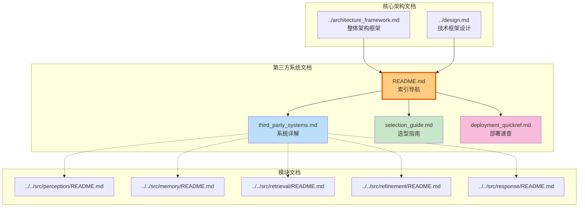

# NecoRAG 第三方系统文档结构

**Document Structure Overview**

---

## 📁 文件组织结构

```
design/3rd/
│
├── 📄 README.md                        # 📋 索引与导航（本文档）
│   │
│   └── 包含：文档概览、角色阅读路径、快速链接
│
├── 🔧 third_party_systems.md           # ⭐ 主文档 - 第三方系统详解 (55KB)
│   │
│   ├── 1. AI/ML 模型服务 (6 个)
│   │   ├── Ollama / vLLM / OpenAI     # LLM 推理
│   │   ├── BGE-M3                      # 向量化
│   │   ├── BGE-Reranker                # 重排序
│   │   ├── Rasa NLU                    # 意图识别
│   │   ├── spaCy + jieba               # NLP 处理
│   │   └── PaddleOCR                    # OCR
│   │
│   ├── 2. 数据存储系统 (3 个)
│   │   ├── Redis                       # L1 工作记忆
│   │   ├── Qdrant                      # L2 语义记忆
│   │   └── Neo4j                       # L3 情景图谱
│   │
│   ├── 3. 文档处理系统 (1 个)
│   │   └── RAGFlow                     # 深度文档解析
│   │
│   ├── 4. 任务调度系统 (2 个)
│   │   ├── APScheduler                 # 定时任务
│   │   └── Celery                      # 分布式队列
│   │
│   └── 5. 监控运维系统 (2 个)
│       ├── Prometheus                  # 指标采集
│       └── Grafana                     # 可视化
│
├── 🎯 selection_guide.md               # 📊 技术选型指南 (26KB)
│   │
│   ├── 快速选型决策树
│   ├── LLM 推理服务选型对比
│   ├── 向量数据库选型对比
│   ├── 图数据库选型对比
│   ├── 意图识别选型对比
│   ├── 文档解析选型对比
│   ├── 监控方案选型对比
│   ├── 综合推荐配置清单 (4 套方案)
│   ├── 迁移策略与兼容性
│   └── 性能基准测试
│
└── ⚡ deployment_quickref.md           # 🚀 部署配置速查表 (21KB)
    │
    ├── 一键启动脚本 (开发/生产/最小化)
    ├── 各组件独立部署
    │   ├── Ollama Docker/K8s部署
    │   ├── Qdrant 单机/集群部署
    │   ├── Neo4j 社区版/企业版部署
    │   ├── Redis 高可用部署
    │   └── RAGFlow/Rasa等部署
    │
    ├── 配置文件模板
    │   ├── .env 完整配置
    │   └── docker-compose.yml
    │
    ├── 端口速查表 (14+ 服务)
    ├── 环境变量速查表
    ├── 故障排查命令
    └── 健康检查脚本
```

---

## 📊 文档统计信息

| 文档 | 大小 | 字数 | 章节数 | 代码示例 | 推荐指数 |
|-----|------|------|--------|---------|---------|
| **README.md** | 12KB | ~3,000 | 8 | 5 | ⭐⭐⭐⭐⭐ |
| **third_party_systems.md** | 55KB | ~15,000 | 14 | 50+ | ⭐⭐⭐⭐⭐ |
| **selection_guide.md** | 26KB | ~8,000 | 10 | 20+ | ⭐⭐⭐⭐ |
| **deployment_quickref.md** | 21KB | ~6,000 | 8 | 30+ | ⭐⭐⭐⭐⭐ |
| **总计** | **114KB** | **~32,000** | **40** | **105+** | **-** |

---

## 🎯 文档关系图



---

## 📖 阅读流程图

```
开始阅读
    │
    ▼
是否需要了解整体架构？
    │
    ├─ YES → 阅读 ../architecture_framework.md
    │          │
    │          ▼
    │      继续下一步
    │
    └─ NO → 直接下一步
              │
              ▼
          选择你的角色？
              │
        ┌─────┼─────┬─────────┐
        ↓     ↓     ↓         ↓
    开发人员 架构师  运维工程师  项目经理
        │     │     │         │
        │     │     │         │
        ▼     ▼     ▼         ▼
    第三部分 第二部分 第四部分  第一部分
        │     │     │         │
        │     │     │         │
        └─────┴─────┴─────────┘
              │
              ▼
          实践操作
              │
              ▼
         deployment_quickref.md
              │
              ▼
          本地环境搭建
              │
              ▼
          完成 ✅
```

---

## 🔗 交叉引用关系

### third_party_systems.md 引用其他文档
- 第 1 章 (LLM): 引用 [selection_guide.md](./selection_guide.md#1-llm 推理服务选型) 的选型建议
- 第 2 章 (存储): 引用 [deployment_quickref.md](./deployment_quickref.md#2-qdrant 向量数据库) 的部署配置
- 第 5 章 (监控): 引用 [../architecture_framework.md](../architecture_framework.md#性能指标与监控) 的指标定义

### selection_guide.md 引用其他文档
- 成本分析章节：引用 [third_party_systems.md](./third_party_systems.md) 的性能数据
- 迁移策略章节：引用 [../architecture_framework.md](../architecture_framework.md#模块依赖关系) 的抽象层设计

### deployment_quickref.md 引用其他文档
- 配置文件模板：引用 [third_party_systems.md](./third_party_systems.md) 的各系统配置参数
- 健康检查：引用 [selection_guide.md](./selection_guide.md#性能基准) 的性能基准值

---

## �� 视觉标识系统

### 图标含义
| 图标 | 含义 | 使用场景 |
|-----|------|---------|
| 📋 | 索引/概览 | README、目录 |
| 🔧 | 技术详解 | 系统说明文档 |
| 🎯 | 选型指南 | 对比分析文档 |
| ⚡ | 快速参考 | 速查表、命令集 |
| ⭐ | 重要程度 | 五星推荐 |
| 📊 | 数据对比 | 表格、图表 |
| 🚀 | 部署启动 | 脚本、配置 |
| 🔗 | 关联引用 | 跨文档链接 |

### 颜色编码
| 颜色 | 含义 | 使用场景 |
|-----|------|---------|
| 🟠 橙色 | 核心/重要 | 主文档、关键配置 |
| 🔵 蓝色 | 技术/专业 | 技术细节、API |
| 🟢 绿色 | 指南/建议 | 选型建议、最佳实践 |
| 🟣 紫色 | 工具/参考 | 速查表、命令 |

---

## 📱 多平台访问

### 在线阅读
- **GitHub**: 直接浏览最新版本
- **GitBook**: 美化排版，支持搜索
- **Notion**: 团队协作版本

### 离线阅读
- **PDF**: 打印友好格式
- **ePub**: 电子书阅读器
- **Markdown**: 本地编辑器

### 移动端
- **Responsive**: 自适应手机屏幕
- **App**: Notion 移动应用

---

## 🔄 版本控制

### Git 标签
```bash
# 查看文档历史
git log design/3rd/

# 查看特定版本
git checkout v1.0.0 -- design/3rd/

# 比较版本差异
git diff v0.9.0 v1.0.0 -- design/3rd/
```

### 更新频率
- **小更新**: 每周（错别字、配置修正）
- **中更新**: 每月（新增组件、优化建议）
- **大更新**: 每季度（架构调整、新技术引入）

---

## 📞 使用反馈

### 问题报告
发现文档问题时，请提供：
1. 文档名称和章节
2. 问题描述（截图/错误信息）
3. 建议的修正方案

### 改进建议
欢迎提交：
1. 新的第三方系统集成经验
2. 性能调优的最佳实践
3. 故障排查的案例分享

### 联系方式
- GitHub Issues: [新建 Issue](https://github.com/NecoRAG/core/issues)
- 邮件：necorag-docs@googlegroups.com
- Discord: #documentation 频道

---

<div align="center">

**完整的第三方系统文档体系**  
**114KB 技术干货 · 14+ 系统详解 · 105+ 代码示例**

**Let's make AI think like a brain!** 🧠

</div>
