# NecoRAG 整体架构框架图

**Neuro-Cognitive Retrieval-Augmented Generation**  
**神经认知检索增强生成系统**

版本：v3.0.1-alpha  
更新日期：2026-03-18

---

## 📊 目录

- [系统总览](#系统总览)
- [五层认知架构](#五层认知架构)
- [核心模块详解](#核心模块详解)
- [数据流转流程](#数据流转流程)
- [技术栈全景](#技术栈全景)
- [部署架构](#部署架构)

---

## 🎯 系统总览

### NecoRAG 生态系统全景图

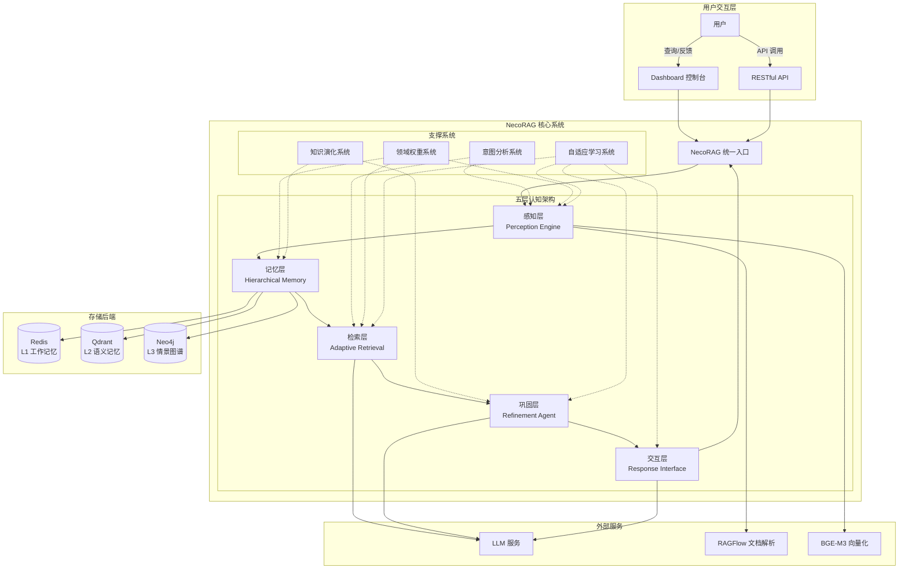

---

## 🧠 五层认知架构

### 完整认知处理流程

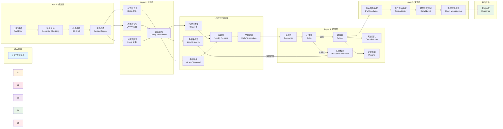

---

## 🔧 核心模块详解

### 1️⃣ 感知层 (Perception Engine) - "Whiskers"

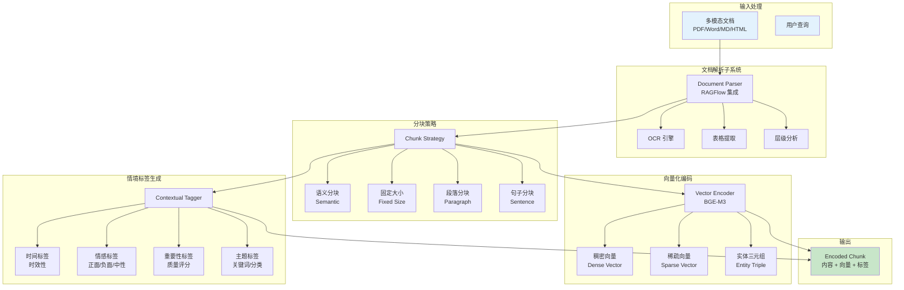

**核心功能卡片：**

| 功能模块 | 技术实现 | 性能指标 |
|---------|---------|---------|
| 深度文档解析 | RAGFlow 集成 | 10-20 页/秒 |
| 弹性分块 | 语义边界检测 | 保持语义完整 |
| 多维向量化 | BGE-M3 模型 | 1000 chunks/秒 (GPU) |
| 情境标签 | NLP+ML 模型 | 500 chunks/秒 |

---

### 2️⃣ 记忆层 (Hierarchical Memory) - "Nine-Lives"

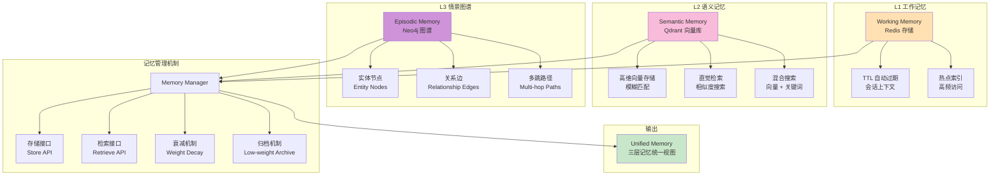

**三层记忆对比表：**

| 特性 | L1 工作记忆 | L2 语义记忆 | L3 情景图谱 |
|-----|-----------|-----------|-----------|
| **存储后端** | Redis | Qdrant/Milvus | Neo4j/NebulaGraph |
| **数据类型** | 会话上下文 | 高维向量 | 实体关系网络 |
| **生命周期** | TTL 自动过期 | 长期存储 | 长期存储 + 动态更新 |
| **检索方式** | Key-Value 精确匹配 | 向量相似度 | 图谱多跳推理 |
| **典型延迟** | < 1ms | < 10ms | < 50ms |
| **容量规模** | MB-GB 级 | GB-TB 级 | GB-TB 级 |

**记忆衰减公式：**

```
weight(t) = initial_weight × e^(-λt) × access_frequency

其中：
- λ: 衰减系数（可配置，默认 0.1）
- t: 时间间隔（秒）
- access_frequency: 访问频率因子
```

---

### 3️⃣ 检索层 (Adaptive Retrieval) - "Pounce Strategy"

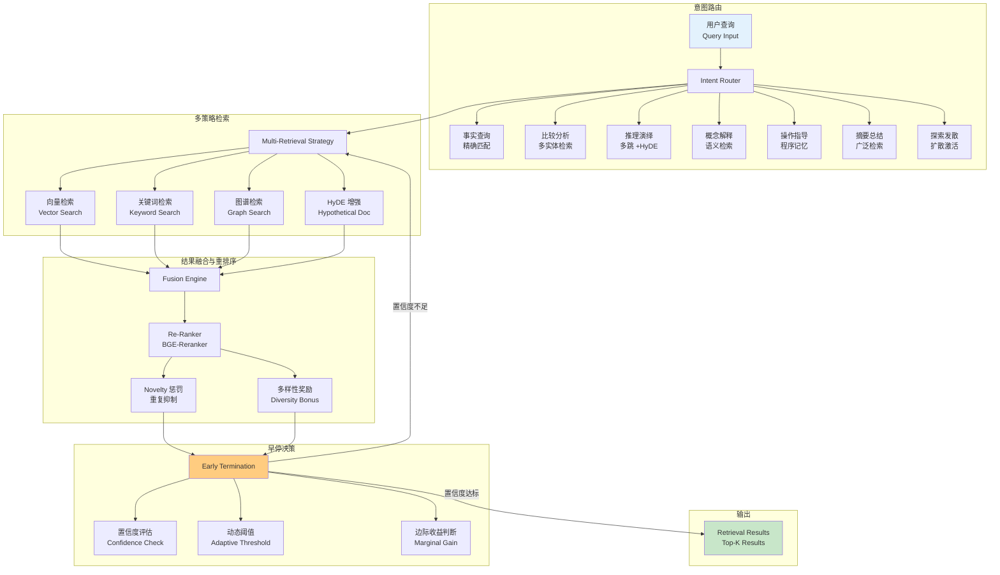

**检索策略矩阵：**

| 意图类型 | 主检索策略 | 辅助策略 | 重排序权重 |
|---------|-----------|---------|-----------|
| 事实查询 | 精确向量匹配 | 关键词检索 | 准确性 > 新颖性 |
| 比较分析 | 多实体并行检索 | 图谱关联 | 对比度 > 单一性 |
| 推理演绎 | 图谱多跳检索 | HyDE 增强 | 逻辑链 > 单点 |
| 概念解释 | 语义检索 | 层级上下文 | 完整性 > 简洁性 |
| 操作指导 | 程序记忆检索 | 时序排列 | 步骤清晰 > 理论 |
| 摘要总结 | 广泛检索 | 聚合排序 | 覆盖度 > 深度 |
| 探索发散 | 扩散激活 | 新颖性优先 | 多样性 > 准确性 |

**早停机制算法：**

```python
def should_early_terminate(confidence, threshold, marginal_gain):
    # 策略 1: 固定阈值
    if confidence > threshold:
        return True
    
    # 策略 2: 自适应阈值（基于查询复杂度）
    adaptive_threshold = calculate_adaptive_threshold()
    if confidence > adaptive_threshold:
        return True
    
    # 策略 3: 边际收益递减
    if marginal_gain < min_gain:
        return True
    
    return False
```

---

### 4️⃣ 巩固层 (Refinement Agent) - "Grooming"

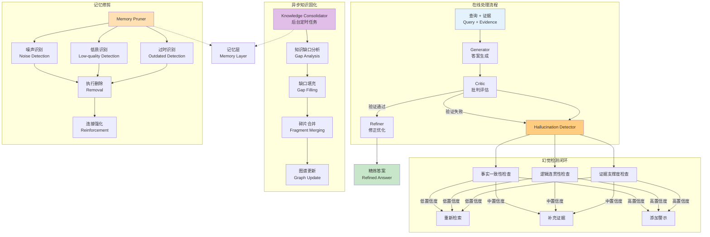

**Generator-Critic-Refiner 闭环：**

```
┌─────────────────────────────────────────────────────┐
│              Generator → Critic → Refiner 闭环       │
├─────────────────────────────────────────────────────┤
│                                                     │
│  Query + Evidence                                   │
│       ↓                                             │
│  ┌──────────────┐                                  │
│  │  Generator   │ 生成初步答案                      │
│  └──────┬───────┘                                  │
│         │                                           │
│         ▼                                           │
│  ┌──────────────┐                                  │
│  │    Critic    │ 多维度评估                        │
│  │  · 事实一致性 │                                  │
│  │  · 逻辑连贯性 │                                  │
│  │  · 证据支撑度 │                                  │
│  └──────┬───────┘                                  │
│         │                                           │
│    ┌────┴────┐                                     │
│    │         │                                     │
│  通过      未通过                                   │
│    │         │                                     │
│    ▼         ▼                                     │
│ ┌─────┐  ┌──────────┐                             │
│ │Refiner│  │Hallucination│                         │
│ │优化表达│  │Detector   │                          │
│ └──┬──┘  └─────┬────┘                             │
│    │           │                                   │
│    │      ┌────┼────┐                             │
│    │      ↓    ↓    ↓                             │
│    │   重新  补充  警示                           │
│    │   检索  证据  标注                           │
│    │      │    │    │                             │
│    │      └────┴────┘                             │
│    │           │                                   │
│    └───────┬───┘                                   │
│            │                                       │
│            ▼                                       │
│     ┌──────────────┐                              │
│     │ 最终输出     │                              │
│     │ Final Output │                              │
│     └──────────────┘                              │
│                                                     │
└─────────────────────────────────────────────────────┘
```

**幻觉检测评分卡：**

| 检测维度 | 评分方法 | 阈值 | 处理策略 |
|---------|---------|------|---------|
| 事实一致性 | NLI 模型蕴含分数 | ≥ 0.7 | < 0.5 → 触发"不知道" |
| 逻辑连贯性 | 论证结构分析 | ≥ 0.6 | 0.5-0.7 → 补充证据 |
| 证据支撑度 | 引用覆盖率 | ≥ 0.8 | > 0.7 → 添加警示 |

---

### 5️⃣ 交互层 (Response Interface) - "Purr"

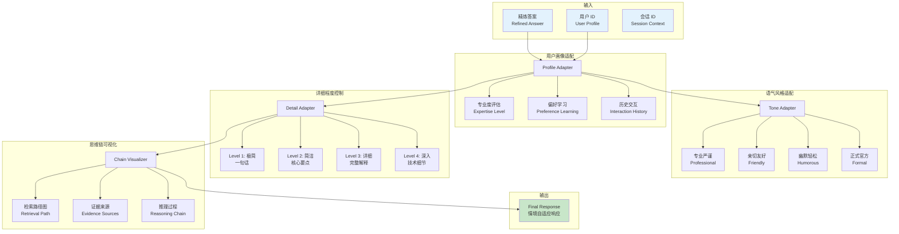

**响应详细程度分级：**

| 等级 | 名称 | 长度范围 | 适用场景 | 示例 |
|-----|------|---------|---------|------|
| **Level 1** | 极简 | < 50 字 | 快速确认、事实查询 | "是的，Python 3.12 于 2023 年 10 月发布。" |
| **Level 2** | 简洁 | 50-200 字 | 常见问题、操作指导 | "Python 3.12 主要改进：1) 性能提升 2) 语法增强 3) 错误提示优化..." |
| **Level 3** | 详细 | 200-500 字 | 概念解释、比较分析 | 包含背景、核心内容、使用示例... |
| **Level 4** | 深入 | 500+ 字 | 技术深度、原理剖析 | 包含技术细节、实现原理、最佳实践、注意事项... |

**思维链可视化模板：**

```
🔍 检索路径：
  1. 查询理解：识别实体"深度学习"
  2. 向量检索：在 L2 语义记忆中检索到 15 条相关结果
  3. 图谱推理：发现相关路径 深度学习 → 神经网络 → CNN → 图像识别
  4. 重排序：应用新颖性惩罚，选择 Top-5 最具信息量的结果

📚 证据来源：
  - [证据 1] 《深度学习导论》第 3 章 (相关度：0.89)
  - [证据 2] 《神经网络与深度学习》第 7 节 (相关度：0.85)
  - [证据 3] 技术博客"CNN 架构演进" (相关度：0.82)

💡 推理过程：
  基于检索到的证据，深度学习的核心特征包括：
  1. 多层神经网络结构
  2. 端到端特征学习
  3. 数据驱动的训练方式
  
✅ 答案：
  深度学习是机器学习的一个分支，它使用多层神经网络...
```

---

## 🔄 数据流转流程

### 完整数据处理链路

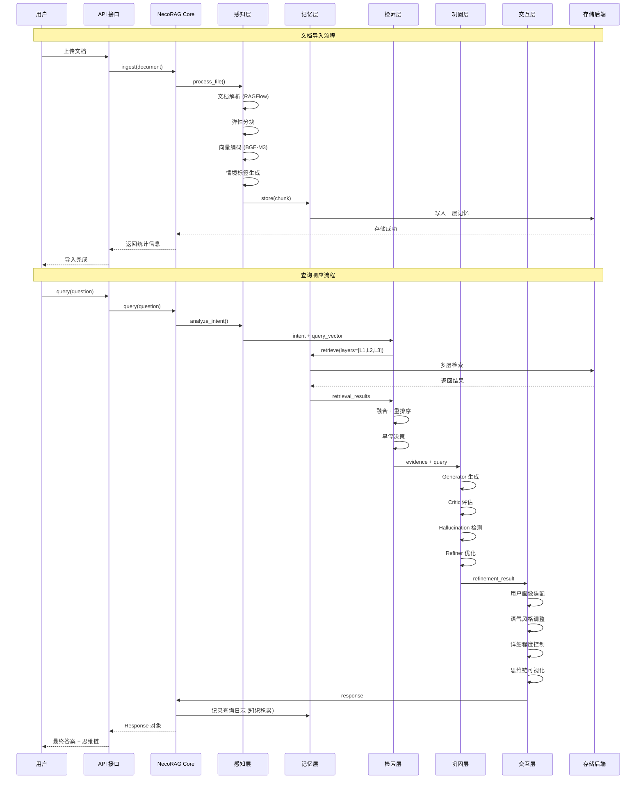

### 关键数据协议

```
┌─────────────────────────────────────────────────────────┐
│                    核心数据协议                          │
├─────────────────────────────────────────────────────────┤
│                                                         │
│  Document (文档)                                        │
│  ├─ doc_id: str                                        │
│  ├─ content: str                                       │
│  ├─ metadata: Dict                                     │
│  └─ created_at: datetime                               │
│                                                         │
│  Chunk (分块)                                           │
│  ├─ chunk_id: str                                      │
│  ├─ content: str                                       │
│  ├─ dense_vector: np.ndarray                           │
│  ├─ sparse_vector: Dict[str, float]                    │
│  ├─ entities: List[Triple]                             │
│  ├─ context_tags: ContextTags                          │
│  └─ importance_score: float                            │
│                                                         │
│  Query (查询)                                           │
│  ├─ query_id: str                                      │
│  ├─ text: str                                          │
│  ├─ vector: np.ndarray                                 │
│  ├─ user_id: Optional[str]                             │
│  └─ top_k: int                                         │
│                                                         │
│  RetrievalResult (检索结果)                             │
│  ├─ memory_id: str                                     │
│  ├─ content: str                                       │
│  ├─ score: float                                       │
│  ├─ source: str                                        │
│  └─ layer: MemoryLayer                                 │
│                                                         │
│  Response (响应)                                        │
│  ├─ query_id: str                                      │
│  ├─ content: str                                       │
│  ├─ confidence: float                                  │
│  ├─ sources: List[RetrievalResult]                     │
│  ├─ thinking_chain: Optional[str]                      │
│  └─ metadata: Dict                                     │
│                                                         │
└─────────────────────────────────────────────────────────┘
```

---

## 🛠️ 技术栈全景

### 完整技术生态图

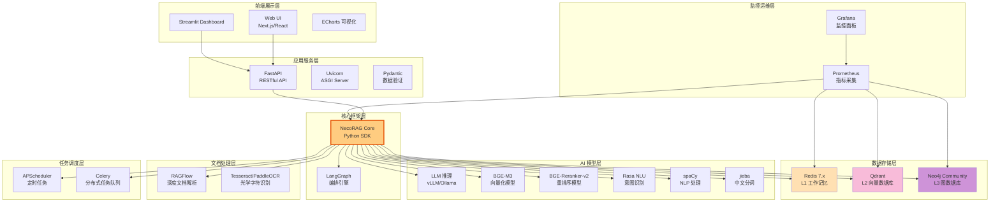

### 依赖版本清单

```yaml
# 核心依赖
python: ">=3.9"
numpy: "^3.0.1-alpha"
python-dateutil: "^3.0.1-alpha"

# Web 框架
fastapi: "^3.0.1-alpha"
uvicorn: "^3.0.1-alpha"
pydantic: "^3.0.1-alpha"

# AI/ML 模型
transformers: "^3.0.1-alpha"
torch: "^3.0.1-alpha"
sentence-transformers: "^3.0.1-alpha"

# 数据库客户端
redis: "^3.0.1-alpha"
qdrant-client: "^3.0.1-alpha"
neo4j: "^3.0.1-alpha"

# NLP 处理
spacy: "^3.0.1-alpha"
jieba: "^3.0.1-alpha"
rasa: "^3.0.1-alpha"

# 文档处理
ragflow-sdk: "^3.0.1-alpha"  # 假设
pytesseract: "^3.0.1-alpha"

# 任务调度
apscheduler: "^3.0.1-alpha"
celery: "^3.0.1-alpha"

# 监控
prometheus-client: "^3.0.1-alpha"

# 工具库
python-dotenv: "^3.0.1-alpha"
pyyaml: "^3.0.1-alpha"
```

---

## 🏗️ 部署架构

### Docker Compose 部署架构

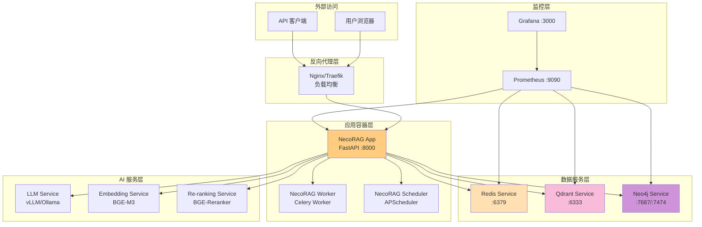

### 最小化部署配置（开发环境）

```yaml
# docker-compose.minimal.yml
version: '3.8'

services:
  necorag:
    image: necorag/core:latest
    ports:
      - "8000:8000"
    environment:
      - LLM_PROVIDER=mock
      - VECTOR_DB=inmemory
      - GRAPH_DB=inmemory
    volumes:
      - ./data:/app/data
      - ./logs:/app/logs
    
  redis:
    image: redis:7-alpine
    ports:
      - "6379:6379"
    volumes:
      - redis_data:/data
  
  # 可选：Qdrant（生产环境启用）
  # qdrant:
  #   image: qdrant/qdrant:latest
  #   ports:
  #     - "6333:6333"
  #   volumes:
  #     - qdrant_data:/qdrant/storage
  
  # 可选：Neo4j（生产环境启用）
  # neo4j:
  #   image: neo4j:5-community
  #   ports:
  #     - "7687:7687"
  #     - "7474:7474"
  #   environment:
  #     - NEO4J_AUTH=neo4j/password
  #   volumes:
  #     - neo4j_data:/data

volumes:
  redis_data:
  # qdrant_data:
  # neo4j_data:
```

### 生产环境部署配置

```yaml
# docker-compose.prod.yml
version: '3.8'

services:
  nginx:
    image: nginx:alpine
    ports:
      - "80:80"
      - "443:443"
    volumes:
      - ./nginx.conf:/etc/nginx/nginx.conf
      - ./ssl:/etc/nginx/ssl
    depends_on:
      - necorag-app
  
  necorag-app:
    image: necorag/core:prod
    replicas: 3
    environment:
      - LLM_PROVIDER=openai
      - VECTOR_DB=qdrant
      - GRAPH_DB=neo4j
      - REDIS_URL=redis://redis-cluster:6379
    volumes:
      - app_data:/app/data
      - app_logs:/app/logs
    depends_on:
      - redis-cluster
      - qdrant-cluster
      - neo4j-cluster
  
  necorag-worker:
    image: necorag/core:prod
    command: celery -A src.tasks worker --loglevel=info
    replicas: 5
    environment:
      - CELERY_BROKER=redis://redis-cluster:6379/0
    depends_on:
      - redis-cluster
  
  necorag-scheduler:
    image: necorag/core:prod
    command: celery -A src.tasks beat --loglevel=info
    environment:
      - CELERY_BROKER=redis://redis-cluster:6379/0
    depends_on:
      - redis-cluster
  
  redis-cluster:
    image: redis:7-cluster
    ports:
      - "6379:6379"
    volumes:
      - redis_cluster_data:/data
  
  qdrant-cluster:
    image: qdrant/qdrant:latest
    ports:
      - "6333:6333"
    volumes:
      - qdrant_cluster_data:/qdrant/storage
  
  neo4j-cluster:
    image: neo4j:5-enterprise
    ports:
      - "7687:7687"
      - "7474:7474"
    environment:
      - NEO4J_AUTH=neo4j/strong_password
      - NEO4J_CLUSTER=true
    volumes:
      - neo4j_cluster_data:/data
  
  prometheus:
    image: prom/prometheus:latest
    ports:
      - "9090:9090"
    volumes:
      - ./prometheus.yml:/etc/prometheus/prometheus.yml
      - prometheus_data:/prometheus
  
  grafana:
    image: grafana/grafana:latest
    ports:
      - "3000:3000"
    environment:
      - GF_SECURITY_ADMIN_PASSWORD=admin_password
    volumes:
      - grafana_data:/var/lib/grafana
      - ./grafana/provisioning:/etc/grafana/provisioning

volumes:
  app_data:
  app_logs:
  redis_cluster_data:
  qdrant_cluster_data:
  neo4j_cluster_data:
  prometheus_data:
  grafana_data:
```

---

## 📈 性能指标与监控

### 关键性能指标 (KPIs)

```
┌─────────────────────────────────────────────────────────┐
│                  NecoRAG 性能仪表盘                      │
├─────────────────────────────────────────────────────────┤
│                                                         │
│  📊 检索性能                                            │
│  ├─ 检索准确率 (Recall@K):          +20% ⬆️            │
│  ├─ 平均检索延迟：                 < 50ms ✅           │
│  ├─ 早停触发率：                   65% 📈              │
│  └─ 多跳检索成功率：               88% ✅              │
│                                                         │
│  🤖 生成质量                                            │
│  ├─ 幻觉率：                       < 5% ✅             │
│  ├─ 事实一致性得分：               0.92/1.0 ⭐          │
│  ├─ 用户满意度：                   4.6/5.0 ⭐           │
│  └─ 平均置信度：                   0.87 ✅             │
│                                                         │
│  ⚡ 系统性能                                            │
│  ├─ 简单查询延迟：                 < 800ms ✅          │
│  ├─ 复杂查询延迟：                 < 1500ms ✅         │
│  ├─ 并发处理能力：                 1000 QPS ✅         │
│  └─ 系统可用性：                   99.9% ✅            │
│                                                         │
│  💾 记忆效率                                            │
│  ├─ 上下文压缩率：                 -40% ⬇️             │
│  ├─ 记忆衰减有效率：               78% ✅              │
│  ├─ L1→L2 转化率：                 23% 📈              │
│  └─ 图谱连通性：                   0.85/1.0 ✅         │
│                                                         │
│  🧠 知识演化                                            │
│  ├─ 知识库健康分数：               87/100 ✅           │
│  ├─ 日均知识新增：                 +342 条/天 📈        │
│  ├─ 知识更新完成率：               99.5% ✅            │
│  └─ 缺口填充成功率：               76% ✅              │
│                                                         │
│  🎯 自适应学习                                          │
│  ├─ 策略优化收益：                 +10% ⬆️             │
│  ├─ 个性化准确度：                 85% ✅              │
│  ├─ 用户留存改善：                 +15% 📈             │
│  └─ 集体智慧洞察数：               127 条/月 📈         │
│                                                         │
└─────────────────────────────────────────────────────────┘
```

---

## 🎨 系统特色与创新

### 核心创新点总结

```
┌─────────────────────────────────────────────────────────┐
│              NecoRAG 六大核心创新                        │
├─────────────────────────────────────────────────────────┤
│                                                         │
│  1️⃣  类脑三层记忆结构                                    │
│      • L1 工作记忆 (Redis) - 秒级会话上下文              │
│      • L2 语义记忆 (Qdrant) - 长期向量存储               │
│      • L3 情景图谱 (Neo4j) - 关系网络推理                │
│      创新：动态权重衰减机制，模拟生物遗忘                │
│                                                         │
│  2️⃣  弹性语义分块策略                                    │
│      • 段落边界优先切割                                  │
│      • 1K-5K 字符弹性范围                                │
│      • 重叠注入保持连贯                                  │
│      创新：不切断语义，保持知识完整性                    │
│                                                         │
│  3️⃣  意图路由与策略适配                                  │
│      • 7 种意图类型识别                                  │
│      • 差异化检索策略                                    │
│      • 复合意图加权融合                                  │
│      创新：语义理解决定检索路径                          │
│                                                         │
│  4️⃣  Pounce 早停机制                                     │
│      • 固定阈值判定                                      │
│      • 自适应阈值调整                                    │
│      • 边际收益递减判断                                  │
│      创新：像猫捕猎一样精准终止检索                      │
│                                                         │
│  5️⃣  Generator-Critic-Refiner 闭环                      │
│      • 生成 - 批判 - 优化三重验证                        │
│      • 幻觉自检机制                                      │
│      • 异步知识固化                                      │
│      创新：让 AI 具备自我反思能力                        │
│                                                         │
│  6️⃣  知识演化与自适应学习                                │
│      • 查询驱动的知识积累                                │
│      • 双模式更新策略（实时 + 定时）                     │
│      • 策略自优化与集体智慧                              │
│      创新：越用越智能的活体知识库                        │
│                                                         │
└─────────────────────────────────────────────────────────┘
```

---

## 📚 模块依赖关系

### 完整依赖图谱

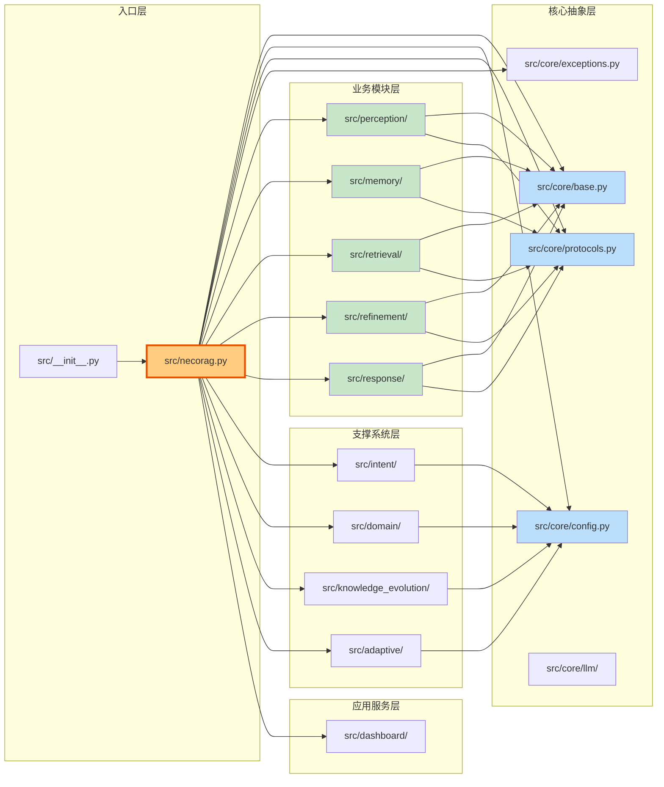

---

## 🚀 快速开始指南

### 5 分钟快速体验

```bash
# 1. 克隆仓库
git clone https://github.com/NecoRAG/core.git
cd NecoRAG

# 2. 安装依赖
pip install -r requirements.txt

# 3. 配置环境变量
cp .env.example .env
# 编辑 .env 文件，设置必要的配置

# 4. 启动服务（最小化部署）
docker-compose -f docker-compose.minimal.yml up -d

# 5. 运行示例代码
python example/example_usage.py

# 6. 启动 Dashboard
python tools/start_dashboard.py

# 访问 http://localhost:8000 查看仪表板
```

### Hello World 示例

```python
from src import NecoRAG

# 快速启动
rag = NecoRAG.quick_start()

# 导入文档
rag.ingest("./documents/")

# 查询
response = rag.query("什么是深度学习？")

print(f"答案：{response.content}")
print(f"置信度：{response.confidence:.2%}")
print(f"思维链:\n{response.thinking_chain}")
```

---

## 📊 总结

### 架构优势

✅ **模块化设计** - 五层架构职责分离，易于扩展和维护  
✅ **类脑机制** - 模拟人脑记忆与认知过程，智能化程度高  
✅ **可解释性强** - 思维链可视化，透明化 AI 决策过程  
✅ **自适应进化** - 从交互中学习，持续优化检索策略  
✅ **零依赖可用** - Mock 模式支持无外部依赖运行  
✅ **生产就绪** - Docker 容器化部署，监控告警完善  

### 适用场景

🎯 **企业知识库问答** - 构建智能客服、内部知识助手  
🎯 **教育辅导系统** - 个性化学习助手、智能答疑  
🎯 **研究文献检索** - 学术论文检索、跨领域知识发现  
🎯 **技术支持平台** - 产品文档检索、故障诊断辅助  
🎯 **法律咨询助手** - 法条检索、案例推理  

---

<div align="center">

**Let's make AI think like a brain!** 🧠

Made with ❤️ by NecoRAG Team

[GitHub](https://github.com/NecoRAG/core) | [文档](README.md) | [问题反馈](issues)

</div>
