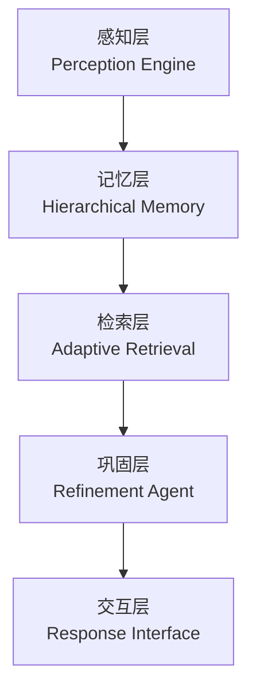

# 📜 NecoRAG 技术框架设计任务书 (Technical Design Charter)

**项目名称：** NecoRAG (Neuro-Cognitive Retrieval-Augmented Generation)  
**版本号：** v1.2-Alpha  
**日期：** 2026-03-17  
**状态：** 草案评审中  
**核心理念：** 模拟人脑双系统记忆与认知科学理论，构建下一代认知型 RAG 框架。

---

## 一、项目背景与愿景 (Background & Vision)

### 1.1 现状痛点

当前主流 RAG 框架（如 LangChain, LlamaIndex 基础版）存在以下局限：

- **记忆扁平化**：仅依赖向量相似度，缺乏结构化知识关联，无法处理多跳推理。
- **静态知识库**：知识入库后不再进化，缺乏"遗忘"与"巩固"机制，导致上下文窗口浪费在低价值信息上。
- **被动检索**：仅响应用户查询，缺乏主动联想和自我校正能力，幻觉率较高。
- **缺乏情境感知**：无法根据用户历史行为动态调整检索策略和回答风格。

### 1.2 愿景目标

打造 NecoRAG —— 一个具备**"类脑记忆结构"**和**"敏捷智能反应"**的智能框架。

- **敏捷响应**：毫秒级响应，精准捕捉关键信息（Perception Engine）。
- **类脑思考**：拥有工作记忆、长期语义记忆和情景图谱，支持自我反思与知识进化（Neural Consolidation）。
- **开源生态核心**：基于现有成熟开源组件（RAGFlow, Neo4j, Qdrant, LangGraph）进行深度编排，降低开发者构建复杂认知应用的门槛。

---

## 二、认知科学基础：人脑记忆机制 (Cognitive Science Foundation)

> NecoRAG 的设计深度借鉴了人类大脑的记忆与检索机制，尤其是海马体在记忆形成中的核心作用。本章节阐述人脑记忆的工作原理，作为系统架构设计的理论基础。

### 2.1 海马体：记忆的指挥中枢

**海马体 (Hippocampus)** 位于大脑颞叶内侧，是记忆形成和空间导航的关键脑区。它并非记忆的最终存储地，而是充当"记忆索引器"和"临时中转站"。

```
┌─────────────────────────────────────────────────────────────┐
│                    人脑记忆系统架构                           │
├─────────────────────────────────────────────────────────────┤
│                                                             │
│   感觉输入 ──▶ 感觉皮层 ──▶ 海马体 ──▶ 新皮层（长期存储）    │
│              (编码)      (索引/巩固)    (分布式存储)          │
│                             │                               │
│                             ▼                               │
│                     记忆检索时激活                           │
│                    "模式完成"机制                            │
│                                                             │
└─────────────────────────────────────────────────────────────┘
```

**海马体的核心功能：**

| 功能 | 描述 | NecoRAG 对应设计 |
|------|------|-----------------|
| **模式分离** (Pattern Separation) | 将相似的输入编码为不同的记忆表征，避免混淆 | 情境标签生成器，为相似文档打上差异化标签 |
| **模式完成** (Pattern Completion) | 从部分线索恢复完整记忆 | 向量检索 + 图谱多跳联想 |
| **记忆索引** (Memory Indexing) | 创建指向新皮层存储位置的"指针" | 三层记忆的索引结构 |
| **记忆巩固** (Memory Consolidation) | 将短期记忆转化为长期记忆 | 异步知识固化机制 |

### 2.2 记忆的四阶段模型

人脑记忆遵循 **编码 → 存储 → 巩固 → 检索** 的四阶段模型：

#### 阶段一：编码 (Encoding)

感觉信息通过感觉皮层进行初步处理，转换为神经信号模式。

- **浅层编码**：仅处理物理特征（如字形、声音）
- **深层编码**：处理语义和关联意义（记忆效果更好）
- **情境编码**：将信息与时间、地点、情绪绑定

> **NecoRAG 映射**：Perception Engine 的多维向量化 + 情境标签生成

#### 阶段二：存储 (Storage)

信息以分布式方式存储在不同脑区：

| 记忆类型 | 脑区 | 特点 | NecoRAG 对应 |
|---------|------|------|-------------|
| **工作记忆** (Working Memory) | 前额叶皮层 | 容量有限（7±2项），持续秒级 | L1 Redis（TTL 机制） |
| **情景记忆** (Episodic Memory) | 海马体 → 新皮层 | 个人经历，有时间地点 | L3 情景图谱（Neo4j） |
| **语义记忆** (Semantic Memory) | 颞叶新皮层 | 概念知识，无时间标记 | L2 语义向量（Qdrant） |
| **程序记忆** (Procedural Memory) | 基底神经节、小脑 | 技能和习惯 | 预设检索策略 |

#### 阶段三：巩固 (Consolidation)

记忆巩固是将脆弱的新记忆转化为稳定长期记忆的过程：

**系统巩固 (Systems Consolidation)**：
- 发生在睡眠期间（尤其是慢波睡眠）
- 海马体"重播"白天经历，将记忆逐步转移到新皮层
- 耗时数周到数年

**突触巩固 (Synaptic Consolidation)**：
- 发生在学习后数小时内
- 涉及突触强度的持久变化（LTP：长时程增强）

> **NecoRAG 映射**：Refinement Agent 的异步固化任务，定期分析高频 Query 并补充知识缺口

#### 阶段四：检索 (Retrieval)

记忆检索是重新激活存储记忆痕迹的过程：

**检索机制：**

1. **线索依赖检索** (Cue-dependent Retrieval)
   - 外部线索（问题、图像）触发相关记忆
   - 编码特异性原则：检索线索与编码情境匹配时效果最好

2. **扩散激活** (Spreading Activation)
   - 激活一个概念会自动激活相关概念
   - 形成"联想网络"

3. **模式完成** (Pattern Completion)
   - 海马体从部分线索重建完整记忆
   - CA3 区域的自联想网络实现此功能

```
检索过程示意：

查询: "深度学习的应用"
       │
       ▼
   ┌───────────┐
   │ 线索匹配   │◀── 向量相似度检索
   └─────┬─────┘
         │
         ▼
   ┌───────────┐
   │ 扩散激活   │◀── 图谱多跳联想
   └─────┬─────┘    (深度学习 → 神经网络 → CNN → 图像识别)
         │
         ▼
   ┌───────────┐
   │ 模式完成   │◀── 上下文重建
   └─────┬─────┘
         │
         ▼
    完整记忆输出
```

### 2.3 遗忘机制：记忆的主动修剪

遗忘不是记忆系统的缺陷，而是**必要的优化机制**：

| 遗忘类型 | 机制 | 功能 | NecoRAG 对应 |
|---------|------|------|-------------|
| **衰减遗忘** (Decay) | 记忆痕迹随时间减弱 | 清除过时信息 | 时间权重衰减函数 |
| **干扰遗忘** (Interference) | 新旧信息相互干扰 | 优先保留新知识 | 新颖性惩罚机制 |
| **检索抑制** (Retrieval Inhibition) | 主动抑制无关记忆 | 提高检索精度 | 领域相关性过滤 |
| **主动遗忘** (Active Forgetting) | 神经元主动清除机制 | 防止记忆过载 | 低权重知识归档 |

**遗忘曲线 (Ebbinghaus Forgetting Curve)**：

```
记忆保持率
100% │█████
     │████████
 50% │███████████████
     │██████████████████████████
 20% │█████████████████████████████████████████
     └────────────────────────────────────────▶ 时间
        1h    1d    1w    1m    6m
```

### 2.4 记忆的情绪调节

杏仁核 (Amygdala) 与海马体紧密相连，情绪显著影响记忆：

- **情绪增强效应**：情绪激动时，记忆编码更深刻
- **闪光灯记忆**：重大事件形成异常清晰的记忆
- **应激损害**：长期压力损害海马体功能

> **NecoRAG 映射**：情境标签中的"重要性"维度，为关键信息赋予更高权重

### 2.5 从神经科学到系统设计

NecoRAG 的设计直接映射人脑记忆机制：

```
┌─────────────────────────────────────────────────────────────────┐
│              人脑记忆系统 ←→ NecoRAG 架构映射                    │
├─────────────────────────────────────────────────────────────────┤
│                                                                 │
│  感觉皮层（编码）     ←→  Perception Engine（感知引擎）         │
│                                                                 │
│  海马体（索引/巩固）   ←→  Refinement Agent（精炼代理）         │
│                                                                 │
│  工作记忆（前额叶）    ←→  L1 Redis（会话记忆）                  │
│                                                                 │
│  语义记忆（颞叶）      ←→  L2 Qdrant（向量检索）                 │
│                                                                 │
│  情景记忆（海马-皮层）  ←→  L3 Neo4j（知识图谱）                 │
│                                                                 │
│  扩散激活（联想网络）   ←→  Adaptive Retrieval（多跳检索）       │
│                                                                 │
│  遗忘机制（记忆修剪）   ←→  时间衰减 + 低频归档                  │
│                                                                 │
│  情绪调节（杏仁核）     ←→  重要性权重 + 情境标签                │
│                                                                 │
└─────────────────────────────────────────────────────────────────┘
```

**核心设计原则（源自认知科学）：**

1. **分布式存储**：信息不集中存储，而是分散在多个子系统
2. **多层次处理**：从感知到记忆到检索，层层递进
3. **主动遗忘**：定期清理低价值信息，保持系统"鲜活"
4. **情境绑定**：记忆与时间、空间、情绪关联，提高检索准确性
5. **联想检索**：通过概念网络扩散激活，实现"举一反三"

---

## 三、核心架构设计 (Core Architecture)

### 顶层设计逻辑 (Top-Level Design Philosophy)

NecoRAG 作为面向特定领域的智能知识系统，采用**多维权重融合策略**，确保检索结果的精准性和时效性。

#### 1. 领域知识与关键字权重系统 (Domain Knowledge & Keyword Weighting)

**设计原理：**

不同于通用 RAG 系统，NecoRAG 针对特定领域进行深度优化，通过预定义的领域关键字词典和权重配置，在索引构建和检索时对领域核心概念进行增强。

**核心机制：**

- **领域关键字词典**：维护领域核心术语、专业词汇、缩写映射表。
- **关键字权重分级**：
  - **核心关键字** (Core Keywords): 权重 `1.5-2.0`，领域最核心的概念和术语
  - **重要关键字** (Important Keywords): 权重 `1.2-1.5`，领域常用但非核心的词汇
  - **普通关键字** (Normal Keywords): 权重 `1.0`，一般性领域相关词汇
  - **边缘关键字** (Peripheral Keywords): 权重 `0.5-0.8`，领域边缘或跨领域词汇
- **索引增强**：在向量化时，对包含高权重关键字的文本块进行向量加权。
- **检索增强**：查询时识别关键字并动态调整检索权重。

**权重计算公式：**

```math
keyword\_score = \frac{\sum(keyword\_weight[i] \times keyword\_frequency[i])}{total\_keywords}
```

#### 2. 时间权重机制 (Temporal Weighting Mechanism)

**设计原理：**

知识具有时效性，最新的知识往往更具参考价值。系统通过时间衰减函数，自动降低陈旧知识的检索优先级，确保用户获取最新、最相关的信息。

**核心机制：**

- **时间衰减函数**：采用指数衰减模型
  
  ```math
  temporal\_weight = e^{-\lambda \times (current\_time - document\_time)}
  ```
  
  其中 $\lambda$ 为衰减系数，可根据领域特性调整（快速变化领域 $\lambda$ 较大）

- **时间分级策略**：
  | 时间范围 | 权重乘数 | 说明 |
  |---------|----------|------|
  | 最近期 (0-30 天) | 1.0-1.2 | 最新知识 |
  | 近期 (30-90 天) | 0.8-1.0 | 较新知识 |
  | 中期 (90-365 天) | 0.5-0.8 | 稳定知识 |
  | 远期 (1-3 年) | 0.3-0.5 | 陈旧知识 |
  | 历史 (>3 年) | 0.1-0.3 | 历史参考 |

- **例外处理**：标记为"经典/永久"的知识不受时间衰减影响（如基础理论、定律等）。

#### 3. 领域相关性权重 (Domain Relevance Weighting)

**设计原理：**

在检索时优先返回领域内知识，降低领域外知识的干扰，同时保留跨领域知识作为补充参考。

**核心机制：**

- **领域分类器**：基于文本特征和关键字分布，判断知识所属领域。
- **领域相关性评分**：
  | 领域等级 | 权重乘数 | 说明 |
  |---------|----------|------|
  | 核心领域 (Core Domain) | 1.5 | 完全属于目标领域 |
  | 相关领域 (Related Domain) | 1.0-1.2 | 与目标领域有交集 |
  | 边缘领域 (Peripheral Domain) | 0.6-0.8 | 弱相关 |
  | 领域外 (Out-of-Domain) | 0.2-0.4 | 基本无关 |

- **领域边界软化**：允许一定比例的跨领域知识进入结果，促进知识创新。

#### 4. 语义意图分类系统 (Semantic Intent Classification)

**设计原理：**

用户查询蕴含不同的语义意图，不同意图需要不同的检索策略和响应模式。通过语义分析预判意图，实现精准路由：

- **意图多样性**：用户查询可能是事实查询、比较分析、推理演绎、概念解释、摘要总结、操作指导等多种类型。
- **策略差异化**：不同意图对应不同的最优检索路径（精确匹配、图谱多跳、HyDE 增强等）。
- **动态适配**：根据意图识别结果，自动选择最佳检索与响应策略。

**意图分类体系：**

| 意图类型 | 说明 | 检索策略 | 示例 |
|---------|------|----------|------|
| **事实查询** (Factual Query) | 寻找具体事实或数据 | 精确向量匹配 + 关键字检索 | "Python 3.12 发布了什么新特性？" |
| **比较分析** (Comparative Analysis) | 比较多个概念或方案 | 多实体并行检索 + 图谱关联 | "Redis 和 Memcached 有什么区别？" |
| **推理演绎** (Reasoning/Inference) | 需要多步推理 | 图谱多跳检索 + HyDE 增强 | "为什么微服务架构更适合大规模系统？" |
| **概念解释** (Concept Explanation) | 理解某个概念 | 语义检索 + 层级上下文 | "什么是注意力机制？" |
| **摘要总结** (Summarization) | 归纳总结信息 | 广泛检索 + 聚合排序 | "总结这篇论文的核心观点" |
| **操作指导** (Procedural/How-to) | 步骤化指导 | 程序记忆检索 + 时序排列 | "如何部署 Kubernetes 集群？" |
| **探索发散** (Exploratory) | 开放式探索 | 扩散激活 + 新颖性优先 | "有哪些有趣的 AI 应用？" |

**意图路由机制：**

```
┌─────────────────────────────────────────────────────────────────┐
│                    语义意图分类与路由流程                         │
├─────────────────────────────────────────────────────────────────┤
│                                                                 │
│   用户查询 ──▶ 语义分析 ──▶ 意图分类器 ──▶ 置信度评估           │
│                              │                                  │
│               ┌──────────────┼──────────────┐                   │
│               │              │              │                   │
│               ▼              ▼              ▼                   │
│         事实查询路由    推理演绎路由    探索发散路由              │
│               │              │              │                   │
│               ▼              ▼              ▼                   │
│         精确向量匹配    图谱多跳检索    扩散激活检索              │
│         + 关键字检索    + HyDE 增强    + 新颖性排序              │
│               │              │              │                   │
│               └──────────────┼──────────────┘                   │
│                              ▼                                  │
│                       结果融合与响应                             │
│                                                                 │
└─────────────────────────────────────────────────────────────────┘
```

**意图置信度与多意图融合：**

- **置信度阈值**：当意图识别置信度低于阈值（默认 0.7）时，采用多策略并行检索。
- **复合意图支持**：一个查询可能同时包含多种意图，系统支持加权融合多个意图的检索结果。
- **降级机制**：当所有意图置信度均较低时，退化为通用检索策略。

**意图权重融合公式：**

```math
intent\_score = \sum_{i=1}^{n} (confidence_i \times strategy\_weight_i)
```

其中：
- `confidence_i`：第 i 种意图的识别置信度
- `strategy_weight_i`：第 i 种意图对应检索策略的权重
- `n`：识别出的意图数量（单意图时 n=1）

#### 5. 综合权重计算 (Composite Weight Calculation)

最终检索权重采用多因子加权融合：

```math
final\_weight = base\_score \times \alpha \times keyword\_weight \times \beta \times temporal\_weight \times \gamma \times domain\_weight \times \delta \times intent\_weight
```

其中：
- `base_score`：向量相似度基础分数
- `keyword_weight`：关键字权重因子
- `temporal_weight`：时间权重因子
- `domain_weight`：领域相关性权重因子
- `intent_weight`：意图权重因子（基于语义意图分类）
 `α, β, γ, δ`：可配置的因子系数（默认各为 1.0）

#### 6. 知识库更新与演化系统 (Knowledge Base Evolution System)

**设计原理：**

- **学习即使用**：类比人脑的学习机制——每次查询不仅是检索，也是学习机会。系统从用户交互中持续积累新知识。
- **活体知识库**：知识库不是静态的文档仓库，而是通过持续使用不断进化的"活体知识库"，具备自我更新和自我修复能力。
- **双模式学习**：区分实时更新（即时反馈学习）和定时更新（系统巩固学习），对应人脑的"在线学习"和"睡眠巩固"机制。

**核心机制：**

**(a) 查询驱动的知识积累 (Query-Driven Knowledge Accumulation)**

每次用户查询都可能产生新知识，系统通过以下机制捕获和处理：

- **知识来源识别**：
  - 用户反馈（点赞、修正、补充）
  - LLM 生成的高质量回答（经验证后入库）
  - 检索未命中的知识缺口（触发知识补充任务）

- **知识候选池**：暂存待审查的新知识条目，支持自动和人工两种审核模式。

- **自动质量评估**：对新知识进行多维度评分
  | 评估维度 | 说明 | 阈值 |
  |---------|------|------|
  | 可信度 (Credibility) | 来源可靠性、事实一致性 | ≥ 0.7 |
  | 相关性 (Relevance) | 与领域知识库的契合度 | ≥ 0.6 |
  | 新颖性 (Novelty) | 与现有知识的差异度 | ≥ 0.3 |

- **入库决策**：达标知识自动入库，边缘知识进入人工审核队列。

**(b) 双模式更新策略 (Dual-Mode Update Strategy)**

| 更新模式 | 触发条件 | 更新范围 | 适用场景 | 对应脑机制 |
|---------|----------|---------|----------|------------|
| 实时更新 (Real-time) | 用户查询/反馈即时触发 | L1 工作记忆、热点索引 | 会话上下文、高频知识热更新 | 突触可塑性（即时学习） |
| 定时批量更新 (Scheduled Batch) | 定时任务（如每日凌晨） | L2 语义向量、L3 情景图谱 | 向量索引重建、图谱关系维护、大规模知识入库 | 睡眠期系统巩固 |
| 事件触发更新 (Event-Driven) | 外部数据源变更、知识库健康度下降 | 受影响的知识分区 | 数据源同步、质量修复 | 应激响应机制 |

**(c) 增量数据库更新策略 (Incremental Database Update)**

不同存储层采用差异化的更新策略：

- **L1 Redis（工作记忆）**：
  - 实时更新，TTL 自动过期
  - 热点数据即时刷新
  - 支持原子操作，保证并发安全

- **L2 Qdrant（语义向量）**：
  - 支持增量向量插入，无需全量重建
  - 定期执行索引优化（HNSW 参数调优）
  - 向量去重：基于余弦相似度合并高度重复的向量

- **L3 Neo4j（情景图谱）**：
  - 增量添加新实体和关系
  - 定期执行图谱修剪（删除孤立节点、弱关联边）
  - 关系权重更新：基于访问频率和时间衰减调整

- **变更日志 (Change Log)**：
  - 所有更新操作记录变更日志
  - 支持回滚：按时间点恢复知识库状态
  - 支持审计：追踪知识来源和变更历史

**(d) 知识库量化指标体系 (Knowledge Base Metrics)**

| 指标类别 | 指标名称 | 计算方式 | 说明 |
|---------|---------|---------|------|
| 规模指标 | 知识条目总数 | COUNT(entries) | 各层级的知识数量 |
| 规模指标 | 向量覆盖率 | 已向量化/总条目 | 向量索引完整度 |
| 新鲜度指标 | 平均知识年龄 | AVG(now - created_at) | 知识库整体时效性 |
| 新鲜度指标 | 最近更新率 | 近7天更新/总数 | 知识活跃程度 |
| 质量指标 | 检索命中率 | 命中次数/总查询 | 知识覆盖充分度 |
| 质量指标 | 知识碎片率 | 孤立节点数/总节点 | 图谱连通性 |
| 健康度指标 | 知识衰减分布 | 各权重区间的分布 | 知识老化程度 |
| 健康度指标 | 冗余度 | 高相似度对数/总数 | 知识重复程度 |

**综合健康度评分公式：**

```math
health\_score = w_1 \times coverage + w_2 \times freshness + w_3 \times quality + w_4 \times connectivity
```

其中 `w_1 + w_2 + w_3 + w_4 = 1`，默认权重分配为 `0.2, 0.3, 0.3, 0.2`。

**(e) 可视化展示设计 (Visualization Design)**

Dashboard 上展示的知识库状态：

- **知识库健康仪表盘**：综合健康分数（0-100），类似"体检报告"，直观展示知识库整体状态。
- **知识增长曲线**：展示知识条目随时间的增长趋势，支持按日/周/月粒度查看。
- **知识分布热力图**：展示各领域/主题的知识覆盖密度，识别知识盲区。
- **更新时间线**：实时/定时更新操作的时间线视图，便于追踪变更历史。
- **知识衰减雷达图**：展示各维度的知识新鲜度状况，预警老化严重的领域。

**仪表盘布局示意：**

```
┌──────────────────────────────────────────────────────────────┐
│                   知识库健康仪表盘                             │
├──────────┬──────────┬──────────┬─────────────────────────────┤
│ 总知识量  │ 今日新增  │ 健康分数  │        知识增长趋势          │
│ 125,432  │ +342     │ 87/100   │  ▁▂▃▄▅▆▇█ (近30天)          │
├──────────┴──────────┴──────────┤                             │
│      领域覆盖热力图              │        知识衰减雷达图        │
│  ████░░░░  AI (85%)            │     新鲜度 ★★★★☆           │
│  ██████░░  数据库 (75%)        │     覆盖度 ★★★★★           │
│  ██░░░░░░  网络 (25%)          │     连通性 ★★★☆☆           │
├─────────────────────────────────┴────────────────────────────┤
│                    最近更新时间线                              │
│  09:00 [实时] 新增 23 条查询知识                               │
│  03:00 [定时] 向量索引重建完成，更新 1,204 条                    │
│  00:00 [定时] 图谱关系维护，修剪 56 条弱关联                     │
└──────────────────────────────────────────────────────────────┘
```

---

## 四、五层认知架构设计

NecoRAG 采用 **"五层认知"** 分层架构，对应人脑认知机制的不同阶段。



### 4.1 感知层：Perception Engine (感知引擎)

**功能：** 多模态数据的高精度编码与情境标记。

**技术实现：**
- 集成 RAGFlow 进行深度文档解析（OCR、表格还原、层级分析）。
- 利用 BGE-M3 生成稠密向量 + 稀疏向量 + 实体三元组。
- **语义意图分类**：对用户查询进行语义理解和意图识别，为后续检索提供策略路由指导。
- **创新点：** 引入“情境标签生成器”，为每个 Chunk 自动打标（时间、情感、重要性），实现对环境微变化的敏锐感知。

> **感知层与检索层的桥接：** 语义意图分类系统作为感知层的延伸，在检索前对查询进行深度语义理解，识别用户的真实意图（事实查询、比较分析、推理演绎等），并将意图路由信息传递给检索层，实现策略的动态适配。

### 4.2 记忆层：Hierarchical Memory (层级记忆)

**功能：** 分层存储，模拟短期工作记忆与长期结构化记忆。

**技术实现：**
- **L1 工作记忆** (Redis)：存储当前会话上下文、用户意图轨迹，设置 TTL 模拟"瞬时遗忘"。
- **L2 语义记忆** (Qdrant/Milvus)：存储高维向量，负责模糊匹配与直觉检索。
- **L3 情景图谱** (Neo4j/Nebula)：存储实体关系网络，支持多跳推理与因果链条。
- **创新点：** 实现动态权重衰减机制，低频访问知识自动降权或归档，保持记忆库"鲜活"。

### 4.3 检索层：Adaptive Retrieval (自适应检索)

**功能：** 基于扩散激活理论的混合检索与重排序。

**技术实现：**
- 多跳联想：基于图谱的 Multi-hop 搜索，从实体 A 扩散到 B 再到 C。
- HyDE 增强：先生成假设答案再检索，解决提问模糊问题。
- Novelty Re-ranker：引入 BGE-Reranker，并增加"新颖性惩罚"，抑制重复信息，优先展示新异知识。
- **创新点：** 实现"早停机制"（Early Termination），一旦置信度超过阈值，立即终止冗余检索，返回结果。

### 4.4 巩固层：Refinement Agent (精炼代理)

**功能：** 异步知识固化、幻觉自检与记忆修剪。

**技术实现：**
- LangGraph 闭环：构建 Generator → Critic → Refiner 循环。
- 预测误差最小化：对比生成内容与检索证据，若无确凿证据则触发"不知道"或重新检索。
- 异步固化：后台定时任务分析高频未命中 Query，自动补充知识缺口或合并碎片化知识。
- **知识库演化引擎**：管理实时和定时两种知识更新模式，维护知识候选池和变更日志，确保知识库持续进化。
- **知识量化分析**：持续计算知识库健康度指标（规模、新鲜度、质量、连通性），触发低健康度预警。
- **创新点：** 定期清理噪声数据，强化重要连接，保持知识库质量。

### 4.5 交互层：Response Interface (响应接口)

**功能：** 情境自适应生成与可解释性输出。

**技术实现：**
- 用户画像适配：根据 L1 层历史交互，动态调整 Tone (专业/幽默) 和 Detail Level。
- 思维链可视化：输出不仅包含答案，还展示"检索路径图"（我是如何联想到这个答案的）。
- 多模态合成：自动组合文本、图表甚至生成语音回答。
- **知识库健康可视化**：展示知识库健康仪表盘、知识增长曲线、领域覆盖热力图、更新时间线等综合视图。

---

## 五、技术栈选型 (Technology Stack)

| 模块 | 推荐开源组件 | 选型理由 |
|------|------------|---------|
| **编排引擎** | LangGraph | 支持复杂的循环状态机，完美实现"检索 - 反思 - 校正"闭环 |
| **文档解析** | RAGFlow | 业界最强的深度文档解析能力，支持复杂布局还原 |
| **向量数据库** | Qdrant | 高性能，支持混合搜索（向量 + 关键词），Rust 编写速度快 |
| **图数据库** | Neo4j (社区版) / NebulaGraph | 成熟的图谱存储，支持 Cypher/Gremlin 查询，便于多跳推理 |
| **缓存/工作记忆** | Redis | 极低延迟，适合存储短期会话状态 |
| **嵌入模型** | BGE-M3 | 支持多语言、长文本、稠密 + 稀疏混合嵌入 |
| **重排序模型** | BGE-Reranker-v2 | 中文优化好，精度高 |
| **LLM 推理** | vLLM / Ollama | 高吞吐推理，支持本地部署隐私保护 |
| **前端/可视化** | Streamlit / Next.js | 快速构建演示 Demo 和生产级界面 |
| **意图分类** | Rasa NLU / Hugging Face Transformers | Rasa 提供轻量级意图识别；Transformers 支持 BERT 等深度分类模型，可针对特定领域微调 |
| **中文 NLP** | spaCy + jieba | spaCy 提供工业级 NLP 流水线；jieba 擅长中文分词与关键词提取 |
| **轻量分类** | FastText | Facebook 开源，训练速度快、资源占用低，适合作为意图分类的轻量级后备方案 |
| **任务调度** | APScheduler / Celery | APScheduler 轻量级 Python 调度器；Celery 支持分布式任务队列，适合大规模定时更新 |
| **变更追踪** | Debezium / 自研 CDC | Debezium 支持数据库变更数据捕获，实时监听数据源变更 |
| **指标可视化** | Grafana / ECharts | Grafana 专业监控面板；ECharts 嵌入式图表，适合 Dashboard 集成 |

---

## 六、关键功能指标 (KPIs)

| 指标 | 目标值 | 说明 |
|------|--------|------|
| **检索准确率** (Recall@K) | +20% | 在多跳推理数据集（如 HotpotQA）上，相比传统 Vector RAG |
| **幻觉率** (Hallucination Rate) | < 5% | 通过 Refinement Agent 自检，将事实性错误降低 |
| **响应延迟** (Latency) | < 800ms | 简单查询首字延迟（利用早停策略提前终止） |
| **知识更新效率** | 分钟级 | 支持增量更新，新文档入库后可被检索并融入图谱 |
| **上下文压缩率** | -40% | 通过记忆衰减机制，在保证效果前提下减少 Token 消耗 |
| **知识库健康度** | > 80 分 | 综合量化评分（规模、新鲜度、质量、连通性加权） |
| **实时更新延迟** | < 2s | 查询产生的新知识写入工作记忆的延迟 |
| **定时更新完成率** | > 99% | 定时批量更新任务的成功执行率 |

---

## 七、开发路线图 (Roadmap)

### Phase 1: 骨架搭建 (MVP) - [2026 Q2]

- ✅ 完成 Perception Engine 与 Hierarchical Memory 的基础对接
- ✅ 实现基本的 Vector + Graph 混合检索
- ✅ 发布 NecoRAG Core SDK (Python)
- ✅ 确定 Logo 与基础 UI 风格

### Phase 2: 大脑注入 (Intelligence) - [2026 Q3]

- 🔲 集成 LangGraph 实现 Refinement Agent (自检与校正)
- 🔲 实现动态重排序与 Novelty 检测
- 🔲 实现知识库实时更新引擎与查询驱动知识积累
- 🔲 发布 NecoRAG Server (Docker 一键部署)
- 🔲 Dashboard 实时监控增强

### Phase 3: 进化与生态 (Evolution) - [2026 Q4]

- 🔲 实现异步知识固化与自动遗忘机制
- 🔲 知识库量化指标体系与健康仪表盘
- 🔲 定时批量更新与增量同步引擎
- 🔲 推出可视化调试面板 (NecoRAG Dashboard)，展示"思维路径"
- 🔲 建立插件市场，支持自定义"感知器"和"记忆策略"
- 🔲 社区运营：举办 "NecoRAG Hackathon"，鼓励开发者构建专属的智能 Agent

---

## 八、风险评估与应对 (Risk Management)

| 风险 | 应对措施 |
|------|---------|
| **图谱构建成本高**<br/>小数据集效果不明显 | 提供"轻量级图谱模式"，仅在实体密度高时自动激活图谱，否则退化为纯向量检索 |
| **多组件编排导致系统复杂度激增**<br/>调试困难 | 内置详细的 Trace 日志系统，可视化每一步的"神经激活"过程；提供标准化的 Docker Compose 环境 |

---

## 九、结语

> NecoRAG 不仅仅是一个工具库，它是认知科学理论在工程领域的实践。我们希望通过这个项目，让 AI 从"冰冷的检索机器"进化为"拥有记忆、懂得思考、能够成长的数字伙伴"。

**Let's make AI think like a brain! 🧠**

---

**批准人：** Qi Jie  
**项目负责人：** Qijie  
**GitHub 仓库：** github.com/qijie2026/NecoRAG
