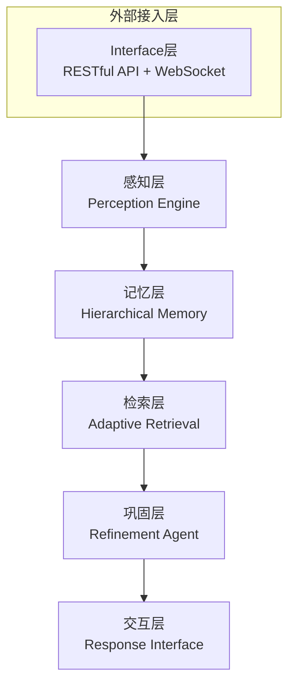
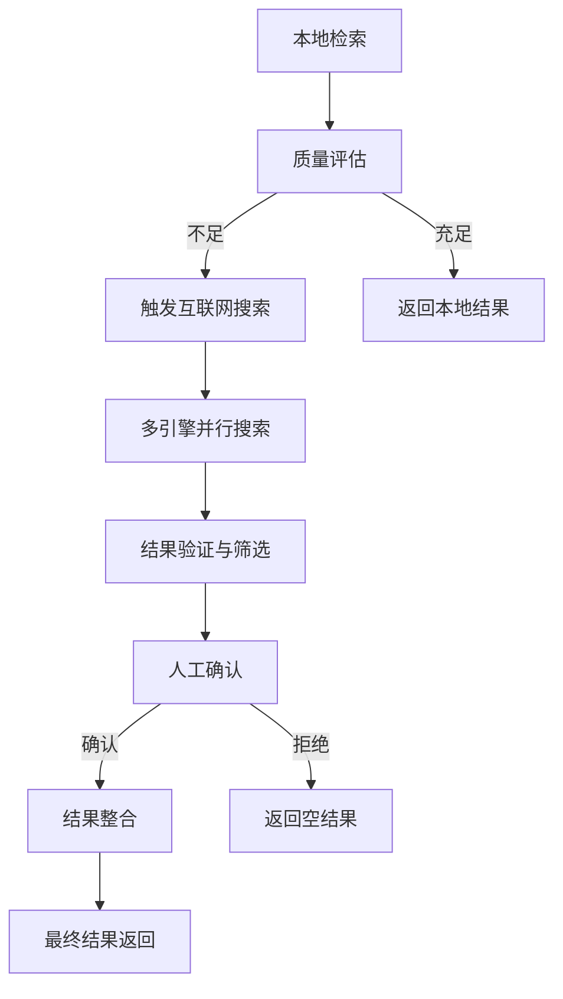

# 📜 NecoRAG 技术框架设计任务书 (Technical Design Charter)

**项目名称：** NecoRAG (Neuro-Cognitive Retrieval-Augmented Generation)  
**版本号：** v1.9-Alpha
**日期：** 2026-03-19
**状态：** ✅ Phase 1 & 2 核心功能已完成，Phase 3 进行中
**核心理念：** 模拟人脑双系统记忆与认知科学理论，构建下一代认知型 RAG 框架。
**最新增强:** ✅ 智能路由与策略融合引擎 - 整合意图分析、CoT思维链和用户画像的三层决策架构

---

## 一、项目背景与愿景 (Background & Vision)

### 1.1 现状痛点

当前主流 RAG 框架（如 LangChain, LlamaIndex 基础版）存在以下局限：

- **记忆扁平化**：仅依赖向量相似度，缺乏结构化知识关联，无法处理多跳推理。
- **静态知识库**：知识入库后不再进化，缺乏"遗忘"与"巩固"机制，导致上下文窗口浪费在低价值信息上。
- **被动检索**：仅响应用户查询，缺乏主动联想和自我校正能力，幻觉率较高。
- **缺乏情境感知**：无法根据用户历史行为动态调整检索策略和回答风格。

### 1.2 愿景目标

打造 NecoRAG —— 一个具备**"类脑记忆结构"**和**"敏捷智能反应"**的智能框架。

- **敏捷响应**：毫秒级响应，精准捕捉关键信息（Perception Engine）。
- **类脑思考**：拥有工作记忆、长期语义记忆和情景图谱，支持自我反思与知识进化（Neural Consolidation）。
- **开源生态核心**：基于现有成熟开源组件（RAGFlow, Neo4j, Qdrant, LangGraph）进行深度编排，降低开发者构建复杂认知应用的门槛。

---

## 二、认知科学基础：人脑记忆机制 (Cognitive Science Foundation)

> NecoRAG 的设计深度借鉴了人类大脑的记忆与检索机制，尤其是海马体在记忆形成中的核心作用。本章节阐述人脑记忆的工作原理，作为系统架构设计的理论基础。

### 2.1 海马体：记忆的指挥中枢

**海马体 (Hippocampus)** 位于大脑颞叶内侧，是记忆形成和空间导航的关键脑区。它并非记忆的最终存储地，而是充当"记忆索引器"和"临时中转站"。

```
┌─────────────────────────────────────────────────────────────┐
│                    人脑记忆系统架构                           │
├─────────────────────────────────────────────────────────────┤
│                                                             │
│   感觉输入 ──▶ 感觉皮层 ──▶ 海马体 ──▶ 新皮层（长期存储）    │
│              (编码)      (索引/巩固)    (分布式存储)          │
│                             │                               │
│                             ▼                               │
│                     记忆检索时激活                           │
│                    "模式完成"机制                            │
│                                                             │
└─────────────────────────────────────────────────────────────┘
```

**海马体的核心功能：**

| 功能 | 描述 | NecoRAG 对应设计 |
|------|------|-----------------|
| **模式分离** (Pattern Separation) | 将相似的输入编码为不同的记忆表征，避免混淆 | 情境标签生成器，为相似文档打上差异化标签 |
| **模式完成** (Pattern Completion) | 从部分线索恢复完整记忆 | 向量检索 + 图谱多跳联想 |
| **记忆索引** (Memory Indexing) | 创建指向新皮层存储位置的"指针" | 三层记忆的索引结构 |
| **记忆巩固** (Memory Consolidation) | 将短期记忆转化为长期记忆 | 异步知识固化机制 |

### 2.2 记忆的四阶段模型

人脑记忆遵循 **编码 → 存储 → 巩固 → 检索** 的四阶段模型：

#### 阶段一：编码 (Encoding)

感觉信息通过感觉皮层进行初步处理，转换为神经信号模式。

- **浅层编码**：仅处理物理特征（如字形、声音）
- **深层编码**：处理语义和关联意义（记忆效果更好）
- **情境编码**：将信息与时间、地点、情绪绑定

> **NecoRAG 映射**：Perception Engine 的多维向量化 + 情境标签生成

#### 阶段二：存储 (Storage)

信息以分布式方式存储在不同脑区：

| 记忆类型 | 脑区 | 特点 | NecoRAG 对应 |
|---------|------|------|-------------|
| **工作记忆** (Working Memory) | 前额叶皮层 | 容量有限（7±2项），持续秒级 | L1 Redis（TTL 机制） |
| **情景记忆** (Episodic Memory) | 海马体 → 新皮层 | 个人经历，有时间地点 | L3 情景图谱（Neo4j） |
| **语义记忆** (Semantic Memory) | 颞叶新皮层 | 概念知识，无时间标记 | L2 语义向量（Qdrant） |
| **程序记忆** (Procedural Memory) | 基底神经节、小脑 | 技能和习惯 | 预设检索策略 |

#### 阶段三：巩固 (Consolidation)

记忆巩固是将脆弱的新记忆转化为稳定长期记忆的过程：

**系统巩固 (Systems Consolidation)**：
- 发生在睡眠期间（尤其是慢波睡眠）
- 海马体"重播"白天经历，将记忆逐步转移到新皮层
- 耗时数周到数年

**突触巩固 (Synaptic Consolidation)**：
- 发生在学习后数小时内
- 涉及突触强度的持久变化（LTP：长时程增强）

> **NecoRAG 映射**：Refinement Agent 的异步固化任务，定期分析高频 Query 并补充知识缺口

#### 阶段四：检索 (Retrieval)

记忆检索是重新激活存储记忆痕迹的过程：

**检索机制：**

1. **线索依赖检索** (Cue-dependent Retrieval)
   - 外部线索（问题、图像）触发相关记忆
   - 编码特异性原则：检索线索与编码情境匹配时效果最好

2. **扩散激活** (Spreading Activation)
   - 激活一个概念会自动激活相关概念
   - 形成"联想网络"

3. **模式完成** (Pattern Completion)
   - 海马体从部分线索重建完整记忆
   - CA3 区域的自联想网络实现此功能

```
检索过程示意：

查询: "深度学习的应用"
       │
       ▼
   ┌───────────┐
   │ 线索匹配   │◀── 向量相似度检索
   └─────┬─────┘
         │
         ▼
   ┌───────────┐
   │ 扩散激活   │◀── 图谱多跳联想
   └─────┬─────┘    (深度学习 → 神经网络 → CNN → 图像识别)
         │
         ▼
   ┌───────────┐
   │ 模式完成   │◀── 上下文重建
   └─────┬─────┘
         │
         ▼
    完整记忆输出
```

### 2.3 遗忘机制：记忆的主动修剪

遗忘不是记忆系统的缺陷，而是**必要的优化机制**：

| 遗忘类型 | 机制 | 功能 | NecoRAG 对应 |
|---------|------|------|-------------|
| **衰减遗忘** (Decay) | 记忆痕迹随时间减弱 | 清除过时信息 | 时间权重衰减函数 |
| **干扰遗忘** (Interference) | 新旧信息相互干扰 | 优先保留新知识 | 新颖性惩罚机制 |
| **检索抑制** (Retrieval Inhibition) | 主动抑制无关记忆 | 提高检索精度 | 领域相关性过滤 |
| **主动遗忘** (Active Forgetting) | 神经元主动清除机制 | 防止记忆过载 | 低权重知识归档 |

**遗忘曲线 (Ebbinghaus Forgetting Curve)**：

```
记忆保持率
100% │█████
     │████████
 50% │███████████████
     │██████████████████████████
 20% │█████████████████████████████████████████
     └────────────────────────────────────────▶ 时间
        1h    1d    1w    1m    6m
```

### 2.4 记忆的情绪调节

杏仁核 (Amygdala) 与海马体紧密相连，情绪显著影响记忆：

- **情绪增强效应**：情绪激动时，记忆编码更深刻
- **闪光灯记忆**：重大事件形成异常清晰的记忆
- **应激损害**：长期压力损害海马体功能

> **NecoRAG 映射**：情境标签中的"重要性"维度，为关键信息赋予更高权重

### 2.5 从神经科学到系统设计

NecoRAG 的设计直接映射人脑记忆机制：

```
┌─────────────────────────────────────────────────────────────────┐
│              人脑记忆系统 ←→ NecoRAG 架构映射                    │
├─────────────────────────────────────────────────────────────────┤
│                                                                 │
│  感觉皮层（编码）     ←→  Perception Engine（感知引擎）         │
│                                                                 │
│  海马体（索引/巩固）   ←→  Refinement Agent（精炼代理）         │
│                                                                 │
│  工作记忆（前额叶）    ←→  L1 Redis（会话记忆）                  │
│                                                                 │
│  语义记忆（颞叶）      ←→  L2 Qdrant（向量检索）                 │
│                                                                 │
│  情景记忆（海马-皮层）  ←→  L3 Neo4j（知识图谱）                 │
│                                                                 │
│  扩散激活（联想网络）   ←→  Adaptive Retrieval（多跳检索）       │
│                                                                 │
│  遗忘机制（记忆修剪）   ←→  时间衰减 + 低频归档                  │
│                                                                 │
│  情绪调节（杏仁核）     ←→  重要性权重 + 情境标签                │
│                                                                 │
└─────────────────────────────────────────────────────────────────┘
```

**核心设计原则（源自认知科学）：**

1. **分布式存储**：信息不集中存储，而是分散在多个子系统
2. **多层次处理**：从感知到记忆到检索，层层递进
3. **主动遗忘**：定期清理低价值信息，保持系统"鲜活"
4. **情境绑定**：记忆与时间、空间、情绪关联，提高检索准确性
5. **联想检索**：通过概念网络扩散激活，实现"举一反三"

---

## 三、核心架构设计 (Core Architecture)

### 3.1 多用户系统与知识空间架构 (Multi-User System & Knowledge Space Architecture)

**设计理念：**

NecoRAG 采用**双层知识空间模型**，模拟人脑记忆中的"个人记忆"与"集体智慧"的双重特性：
- **个人工作空间 (Personal Workspace)**：类比个人的私密记忆，存储用户的私有知识、个人隐私数据和个人偏好配置。
- **公共贡献空间 (Public Contribution Space)**：类比社会的集体知识库，用户可以自愿分享个人知识，促进集体智慧的增长。
- **混合协作空间 (Hybrid Collaboration Space)**：支持团队/组织内部的半公开知识共享，介于个人与公共之间。

这种设计既保护了用户隐私，又鼓励知识共享，实现了"个人知识沉淀 → 集体智慧增长"的良性循环。

#### 3.0.0-alpha 用户画像与权限模型 (User Profile & Permission Model)

**用户角色定义：**

| 角色 | 说明 | 权限范围 |
|------|------|----------|
| **普通用户 (User)** | 系统基础用户 | 个人工作空间完全控制，可申请向公共空间贡献知识 |
| **贡献者 (Contributor)** | 有知识贡献记录的用户 | 拥有公共空间编辑权限，可审核他人贡献 |
| **领域专家 (Domain Expert)** | 在特定领域有深度贡献的用户 | 领域内公共知识的终审权，可设置领域知识规则 |
| **管理员 (Admin)** | 系统管理者 | 全局权限，包括用户管理、空间管理、系统配置 |

**用户画像数据模型 (User Profile Data Model)：**

```python
class UserProfile:
    # 基础信息（公开可见）
    user_id: str
    username: str
    avatar_url: Optional[str]
    bio: Optional[str]  # 个人简介
    expertise_domains: List[str]  # 擅长领域
    contribution_score: int  # 贡献积分
    
    # 个人隐私（仅自己可见）
    private_config: Dict[str, Any]  # 个性化配置
    query_history: List[QueryRecord]  # 查询历史（可配置保留期限）
    preference_model: UserPreference  # 偏好模型（用于个性化响应）
    
    # 知识空间权限
    personal_space: PersonalSpace  # 个人工作空间引用
    shared_contributions: List[KnowledgeContribution]  # 已分享的知识贡献
    team_memberships: List[TeamMembership]  # 团队协作空间成员资格
```

**隐私保护机制：**

1. **数据隔离**：个人工作空间与公共空间物理隔离，使用不同的数据库实例或命名空间。
2. **加密存储**：个人隐私数据（如查询历史、偏好模型）使用端到端加密存储。
3. **访问审计**：所有跨空间访问操作记录审计日志，支持追溯。
4. **用户控制**：用户可随时删除个人数据、导出个人知识、撤销已分享的权限。
5. **合规性**：遵循 GDPR、个人信息保护法等法规要求。

#### 3.0.0-alpha 个人工作空间 (Personal Workspace)

**功能特性：**

- **私有知识库**：用户上传的文档、笔记、查询结果默认存储在个人空间。
- **个性化配置**：独立的检索策略配置、响应风格偏好、通知设置等。
- **本地化记忆**：L1 工作记忆和 L2 语义记忆的私人分区，支持快速访问。
- **临时知识候选池**：用户查询产生的新知识先暂存在个人空间，经审核后可选择是否分享到公共空间。
- **隐私保护查询**：敏感查询自动路由到个人空间，不进入公共日志。

**技术实现：**

```python
class PersonalWorkspace:
    def __init__(self, user_id: str):
        self.user_id = user_id
        self.private_memory = PrivateMemoryManager(user_id)  # 私有记忆管理器
        self.personal_knowledge_base = PersonalKB(user_id)  # 个人知识库
        self.config_profile = ConfigProfile(user_id)  # 个人配置档案
        self.query_cache = QueryCache(user_id, ttl=3600)  # 查询缓存
    
    async def upload_document(self, file: File, metadata: Dict) -> str:
        """上传文档到个人空间"""
        # 文档解析、向量化后存储到个人向量库
        pass
    
    async def search_personal(self, query: str) -> List[Result]:
        """在个人空间内检索"""
        # 仅在个人知识库和记忆分区中检索
        pass
    
    async def share_to_public(self, knowledge_id: str, target_domain: str) -> bool:
        """申请将个人知识分享到公共空间"""
        # 质量评估 → 提交审核 → 通过后复制到公共空间
        pass
```

**存储结构：**

```
personal_workspace/{user_id}/
├── memory/
│   ├── l1_working_memory/      # L1 工作记忆（Redis 独立实例）
│   ├── l2_semantic_vectors/    # L2 语义向量（Qdrant 独立 Collection）
│   └── l3_episodic_graph/      # L3 情景图谱（Neo4j 独立子图）
├── documents/                   # 原始文档存储
├── configurations/              # 个人配置文件
├── query_logs/                  # 查询日志（加密存储）
└── candidates/                  # 知识候选池（待审核的新知识）
```

#### 3.0.0-alpha 公共贡献空间 (Public Contribution Space)

**知识贡献流程：**

```
用户发起分享请求
       │
       ▼
个人空间提取知识 ──▶ 自动质量评估 ──▶ 不达标 ──▶ 拒绝并反馈原因
       │                      │
       │                    达标
       ▼                      ▼
  填写贡献元数据          提交审核队列
       │                      │
       ▼                      ▼
 领域专家审核 ────────▶ 人工审核 ──▶ 拒绝 ──▶ 返回修改建议
       │                      │
       │                    通过
       ▼                      ▼
  合并到公共知识库      更新贡献者积分和排名
       │
       ▼
  生成贡献证书和溯源记录
```

**贡献激励机制：**

| 激励类型 | 说明 | 计算方式 |
|---------|------|----------|
| **贡献积分** | 每次有效贡献获得积分 | 基础分 + 质量系数 + 被引用次数 |
| **领域声望** | 在特定领域的专业度认可 | 领域内贡献加权求和 |
| **贡献等级** | 用户等级提升（普通→贡献者→专家） | 累计积分 + 领域声望阈值 |
| **物质奖励** | 优秀贡献者获得奖金或礼品 | 月度/年度评选 |
| **社区认可** | 贡献排行榜、勋章系统 | 公开展示 |

**知识溯源机制：**

每条公共知识都包含完整的溯源信息：
- **原始贡献者**：知识的初始上传者。
- **贡献时间线**：知识的创建、修改、合并历史。
- **版本关系**：不同版本之间的演化关系。
- **引用网络**：该知识被其他知识引用的关系图。

**技术实现：**

```python
class PublicContributionSpace:
    def __init__(self):
        self.public_kb = PublicKnowledgeBase()  # 公共知识库
        self.review_queue = ReviewQueue()  # 审核队列
        self.contribution_tracker = ContributionTracker()  # 贡献追踪器
    
    async def submit_contribution(self, contribution: KnowledgeContribution):
        """提交知识贡献"""
        # 1. 自动质量评估
        quality_score = await self.auto_evaluate(contribution)
        if quality_score < THRESHOLD:
            return RejectionReason("质量不达标")
        
        # 2. 加入审核队列
        await self.review_queue.add(contribution, quality_score)
        
        # 3. 领域专家审核（异步）
        # ... 等待审核结果 ...
    
    async def merge_to_public(self, contribution: KnowledgeContribution):
        """将通过审核的贡献合并到公共知识库"""
        # 1. 去重检测
        existing = await self.detect_duplicate(contribution)
        if existing:
            return MergeConflict(existing)
        
        # 2. 合并到公共知识库（向量库 + 图谱）
        await self.public_kb.insert(contribution)
        
        # 3. 更新贡献者积分和统计
        await self.contribution_tracker.update_stats(contribution)
```

#### 3.0.0-alpha 混合协作空间 (Hybrid Collaboration Space)

**适用场景：**

- **团队项目**：项目组内部共享的知识库，对外保密。
- **企业部门**：部门内部的专业知识库，跨部门需授权。
- **研究小组**：学术合作团队的联合知识库，阶段性公开。

**权限模型：**

```python
class TeamMembership:
    team_id: str
    user_id: str
    role: TeamRole  # Owner / Admin / Member / Guest
    permissions: List[Permission]  # 读/写/审核/管理权限
    joined_at: datetime
    expires_at: Optional[datetime]  # 成员资格过期时间
```

**空间层级：**

```
协作空间层级结构：
├── 组织 (Organization)
│   ├── 团队 A (Team A)
│   │   ├── 项目 A1 (Project A1)
│   │   └── 项目 A2 (Project A2)
│   └── 团队 B (Team B)
│       └── ...
└── 团队 C (Team C)
    └── ...
```

#### 3.0.0-alpha 跨空间知识流动机制 (Cross-Space Knowledge Flow)

**知识流动路径：**

```
┌─────────────────────────────────────────────────────────────┐
│                    多用户知识流动架构图                       │
├─────────────────────────────────────────────────────────────┤
│                                                             │
│   个人工作空间 ──▶ 申请分享 ──▶ 审核 ──▶ 公共贡献空间       │
│        │                                    │               │
│        │◀────── 授权使用 ───────────────────│                │
│        │                                    │               │
│        ▼                                    ▼               │
│   团队协作空间 ◀─────── 同步/复制 ────────────┘               │
│        │                                                    │
│        └──────▶ 晋升为公共知识（高价值团队知识）             │
│                                                             │
└─────────────────────────────────────────────────────────────┘
```

**流动规则：**

1. **个人 → 公共**：需要申请和审核，确保质量。
2. **公共 → 个人**：自动授权，用户可自由引用公共知识到个人空间。
3. **团队 → 公共**：团队管理员审批后，可批量分享到公共空间。
4. **公共 → 团队**：团队内部可镜像公共知识，支持离线使用。
5. **个人 ↔ 团队**：基于团队成员权限自动流转。

**冲突解决策略：**

当同一知识点在不同空间出现冲突时：
- **优先级顺序**：公共空间 > 团队空间 > 个人空间。
- **版本合并**：支持手动或自动合并冲突版本。
- **差异对比**：提供可视化的版本差异对比工具。
- **变更通知**：当公共知识更新时，通知相关团队和个人。

#### 3.0.0-alpha 安全与隐私保护 (Security & Privacy Protection)

**安全措施：**

| 安全层面 | 防护措施 | 技术实现 |
|---------|---------|----------|
| **认证安全** | JWT/OAuth2 双因素认证 | JWT + Refresh Token + OTP |
| **传输安全** | HTTPS/TLS 加密传输 | TLS 1.3 + 证书锁定 |
| **存储安全** | AES-256 加密存储 | 个人数据独立密钥 |
| **访问控制** | RBAC + ABAC 混合模型 | 基于角色和属性的细粒度授权 |
| **审计追踪** | 全操作日志记录和审计 | 不可篡改的审计日志链 |
| **数据备份** | 多副本异地容灾备份 | 每日增量备份 + 每周全量备份 |

**隐私保护特性：**

1. **隐私模式**：用户可开启"隐私查询模式"，查询不留痕。
2. **数据最小化**：仅收集必要的用户数据，支持匿名使用。
3. **遗忘权**：用户可申请彻底删除所有个人数据（符合 GDPR）。
4. **数据可携带**：支持导出个人数据为标准格式（JSON/Markdown）。
5. **透明度报告**：定期发布数据使用和访问透明度报告。

---

### 3.2 顶层设计逻辑 (Top-Level Design Philosophy)

NecoRAG 作为面向特定领域的智能知识系统，采用**多维权重融合策略**，确保检索结果的精准性和时效性。

#### 3.0.0-alpha 领域知识与关键字权重系统 (Domain Knowledge & Keyword Weighting)

**设计原理：**

不同于通用 RAG 系统，NecoRAG 针对特定领域进行深度优化，通过预定义的领域关键字词典和权重配置，在索引构建和检索时对领域核心概念进行增强。

**核心机制：**

- **领域关键字词典**：维护领域核心术语、专业词汇、缩写映射表。
- **关键字权重分级**：
  - **核心关键字** (Core Keywords): 权重 `1.5-2.0`，领域最核心的概念和术语
  - **重要关键字** (Important Keywords): 权重 `1.2-1.5`，领域常用但非核心的词汇
  - **普通关键字** (Normal Keywords): 权重 `1.0`，一般性领域相关词汇
  - **边缘关键字** (Peripheral Keywords): 权重 `0.5-0.8`，领域边缘或跨领域词汇
- **索引增强**：在向量化时，对包含高权重关键字的文本块进行向量加权。
- **检索增强**：查询时识别关键字并动态调整检索权重。

**权重计算公式：**

```math
keyword\_score = \frac{\sum(keyword\_weight[i] \times keyword\_frequency[i])}{total\_keywords}
```

#### 3.0.0-alpha 时间权重机制 (Temporal Weighting Mechanism)

**设计原理：**

知识具有时效性，最新的知识往往更具参考价值。系统通过时间衰减函数，自动降低陈旧知识的检索优先级，确保用户获取最新、最相关的信息。

**核心机制：**

- **时间衰减函数**：采用指数衰减模型
  
  ```math
  temporal\_weight = e^{-\lambda \times (current\_time - document\_time)}
  ```
  
  其中 $\lambda$ 为衰减系数，可根据领域特性调整（快速变化领域 $\lambda$ 较大）

- **时间分级策略**：
  | 时间范围 | 权重乘数 | 说明 |
  |---------|----------|------|
  | 最近期 (0-30 天) | 1.0-1.2 | 最新知识 |
  | 近期 (30-90 天) | 0.8-1.0 | 较新知识 |
  | 中期 (90-365 天) | 0.5-0.8 | 稳定知识 |
  | 远期 (1-3 年) | 0.3-0.5 | 陈旧知识 |
  | 历史 (>3 年) | 0.1-0.3 | 历史参考 |

- **例外处理**：标记为"经典/永久"的知识不受时间衰减影响（如基础理论、定律等）。

#### 3.0.0-alpha 领域相关性权重 (Domain Relevance Weighting)

**设计原理：**

在检索时优先返回领域内知识，降低领域外知识的干扰，同时保留跨领域知识作为补充参考。

**核心机制：**

- **领域分类器**：基于文本特征和关键字分布，判断知识所属领域。
- **领域相关性评分**：
  | 领域等级 | 权重乘数 | 说明 |
  |---------|----------|------|
  | 核心领域 (Core Domain) | 1.5 | 完全属于目标领域 |
  | 相关领域 (Related Domain) | 1.0-1.2 | 与目标领域有交集 |
  | 边缘领域 (Peripheral Domain) | 0.6-0.8 | 弱相关 |
  | 领域外 (Out-of-Domain) | 0.2-0.4 | 基本无关 |

- **领域边界软化**：允许一定比例的跨领域知识进入结果，促进知识创新。

#### 3.0.0-alpha 语义意图分类系统 (Semantic Intent Classification)

**设计原理：**

用户查询蕴含不同的语义意图，不同意图需要不同的检索策略和响应模式。通过多语言语义分析预判意图，实现精准路由：

- **中文化处理**：中文查询使用阿里巴巴千问3.5进行深度语义理解和意图识别
- **国际化支持**：英文及其他语言查询使用开源模型组合（FastText + spaCy）
- **策略差异化**：不同语言和意图对应不同的最优检索路径

- **意图多样性**：用户查询可能是事实查询、比较分析、推理演绎、概念解释、摘要总结、操作指导等多种类型。
- **策略差异化**：不同意图对应不同的最优检索路径（精确匹配、图谱多跳、HyDE 增强等）。
- **动态适配**：根据意图识别结果，自动选择最佳检索与响应策略。

**意图分类体系：**

| **意图类型** | 说明 | 检索策略 | 中文示例 | 英文示例 |
|---------|------|----------|------|------|
| **事实查询** (Factual Query) | 寻找具体事实或数据 | 精确向量匹配 + 关键字检索 | "Python 3.12 发布了什么新特性？" | "What are the new features in Python 3.12?" |
| **比较分析** (Comparative Analysis) | 比较多个概念或方案 | 多实体并行检索 + 图谱关联 | "Redis 和 Memcached 有什么区别？" | "What are the differences between Redis and Memcached?" |
| **推理演绎** (Reasoning/Inference) | 需要多步推理 | 图谱多跳检索 + HyDE 增强 | "为什么微服务架构更适合大规模系统？" | "Why is microservices architecture better for large-scale systems?" |
| **概念解释** (Concept Explanation) | 理解某个概念 | 语义检索 + 层级上下文 | "什么是注意力机制？" | "What is attention mechanism?" |
| **摘要总结** (Summarization) | 归纳总结信息 | 广泛检索 + 聚合排序 | "总结这篇论文的核心观点" | "Summarize the key points of this paper" |
| **操作指导** (Procedural/How-to) | 步骤化指导 | 程序记忆检索 + 时序排列 | "如何部署 Kubernetes 集群？" | "How to deploy a Kubernetes cluster?" |
| **探索发散** (Exploratory) | 开放式探索 | 扩散激活 + 新颖性优先 | "有哪些有趣的 AI 应用？" | "What are some interesting AI applications?" |

**意图路由机制：**

```
┌─────────────────────────────────────────────────────────────────┐
│                    语义意图分类与路由流程                         │
├─────────────────────────────────────────────────────────────────┤
│                                                                 │
│   用户查询 ──▶ 语义分析 ──▶ 意图分类器 ──▶ 置信度评估           │
│                              │                                  │
│               ┌──────────────┼──────────────┐                   │
│               │              │              │                   │
│               ▼              ▼              ▼                   │
│         事实查询路由    推理演绎路由    探索发散路由              │
│               │              │              │                   │
│               ▼              ▼              ▼                   │
│         精确向量匹配    图谱多跳检索    扩散激活检索              │
│         + 关键字检索    + HyDE 增强    + 新颖性排序              │
│               │              │              │                   │
│               └──────────────┼──────────────┘                   │
│                              ▼                                  │
│                       结果融合与响应                             │
│                                                                 │
└─────────────────────────────────────────────────────────────────┘
```

**意图置信度与多意图融合：**

- **置信度阈值**：当意图识别置信度低于阈值（默认 0.7）时，采用多策略并行检索。
- **复合意图支持**：一个查询可能同时包含多种意图，系统支持加权融合多个意图的检索结果。
- **降级机制**：当所有意图置信度均较低时，退化为通用检索策略。

**意图权重融合公式：**

```math
intent\_score = \sum_{i=1}^{n} (confidence_i \times strategy\_weight_i)
```

其中：
- `confidence_i`：第 i 种意图的识别置信度
- `strategy_weight_i`：第 i 种意图对应检索策略的权重
- `n`：识别出的意图数量（单意图时 n=1）

#### 3.0.0-alpha 综合权重计算 (Composite Weight Calculation)

最终检索权重采用多因子加权融合：

```math
final\_weight = base\_score \times \alpha \times keyword\_weight \times \beta \times temporal\_weight \times \gamma \times domain\_weight \times \delta \times intent\_weight
```

其中：
- `base_score`：向量相似度基础分数
- `keyword_weight`：关键字权重因子
- `temporal_weight`：时间权重因子
- `domain_weight`：领域相关性权重因子
- `intent_weight`：意图权重因子（基于语义意图分类）
 `α, β, γ, δ`：可配置的因子系数（默认各为 1.0）

#### 3.0.0-alpha 智能路由与策略融合引擎 (Intelligent Routing & Strategy Fusion Engine)

**设计原理:**

整合语义意图分类、CoT思维链推理和用户画像三大核心能力，构建智能化的检索 - 响应决策引擎。该引擎根据查询特征、用户偏好和历史行为，动态选择最优的检索策略组合和响应生成模式。

**三层决策架构:**

```
┌─────────────────────────────────────────────────────────────┐
│                  智能路由与策略融合引擎                        │
├─────────────────────────────────────────────────────────────┤
│                                                             │
│   第一层：意图识别层                                         │
│   ├── 语义意图分类 (7 大类意图)                             │
│   ├── 复杂度评估 (简单/中等/复杂)                          │
│   └── CoT 触发判断                                          │
│                                                             │
│   第二层：用户画像层                                         │
│   ├── 专业度匹配 (专家/中级/新手)                          │
│   ├── 风格偏好 (简洁/详细/学术/实用)                       │
│   └── 历史行为模式 (查询习惯、反馈倾向)                    │
│                                                             │
│   第三层：策略融合层                                         │
│   ├── 多策略权重分配                                        │
│   ├── 资源约束优化 (延迟、成本)                            │
│   └── 动态早停机制                                          │
│                                                             │
└─────────────────────────────────────────────────────────────┘
```

##### (1) 意图驱动的初始路由 (Intent-Driven Initial Routing)

基于 3.0.0-alpha 节的语义意图分类系统，将查询路由到对应的策略模板:

| 意图类型 | 默认策略组合 | CoT 触发概率 | 典型响应模式 |
|---------|-------------|-------------|-------------|
| **事实查询** | 精确向量匹配 (0.7) + 关键字检索 (0.3) | 低 (0.1) | 直接回答 + 来源引用 |
| **比较分析** | 多实体并行检索 (0.5) + 图谱关联 (0.3) + 对比生成 (0.2) | 中 (0.4) | 对比表格 + 优劣势分析 |
| **推理演绎** | 图谱多跳检索 (0.4) + HyDE 增强 (0.3) + CoT 推理 (0.3) | 高 (0.9) | 思维链展示 + 逻辑推导 |
| **概念解释** | 语义检索 (0.6) + 层级上下文 (0.3) + 示例生成 (0.1) | 中 (0.5) | 定义 + 类比 + 实例 |
| **摘要总结** | 广泛检索 (0.5) + 聚合排序 (0.3) + 要点提炼 (0.2) | 中 (0.3) | 核心观点列表 + 结构化摘要 |
| **操作指导** | 程序记忆检索 (0.6) + 时序排列 (0.3) + 步骤验证 (0.1) | 低 (0.2) | 分步指南 + 注意事项 |
| **探索发散** | 扩散激活 (0.4) + 新颖性优先 (0.4) + 跨领域联想 (0.2) | 高 (0.7) | 多角度探索 + 创新联想 |

**策略权重动态调整公式:**

```math
strategy\_weight_i = base\_weight_i \times \alpha_{intent} \times \beta_{user} \times \gamma_{context}
```

其中:
- `base_weight_i`:意图类型对应的基础权重 (见上表)
- `α_intent`:意图置信度调节因子 (置信度越高，越倾向默认策略)
- `β_user`:用户偏好调节因子 (基于用户历史满意度)
- `γ_context`:上下文调节因子 (会话历史、时间压力等)

##### (2) 用户画像增强的个性化适配 (User Profile-Enhanced Personalization)

基于 3.1 节的个人工作空间中的用户画像数据，对检索策略和响应生成进行个性化定制:

**专业度适配矩阵:**

| 用户专业度 | 检索策略调整 | 响应风格调整 | CoT 展示策略 |
|-----------|-------------|-------------|-------------|
| **专家 (Expert, ≥0.8)** | 增加深度检索权重，减少基础概念检索 | 简洁、专业术语、假设已知背景 | 仅展示关键推理跳跃，省略基础步骤 |
| **中级 (Intermediate, 0.5-0.8)** | 平衡深度和广度 | 适度解释专业术语，提供背景链接 | 完整展示推理链，标注关键节点 |
| **新手 (Novice, <0.5)** | 增加基础概念和示例检索 | 通俗易懂、类比解释、逐步引导 | 详细展示每一步，提供额外说明 |

**风格偏好适配:**

```python
class UserStylePreference:
    detail_level: Literal["concise", "balanced", "comprehensive"]
    tone: Literal["formal", "casual", "humorous"]
    format_preference: Literal["text", "bullet_points", "table", "diagram"]
    citation_style: Literal["inline", "footnote", "endnote", "none"]
    example_preference: Literal["many", "moderate", "few", "none"]
```

**个性化响应生成示例:**

```markdown
# 同一问题的不同响应风格

## 专家用户 (简洁专业型)
**问**: "微服务的容错机制如何实现？"
**答**: "主要通过熔断器模式 (Circuit Breaker)、舱壁隔离 (Bulkhead) 
和降级策略。推荐 Hystrix/Resilience4j，参考 [Netflix TechBlog]。"

## 中级用户 (平衡解释型)
**问**: "微服务的容错机制如何实现？"
**答**: "微服务容错的核心是故障隔离和快速失败:
1. **熔断器模式**: 检测失败次数，超过阈值自动熔断...
2. **舱壁隔离**: 将资源分组隔离，避免级联故障...
3. **降级策略**: 服务不可用时提供备用方案..."

## 新手用户 (详细引导型)
**问**: "微服务的容错机制如何实现？"
**答**: "想象一个电力系统：当某个电器短路时，保险丝会熔断，
保护整个电路不被烧毁。微服务的容错机制类似...
[配合电路类比图]..."
```

##### (3) CoT思维链的智能触发与深度调节 (Adaptive CoT Triggering & Depth Control)

在 4.3 节 CoT思维链推理机制基础上，增加基于意图和用户画像的动态调节:

**CoT 触发决策树:**

```
查询输入
    │
    ▼
┌─────────────────┐
│ 意图分类器       │
└────┬────────────┘
     │
     ├─▶ 推理演绎类 ──▶ 强制触发 CoT (置信度>0.8)
     │                   │
     │                   ▼
     │              ┌────────────┐
     │              │ 用户画像检查 │
     │              └────┬───────┘
     │                   │
     │              ┌────┴────┐
     │              │         │
     │          专家用户   新手用户
     │              │         │
     │          精简 CoT   详细 CoT
     │          (2-3 步)    (5-7 步)
     │
     ├─▶ 事实查询类 ──▶ 默认不触发
     │                   │
     │                   ▼
     │              例外情况:
     │              - 新手用户明确要求"解释为什么"
     │              - 低置信度结果 (<0.6)
     │              - 跨领域概念首次出现
     │
     └─▶ 比较分析类 ──▶ 条件触发
                        │
                        ▼
                   复杂度评估
                   (实体数>3 或关系>5)
```

**CoT 深度分级:**

| 深度等级 | 推理步数 | 适用场景 | 展示内容 |
|---------|---------|---------|---------|
| **L1 - 精简版** | 1-2 步 | 专家用户、简单问题 | 关键推理跳跃，省略中间步骤 |
| **L2 - 标准版** | 3-4 步 | 中级用户、中等复杂度 | 完整逻辑链，标注关键节点 |
| **L3 - 详细版** | 5-7 步 | 新手用户、复杂推理 | 每步详细说明，附带示例和类比 |
| **L4 - 探索版** | 7+ 步 | 探索性问题、跨领域整合 | 多路径推理，展示不同视角 |

**动态深度调节算法:**

```python
def determine_cot_depth(query, user_profile, intent_result):
    """动态确定 CoT 推理深度"""
    base_depth = 3  # 默认 3 步
    
    # 意图复杂度调节
    if intent_result.complexity >= 0.8:
        base_depth += 2
    elif intent_result.complexity <= 0.4:
        base_depth -= 1
    
    # 用户专业度调节
    expertise = user_profile.expertise_level.get(intent_result.domain, 0.5)
    if expertise >= 0.8:
        base_depth -= 1  # 专家减少步骤
    elif expertise <= 0.3:
        base_depth += 2  # 新手增加步骤
    
    # 用户显式偏好
    if user_profile.preference.get("cot_detail") == "minimal":
        base_depth -= 1
    elif user_profile.preference.get("cot_detail") == "maximal":
        base_depth += 2
    
    # 上下文调节 (会话历史)
    if _user_asked_followup(query):
        base_depth -= 1  # 追问时简化
    
    return max(1, min(base_depth, 7))  # 限制在 1-7 步
```

##### (4) 多策略并行与融合 (Multi-Strategy Parallelization & Fusion)

对于复杂查询或低置信度场景，采用多策略并行检索，然后融合结果:

**并行检索架构:**

```
                    用户查询
                      │
                      ▼
            ┌─────────────────┐
            │ 意图识别 + 画像  │
            └────────┬────────┘
                     │
        ┌────────────┼────────────┐
        │            │            │
        ▼            ▼            ▼
   向量检索      图谱多跳      HyDE 增强
   (Qdrant)     (Neo4j)      (假设答案)
        │            │            │
        └────────────┴────────────┘
                     │
                     ▼
            ┌─────────────────┐
            │   结果融合层     │
            │  - 去重          │
            │  - 评分归一化    │
            │  - 多样性保证    │
            └────────┬────────┘
                     │
                     ▼
            ┌─────────────────┐
            │   重排序层       │
            │  BGE-Reranker   │
            │  + Novelty 检测  │
            └────────┬────────┘
                     │
                     ▼
               最终 Top-K 结果
```

**融合评分公式:**

```math
fusion\_score(d) = \sum_{s \in Strategies} w_s \cdot norm(score_{s,d}) \cdot (1 + novelty_d) \cdot diversity_penalty
```

其中:
- `w_s`:策略 s 的权重 (由意图和用户画像决定)
- `norm(score_{s,d})`:文档 d 在策略 s 下的归一化分数
- `novelty_d`:文档 d 的新颖性得分 (基于 n-gram 相似度)
- `diversity_penalty`:多样性惩罚项 (避免结果过于集中)

**多样性控制参数:**

```python
diversity_config = {
    "max_same_domain_ratio": 0.6,      # 同一领域结果最多占 60%
    "min_cross_domain_count": 2,       # 至少包含 2 个跨领域结果
    "temporal_diversity": True,        # 混合新旧知识
    "source_diversity": True           # 避免单一来源垄断
}
```

##### (5) 早停与降级机制 (Early Termination & Degradation)

为平衡效果和延迟，实现智能的早停和降级决策:

**早停条件 (满足任一即停止):**

1. **置信度阈值达成**:
   ```python
   if best_result.confidence >= 0.95:
       trigger_early_stop(reason="high_confidence")
   ```

2. **边际收益递减**:
   ```python
   if additional_search_improvement < 0.02:  # 提升小于 2%
       trigger_early_stop(reason="diminishing_returns")
   ```

3. **资源约束**:
   ```python
   if elapsed_time > max_allowed_latency * 0.8:
       trigger_early_stop(reason="latency_budget")
   ```

4. **用户满意度预测**:
   ```python
   predicted_satisfaction = model.predict(current_results)
   if predicted_satisfaction >= 4.5:  # 5 分制
       trigger_early_stop(reason="satisfaction_optimized")
   ```

**降级策略 (从高到低):**

| 降级等级 | 触发条件 | 降级动作 | 效果影响 |
|---------|---------|---------|---------|
| **Level 1** | 延迟>500ms | 减少并行策略数 (保留最优 2 个) | 轻微 |
| **Level 2** | 延迟>700ms | 跳过 CoT，使用直接回答 | 中等 |
| **Level 3** | 延迟>900ms | 仅执行向量检索，跳过图谱多跳 | 显著 |
| **Level 4** | 延迟>1000ms | 返回缓存结果或简化答案 | 较大 |

##### (6) 实时反馈闭环 (Real-time Feedback Loop)

每次交互后收集显式和隐式反馈，用于优化未来的路由决策:

**反馈信号类型:**

| 信号类型 | 采集方式 | 权重 | 更新频率 |
|---------|---------|------|---------|
| **显式评分** | 用户点赞/点踩 | 1.0 | 实时 |
| **查询改写** | 用户修改原查询 | 0.8 | 实时 |
| **会话放弃** | 用户提前结束会话 | 0.7 | 实时 |
| **二次检索** | 短时间内再次搜索 | 0.6 | 实时 |
| **停留时长** | 在结果页停留时间 | 0.5 | 批量 |
| **引用行为** | 用户复制/分享结果 | 0.9 | 实时 |

**策略权重更新规则 (在线学习):**

```python
def update_strategy_weights(intent_type, strategy_id, feedback_signal):
    """基于反馈更新策略权重"""
    old_weight = strategy_weights[intent_type][strategy_id]
    reward = feedback_signal.normalized_score()  # [-1, 1]
    
    # 增量更新 (类似 MAB 算法)
    new_weight = old_weight + learning_rate * (reward - expected_reward)
    
    # 平滑限制
    new_weight = clip(new_weight, min=0.1, max=2.0)
    
    strategy_weights[intent_type][strategy_id] = new_weight
```

**用户画像实时更新:**

```python
class UserProfileUpdater:
    def on_feedback(self, user_id, query, response, feedback):
        # 更新用户满意度模型
        user = self.user_store.get(user_id)
        
        # 更新领域专业度评估
        if feedback.is_positive():
            user.expertise_in(query.domain) += 0.02
        else:
            user.expertise_in(query.domain) -= 0.01
        
        # 更新风格偏好
        if feedback.prefers("detailed"):
            user.preference["detail_level"] = "comprehensive"
        elif feedback.prefers("concise"):
            user.preference["detail_level"] = "concise"
        
        # 更新 CoT 偏好
        if feedback.shows_interest_in("reasoning_steps"):
            user.preference["cot_detail"] = "maximal"
        
        self.user_store.update(user)
```

---

#### 3.0.0-alpha 多语言知识库更新与演化系统 (Multilingual Knowledge Base Evolution System)

**设计原理：**

- **学习即使用**：类比人脑的学习机制——每次查询不仅是检索，也是学习机会。系统从用户交互中持续积累新知识。
- **活体知识库**：知识库不是静态的文档仓库，而是通过持续使用不断进化的"活体知识库"，具备自我更新和自我修复能力。
- **双模式学习**：区分实时更新（即时反馈学习）和定时更新（系统巩固学习），对应人脑的"在线学习"和"睡眠巩固"机制。
- **多语言适配**：支持中英文双语知识处理，中文内容使用阿里巴巴千问3.5进行语义理解和质量评估，英文内容使用开源模型组合。

**核心机制：**

**(a) 查询驱动的知识积累 (Query-Driven Knowledge Accumulation)**

每次用户查询都可能产生新知识，系统通过以下机制捕获和处理：

- **知识来源识别**：
  - 用户反馈（点赞、修正、补充）
  - LLM 生成的高质量回答（中文使用千问3.5，英文使用开源LLM，经验证后入库）
  - 检索未命中的知识缺口（触发知识补充任务）
  - 多语言内容自动识别与分类处理

- **知识候选池**：暂存待审查的新知识条目，支持自动和人工两种审核模式。

- **自动质量评估**：对新知识进行多维度评分
  | 评估维度 | 说明 | 阈值 |
  |---------|------|------|
  | 可信度 (Credibility) | 来源可靠性、事实一致性（中文使用千问3.5评估） | ≥ 0.7 |
  | 相关性 (Relevance) | 与领域知识库的契合度 | ≥ 0.6 |
  | 新颖性 (Novelty) | 与现有知识的差异度 | ≥ 0.3 |
  | 语言质量 (Language Quality) | 语法正确性、表达流畅度（中英文分别评估） | ≥ 0.8 |

- **入库决策**：达标知识自动入库，边缘知识进入人工审核队列。

**(b) 双模式更新策略 (Dual-Mode Update Strategy)**

| 更新模式 | 触发条件 | 更新范围 | 适用场景 | 对应脑机制 |
|---------|----------|---------|----------|------------|
| 实时更新 (Real-time) | 用户查询/反馈即时触发 | L1 工作记忆、热点索引 | 会话上下文、高频知识热更新 | 突触可塑性（即时学习） |
| 定时批量更新 (Scheduled Batch) | 定时任务（如每日凌晨） | L2 语义向量、L3 情景图谱 | 向量索引重建、图谱关系维护、大规模知识入库 | 睡眠期系统巩固 |
| 事件触发更新 (Event-Driven) | 外部数据源变更、知识库健康度下降 | 受影响的知识分区 | 数据源同步、质量修复 | 应激响应机制 |

**(c) 增量数据库更新策略 (Incremental Database Update)**

不同存储层采用差异化的更新策略：

- **L1 Redis（工作记忆）**：
  - 实时更新，TTL 自动过期
  - 热点数据即时刷新
  - 支持原子操作，保证并发安全

- **L2 Qdrant（语义向量）**：
  - 支持增量向量插入，无需全量重建
  - 定期执行索引优化（HNSW 参数调优）
  - 向量去重：基于余弦相似度合并高度重复的向量

- **L3 Neo4j（情景图谱）**：
  - 增量添加新实体和关系
  - 定期执行图谱修剪（删除孤立节点、弱关联边）
  - 关系权重更新：基于访问频率和时间衰减调整

- **变更日志 (Change Log)**：
  - 所有更新操作记录变更日志
  - 支持回滚：按时间点恢复知识库状态
  - 支持审计：追踪知识来源和变更历史

**(d) 知识库量化指标体系 (Knowledge Base Metrics)**

| 指标类别 | 指标名称 | 计算方式 | 说明 |
|---------|---------|---------|------|
| 规模指标 | 知识条目总数 | COUNT(entries) | 各层级的知识数量 |
| 规模指标 | 向量覆盖率 | 已向量化/总条目 | 向量索引完整度 |
| 新鲜度指标 | 平均知识年龄 | AVG(now - created_at) | 知识库整体时效性 |
| 新鲜度指标 | 最近更新率 | 近7天更新/总数 | 知识活跃程度 |
| 质量指标 | 检索命中率 | 命中次数/总查询 | 知识覆盖充分度 |
| 质量指标 | 知识碎片率 | 孤立节点数/总节点 | 图谱连通性 |
| 健康度指标 | 知识衰减分布 | 各权重区间的分布 | 知识老化程度 |
| 健康度指标 | 冗余度 | 高相似度对数/总数 | 知识重复程度 |

**综合健康度评分公式：**

```math
health\_score = w_1 \times coverage + w_2 \times freshness + w_3 \times quality + w_4 \times connectivity
```

其中 `w_1 + w_2 + w_3 + w_4 = 1`，默认权重分配为 `0.2, 0.3, 0.3, 0.2`。

**(e) 可视化展示设计 (Visualization Design)**

Dashboard 上展示的知识库状态：

- **知识库健康仪表盘**：综合健康分数（0-100），类似"体检报告"，直观展示知识库整体状态。
- **知识增长曲线**：展示知识条目随时间的增长趋势，支持按日/周/月粒度查看。
- **知识分布热力图**：展示各领域/主题的知识覆盖密度，识别知识盲区。
- **更新时间线**：实时/定时更新操作的时间线视图，便于追踪变更历史。
- **知识衰减雷达图**：展示各维度的知识新鲜度状况，预警老化严重的领域。

**仪表盘布局示意：**

```
┌──────────────────────────────────────────────────────────────┐
│                   知识库健康仪表盘                             │
├──────────┬──────────┬──────────┬─────────────────────────────┤
│ 总知识量  │ 今日新增  │ 健康分数  │        知识增长趋势          │
│ 125,432  │ +342     │ 87/100   │  ▁▂▃▄▅▆▇█ (近30天)          │
├──────────┴──────────┴──────────┤                             │
│      领域覆盖热力图              │        知识衰减雷达图        │
│  ████░░░░  AI (85%)            │     新鲜度 ★★★★☆           │
│  ██████░░  数据库 (75%)        │     覆盖度 ★★★★★           │
│  ██░░░░░░  网络 (25%)          │     连通性 ★★★☆☆           │
├─────────────────────────────────┴────────────────────────────┤
│                    最近更新时间线                              │
│  09:00 [实时] 新增 23 条查询知识                               │
│  03:00 [定时] 向量索引重建完成，更新 1,204 条                    │
��  00:00 [定时] 图谱关系维护，修剪 56 条弱关联                     │
└──────────────────────────────────────────────────────────────┘
```

#### 3.0.0-alpha 多语言自适应学习引擎 (Multilingual Adaptive Learning Engine)

**设计原理：**

NecoRAG 的核心愿景是"越用越智能"——类比人脑的学习与适应机制，系统不仅被动响应查询，更在每次交互中主动学习和自我优化。这是一个跨越所有层级的元学习系统。

**多语言学习策略：**
- 中文交互使用阿里巴巴千问3.5进行深度语义理解和用户画像构建
- 英文交互使用开源LLM组合进行语义分析和偏好学习
- 跨语言知识迁移：将在一种语言中学到的模式应用到另一种语言

区分三个层次：

| 学习层次 | 说明 | 对应脑机制 | 时间尺度 |
|---------|------|-----------|----------|
| 即时适应 (Instant Adaptation) | 单次会话内的上下文学习 | 工作记忆激活 | 秒-分钟 |
| 短期优化 (Short-term Optimization) | 跨会话的用户偏好学习 | 突触可塑性 | 天-周 |
| 长期进化 (Long-term Evolution) | 全局策略优化与知识沉淀 | 系统巩固 | 周-月 |

**核心机制：**

**(a) 用户行为追踪与分析 (User Behavior Tracking & Analysis)**

追踪的行为维度：
- 查询模式：查询频率、主题分布、查询复杂度演变
- 交互反馈：显式（评分、修正、补充）+ 隐式（查询改写、重复查询、会话放弃率）
- 使用习惯：活跃时段、偏好响应格式、专业度水平变化

用户智能画像数据模型：

| 画像维度 | 数据项 | 更新频率 | 说明 |
|---------|--------|---------|------|
| 知识水平 | expertise_level (0-1) | 每次查询 | 用户在各领域的专业度评估（中英文分别建模） |
| 偏好风格 | preferred_tone, detail_level | 每次反馈 | 回答风格偏好（支持中英双语偏好） |
| 查询习惯 | query_patterns, active_hours | 每日聚合 | 用户查询行为模式（语言分布统计） |
| 满意度 | satisfaction_score (0-1) | 每次反馈 | 用户对回答的满意趋势（分语言统计） |
| 语言偏好 | language_preference | 每次交互 | 中英文使用倾向度 |

**(b) 检索策略自优化 (Retrieval Strategy Self-Optimization)**

系统通过"探索-利用"平衡（Exploration-Exploitation）持续优化检索策略：

- **策略效果追踪**：记录每种检索策略（向量检索、图谱多跳、HyDE 等）在不同意图类型下的命中率和用户满意度。
- **动态权重调整**：
  ```math
  strategy\_weight_{t+1} = strategy\_weight_t + \eta \times (reward - expected\_reward)
  ```
  其中 η 为学习率，reward 来自用户反馈

- **策略推荐表**：展示不同意图在不同阶段的最优策略如何被学习和更新

**策略自优化闭环：**

```
┌───────────────────────────────────────────────────────┐
│             检索策略自优化闭环                           │
├───────────────────────────────────────────────────────┤
│                                                       │
│   用户查询 ──▶ 意图识别 ──▶ 策略选择                   │
│                              │                        │
│                              ▼                        │
│                    ┌──────────────┐                   │
│                    │ 策略效果库   │ ◀── 历史表现数据   │
│                    └──────┬───────┘                   │
│                           │                           │
│                           ▼                           │
│                    检索执行与响应                       │
│                           │                           │
│                           ▼                           │
│                    用户反馈收集                         │
│                    (显式 + 隐式)                       │
│                           │                           │
│                           ▼                           │
│                    策略权重更新                         │
│                    (在线学习)                          │
│                           │                           │
│                           └──▶ 回到策略选择             │
│                                                       │
└───────────────────────────────────────────────────────┘
```

**(c) 反馈闭环学习 (Feedback Loop Learning)**

两种反馈机制：

| 反馈类型 | 信号来源 | 学习内容 | 更新频率 |
|---------|---------|---------|----------|
| 显式反馈 | 用户评分、修正、补充 | 回答质量模型 | 实时 |
| 隐式反馈 | 查询改写、会话放弃、二次检索 | 检索策略效果 | 实时 |
| 延迟反馈 | 后续查询关联分析 | 知识完整度 | 批量 |

**(d) 集体智慧聚合 (Collective Intelligence Aggregation)**

从所有用户的交互中提炼共性智慧：
- **热点知识发现**：统计高频查询主题，主动补充知识缺口
- **最优路径沉淀**：将高满意度的检索-响应路径固化为模板
- **领域专家识别**：通过反馈质量识别专业用户，赋予其反馈更高权重

**(e) 自适应学习指标体系 (Adaptive Learning Metrics)**

| 指标 | 计算方式 | 说明 |
|------|---------|------|
| 查询满意度趋势 | 近30天平均评分变化 | 系统整体智能水平变化 |
| 策略优化收益 | 优化前后命中率差值 | 策略自学习效果量化 |
| 用户留存改善 | 月活跃用户增长率 | 系统吸引力指标 |
| 知识覆盖增长率 | 新增覆盖主题/月 | 知识库主动扩展效果 |
| 个性化准确度 | 个性化推荐命中率 | 用户偏好学习精度 |

---

## 四、五层认知架构设计

NecoRAG 采用 **"五层认知"** 分层架构，对应人脑认知机制的不同阶段。



### 4.1 感知层：Perception Engine (感知引擎)

**功能：** 多模态数据的高精度编码与情境标记。

**技术实现：**
- 集成 RAGFlow 进行深度文档解析（OCR、表格还原、层级分析）。
- 利用 BGE-M3 生成稠密向量 + 稀疏向量 + 实体三元组。
- **多语言处理策略**：中文处理采用阿里巴巴千问3.5，英文及其他语言采用开源LLM（LLaMA3/Mistral），实现最优的语言适配。
- **弹性文档切割策略 (Elastic Document Chunking)**：采用语义感知的弹性切割，确保知识块的语义完整性，是后续权重计算、检索、意图路由等环节数据质量的基础。
- **多语言意图分类**：对用户查询进行语义理解和意图识别，中文查询使用阿里巴巴千问3.5进行深度意图分析，英文查询使用FastText轻量级分类，为后续检索提供策略路由指导。
- **用户行为感知**：追踪查询模式、反馈信号等交互行为数据，为自适应学习引擎提供原始输入。
- **语义分析**：中文语义理解使用阿里巴巴千问3.5，英文语义分析使用spaCy，确保跨语言的一致性处理效果。
- **创新点：** 引入"情境标签生成器"，为每个 Chunk 自动打标（时间、情感、重要性），实现对环境微变化的敏锐感知。

#### 弹性文档切割策略 (Elastic Document Chunking)

**设计原理：**

- 传统固定长度切割会破坏语义完整性，导致检索质量下降。
- NecoRAG 采用弹性可配置的切割策略，基于 email 通信的常见文本大小（1K-5K 字符）作为切割基准。
- 核心原则：**不切断语义**——在段落、句子等自然语言边界处进行切割。

**核心机制：**

| 切割参数 | 默认值 | 范围 | 说明 |
|---------|--------|------|------|
| 最小块大小 (min_chunk_size) | 1024 字符 | 512-2048 | 避免过小碎片 |
| 目标块大小 (target_chunk_size) | 2048 字符 | 1024-4096 | 理想切割大小 |
| 最大块大小 (max_chunk_size) | 5120 字符 | 2048-8192 | 允许的最大块，宁可略大也不破坏语义 |
| 重叠大小 (chunk_overlap) | 128 字符 | 0-512 | 相邻块的重叠区域，保持上下文连贯 |
| 切割策略 (chunk_strategy) | semantic | fixed/sentence/paragraph/semantic | 语义感知切割优先 |

**切割优先级（语义保持策略）：**

1. **段落边界** (最高优先级) — 在段落分隔处切割
2. **句子边界** — 在句号、问号等句末标点处切割
3. **子句边界** — 在逗号、分号等标点处切割
4. **强制切割** (最低优先级) — 仅当超过 max_chunk_size 时在词边界强制切割

**弹性切割流程：**

```
输入文档
    │
    ▼
┌──────────────┐
│ 段落分割      │◀── 按段落边界初步分割
└──────┬───────┘
       │
       ▼
┌──────────────┐
│ 大小评估      │◀── 检查每个段落是否在 [min, max] 范围内
└──────┬───────┘
       │
  ┌────┼────┐
  ↓    ↓    ↓
 合并  保留  再分割
(过小)      (过大→按句子边界再切)
  │    │    │
  └────┼────┘
       ↓
┌──────────────┐
│ 重叠注入      │◀── 在相邻块间添加重叠上下文
└──────┬───────┘
       ↓
  语义完整的切割结果
```

**为什么选择 1K-5K：**

- 对应 email 通信的常见正文大小，是人类自然表达的"语义完整单元"。
- 1K 约为一个完整段落，5K 约为一封完整邮件正文。
- 与主流 LLM 的上下文窗口兼容性好（可高效打包多个 Chunk）。

> **感知层与检索层的桥接：** 语义意图分类系统作为感知层的延伸，在检索前对查询进行深度语义理解，识别用户的真实意图（事实查询、比较分析、推理演绎等），并将意图路由信息传递给检索层，实现策略的动态适配。

### 4.2 记忆层：Hierarchical Memory (层级记忆)

**功能：** 分层存储，模拟短期工作记忆与长期结构化记忆。

**技术实现：**
- **L1 工作记忆** (Redis)：存储当前会话上下文、用户意图轨迹，设置 TTL 模拟"瞬时遗忘"。
- **L2 语义记忆** (Qdrant/Milvus)：存储高维向量，负责模糊匹配与直觉检索。
- **L3 情景图谱** (Neo4j/Nebula)：存储实体关系网络，支持多跳推理与因果链条。
- **创新点：** 实现动态权重衰减机制，低频访问知识自动降权或归档，保持记忆库"鲜活"。

### 4.3 检索层：Adaptive Retrieval (自适应检索)

**功能：** 基于扩散激活理论的混合检索与重排序。

**技术实现：**
- 多跳联想：基于图谱的 Multi-hop 搜索，从实体 A 扩散到 B 再到 C。
- HyDE 增强：先成假设答案再检索，解决提问模糊问题。
- Novelty Re-ranker：引入 BGE-Reranker，并增加"新颖性惩罚"，抑制重复信息，优先展示新异知识。
- **策略自优化**：基于历史效果动态调整检索策略权重，实现越用越准。
- **创新点：** 实现"早停机制"（Early Termination），一旦置信度超过阈值，立即终止冗余检索，返回结果。
- **互联网搜索回退**：当本地检索结果不足时，自动触发互联网搜索，并将高质量结果提交人工确认后整合到最终答案中。
- **CoT 思维链推理**：通过显式构建思维链，结合多源上下文和知识图谱的多跳关联，形成更加全面、逻辑严谨的回答。

#### 互联网搜索回退机制 (Web Search Fallback Mechanism)

**设计原理：**

当本地RAG系统无法提供足够相关或高质量的检索结果时，系统自动触发互联网搜索作为回退机制，确保用户能够获得所需信息。

**核心机制：**

1. **触发条件判断**：
   - 本地检索置信度低于阈值
   - 检索结果数量少于最小要求
   - 结果质量评分不达标

2. **多引擎搜索**：
   - 集成Google、Bing、DuckDuckGo等多个搜索引擎
   - 支持API密钥配置和速率限制
   - 并发执行提高搜索效率

3. **结果验证与筛选**：
   - 可信度评估（基于域名权威性、HTTPS等）
   - 相关性评分（基于内容匹配度）
   - 重复内容检测与去重
   - 垃圾内容过滤

4. **人工确认流程**：
   - 将筛选后的搜索结果提交给用户确认
   - 支持部分接受/拒绝机制
   - 超时自动处理
   - 确认状态跟踪与回调通知

5. **结果整合**：
   - 将确认的网络结果与本地结果合并
   - 统一评分体系和排序逻辑
   - 去重处理避免信息冗余

**技术实现：**



**配置参数：**

| 参数 | 默认值 | 说明 |
|------|--------|------|
| enable_web_search | true | 是否启用互联网搜索 |
| web_search_min_results | 3 | 触发搜索的最小本地结果数 |
| web_search_max_results | 10 | 最大网络搜索结果数 |
| web_search_confidence_threshold | 0.6 | 触发搜索的置信度阈值 |
| confirmation_timeout | 300 | 确认超时时间（秒） |
| search_engines | ["google", "bing"] | 启用的搜索引擎列表 |

**安全与隐私考虑：**

- API 密钥安全存储和访问控制
- 搜索内容敏感信息过滤
- 用户确认数据加密传输
- 搜索历史合规性管理

#### CoT 思维链推理机制 (Chain-of-Thought Reasoning Mechanism)

**设计原理：**

CoT（Chain-of-Thought）思维链是一种模拟人类逐步推理过程的机制。NecoRAG 通过显式构建思维链，将复杂问题分解为多个推理步骤，每一步都结合上下文信息和知识图谱的多跳关联，形成逻辑严谨、证据充分的完整推理链条，从而产生更加全面和准确的回答。

**核心机制：**

1. **思维链触发条件**：
   - 复杂推理问题（需要多步推理才能得出结论）
   - 模糊查询（用户问题不明确，需要多角度分析）
   - 跨领域问题（涉及多个知识领域的交叉）
   - 低置信度场景（单一检索结果置信度不足）
   - 用户明确要求"详细解释"或"展示推理过程"

2. **思维链构建流程**：
   
   **步骤 1: 问题分解**
   ```
   原始问题："为什么微服务架构更适合大规模系统？"
   ↓
   子问题 1: "什么是微服务架构的核心特征？"
   子问题 2: "大规模系统面临哪些挑战？"
   子问题 3: "微服务如何解决这些挑战？"
   子问题 4: "有哪些成功案例和数据支撑？"
   ```
   
   **步骤 2: 多源信息检索**
   - 从 L2 语义记忆检索相关概念定义
   - 从 L3 情景图谱检索实体关系和因果链条
   - 从 L1 工作记忆检索当前会话上下文
   - 必要时触发互联网搜索补充最新案例
   
   **步骤 3: 思维链节点生成**
   每个推理步骤形成一个思维链节点：
   ```python
   class CoTNode:
       step_id: str                    # 推理步骤编号
       question: str                   # 该步骤要回答的子问题
       evidence: List[RetrievalResult] # 支撑证据（向量 + 图谱 + 上下文）
       reasoning: str                  # 推理过程描述
       confidence: float               # 该步骤的置信度
       next_steps: List[str]           # 后续推理步骤
   ```
   
   **步骤 4: 图谱多跳关联增强**
   ```
   问题："微服务 → 大规模系统"
   ↓
   第 1 跳：微服务 → [可独立部署，高内聚低耦合，自动化运维]
   ↓
   第 2 跳：大规模系统 → [高并发，快速迭代，容错要求高]
   ↓
   第 3 跳：匹配关系 → 
       可独立部署 → 支持快速迭代 ✓
       高内聚低耦合 → 降低系统复杂度 ✓
       自动化运维 → 提高容错能力 ✓
   ↓
   结论：微服务的特征恰好解决大规模系统的挑战
   ```
   
   **步骤 5: 思维链整合与验证**
   - 检查推理链的逻辑连贯性
   - 验证每一步的证据充分性
   - 识别并修正潜在的逻辑谬误
   - 生成最终的综合回答

3. **上下文深度融合**：
   
   | 上下文类型 | 融合方式 | 示例 |
   |-----------|---------|------|
   | **会话上下文** | 从 L1 工作记忆提取历史对话 | 用户之前提到过"我们在做电商系统" |
   | **领域上下文** | 从领域知识库提取背景知识 | 电商系统的典型特征是高频交易、高并发 |
   | **时间上下文** | 考虑时间因素和新旧知识 | 最新的微服务实践 vs 传统单体架构 |
   | **用户画像上下文** | 根据用户专业度调整推理深度 | 对技术人员深入细节，对业务人员强调价值 |
   
4. **知识图谱多跳推理**：
   
   **图谱推理策略：**
   - **直接关联**（1 跳）：实体 A → 属性/关系 → 实体 B
   - **间接关联**（2 跳）：实体 A → 中介实体 → 实体 B
   - **扩散激活**（多跳）：从种子实体出发，沿关系网络扩散到相关实体
   
   **推理路径可视化：**
   ```
   查询："深度学习在医疗领域的应用"
   
   推理路径：
   深度学习 ──[擅长]──▶ 图像识别 ──[应用于]──▶ 医学影像分析 ──[用于诊断]──▶ 癌症早期筛查
              │                                    │
              └──[擅长]──▶ 序列建模 ──[应用于]──▶ 基因测序分析 ──[用于]──▶ 个性化用药
   
   最终回答整合多条推理路径，形成全面的应用综述
   ```

5. **思维链质量评估**：
   
   | 评估维度 | 指标 | 阈值 |
   |---------|------|------|
   | **逻辑连贯性** | 推理步骤间的逻辑关系清晰度 | ≥ 0.8 |
   | **证据充分性** | 每个步骤的支撑证据数量和质量 | ≥ 3 个高质量证据 |
   | **覆盖全面性** | 是否考虑了多角度和多方面 | ≥ 2 个不同视角 |
   | **结论可靠性** | 最终结论的证据支持强度 | ≥ 0.85 |
   | **可解释性** | 推理过程的透明度和易理解性 | 用户评分 ≥ 4.0/5.0 |

**技术实现：**

```python
class ChainOfThoughtReasoner:
    """CoT 思维链推理器"""
    
    def __init__(self, context_manager, graph_retriever):
        self.context_manager = context_manager  # 上下文管理器
        self.graph_retriever = graph_retriever  # 图谱检索器
        self.llm = LLMEngine()  # 大语言模型引擎
    
    async def reason(self, query: str) -> CoTResponse:
        """执行思维链推理"""
        # 1. 判断是否需要启动 CoT
        if not self._should_trigger_cot(query):
            return await self._direct_answer(query)
        
        # 2. 问题分解
        sub_questions = await self._decompose_query(query)
        
        # 3. 构建思维链
        cot_chain = []
        for sub_q in sub_questions:
            # 多源信息检索
            context = await self._retrieve_multi_source(sub_q)
            graph_paths = await self._graph_multi_hop(sub_q)
            
            # 生成推理步骤
            step = await self._generate_reasoning_step(
                question=sub_q,
                evidence=context,
                graph_evidence=graph_paths
            )
            cot_chain.append(step)
        
        # 4. 整合思维链，生成最终回答
        final_answer = await self._synthesize_chain(cot_chain)
        
        # 5. 附加思维链可视化（可选）
        visualization = self._generate_visualization(cot_chain)
        
        return CoTResponse(
            answer=final_answer,
            chain=cot_chain,
            visualization=visualization
        )
    
    def _should_trigger_cot(self, query: str) -> bool:
        """判断是否需要启动思维链推理"""
        triggers = [
            self._is_complex_reasoning(query),      # 复杂推理
            self._is_ambiguous(query),              # 模糊问题
            self._is_cross_domain(query),           # 跨领域
            self._has_low_confidence(query),        # 低置信度
            self._user_requests_explanation(query)  # 用户要求解释
        ]
        return any(triggers)
```

**思维链可视化输出：**

```markdown
## 🧠 思维链推理过程

### 步骤 1: 理解核心概念
**问题**: 什么是微服务架构？
**检索来源**: 
- 向量检索：3 篇技术文档 (置信度：0.92)
- 图谱关联：微服务 → [特征，优势，应用场景]
**推理**: 微服务是一种...（详细定义）

### 步骤 2: 分析问题本质  
**问题**: 大规模系统面临哪些挑战？
**检索来源**:
- 图谱多跳：大规模系统 → [挑战 1, 挑战 2, ...]
- 上下文：用户之前提过的业务场景
**推理**: 主要挑战包括...

### 步骤 3: 建立关联匹配
**问题**: 微服务如何解决这些挑战？
**检索来源**:
- 图谱推理路径：3 条有效匹配路径 ✓
- 实际案例：2 个成功案例支撑
**推理**: 通过以下机制解决...

### 步骤 4: 综合结论
**最终答案**: 基于以上推理，微服务架构更适合大规模系统，因为...

---
**推理路径图**:
```
┌──────────────┐     ┌──────────────┐     ┌──────────────┐
│  微服务特征   │ ──▶ │  解决机制     │ ──▶ │  应对挑战     │
└──────────────┘     └──────────────┘     └──────────────┘
     │                     │                      │
     ▼                     ▼                      ▼
• 独立部署          • 快速迭代            • 高并发压力  
• 松耦合           • 降低复杂度          • 维护困难  
• 自动化运维        • 容错隔离            • 单点故障  
```
```

**配置参数：**

| 参数 | 默认值 | 说明 |
|------|--------|------|
| enable_cot | true | 是否启用思维链推理 |
| cot_min_complexity | 0.7 | 触发 CoT 的问题复杂度阈值 |
| cot_max_steps | 5 | 思维链最大推理步骤数 |
| cot_graph_max_hops | 3 | 图谱多跳最大跳数 |
| cot_evidence_min_count | 3 | 每个步骤最少证据数量 |
| cot_confidence_threshold | 0.8 | 推理步骤置信度阈值 |
| show_cot_visualization | true | 是否在回答中展示思维链可视化 |
| cot_timeout_seconds | 30 | CoT 推理超时时间 |

**性能优化策略：**

1. **并行推理**：对于独立的子问题，并行执行推理步骤，减少总耗时。
2. **缓存中间结果**：已生成的思维链步骤可复用于相似问题。
3. **渐进式生成**：先生成关键步骤，再补充细节，优先保证核心逻辑完整。
4. **早停机制**：当某一步骤置信度极低时，及时终止并降级为简单回答。
5. **增量更新**：在长会话中，基于已有思维链增量扩展，避免重复计算。

**与其他模块的协同：**

- **与意图分类协同**：推理演绎类意图自动触发 CoT。
- **与知识图谱协同**：利用图谱的结构化关系加速多跳推理。
- **与自适应检索协同**：检索结果为思维链提供证据支撑。
- **与响应接口协同**：思维链可视化作为可解释性输出的一部分。
- **与巩固层协同**：高质量的思维链可作为新知识入库。

**应用场景示例：**

1. **技术方案选型**：
   - 问题："我们应该选择微服务还是单体架构？"
   - CoT: 分析业务特点 → 对比两种架构 → 匹配需求 → 给出建议

2. **因果关系解释**：
   - 问题："为什么最近系统性能下降了？"
   - CoT: 收集性能指标 → 分析变更历史 → 定位潜在原因 → 提出优化建议

3. **跨领域知识整合**：
   - 问题："区块链如何应用于供应链管理？"
   - CoT: 解析区块链特性 → 理解供应链痛点 → 建立匹配关系 → 列举落地场景

### 4.4 巩固层：Refinement Agent (精炼代理)

**功能：** 异步知识固化、幻觉自检与记忆修剪。

**技术实现：**
- LangGraph 闭环：构建 Generator → Critic → Refiner 循环。
- 预测误差最小化：对比生成内容与检索证据，若无确凿证据则触发"不知道"或重新检索。
- 异步固化：后台定时任务分析高频未命中 Query，自动补充知识缺口或合并碎片化知识。
- **知识库演化引擎**：管理实时和定时两种知识更新模式，维护知识候选池和变更日志，确保知识库持续进化。
- **知识量化分析**：持续计算知识库健康度指标（规模、新鲜度、质量、连通性），触发低健康度预警。
- **集体智慧聚合**：定期从全局交互数据中提取最优检索 - 响应模式，固化为系统级知识。
- **CoT 思维链优化**：分析高质量回答中的推理链条，提炼为可复用的推理模板，提升系统推理能力。
- **创新点：** 定期清理噪声数据，强化重要连接，保持知识库质量。

### 4.5 交互层：Response Interface (响应接口)

**功能：** 情境自适应生成与可解释性输出。

**技术实现：**
- 用户画像适配：根据 L1 层历史交互，动态调整 Tone (专业/幽默) 和 Detail Level。
- **思维链可视化**：输出不仅包含答案，还展示完整的推理路径图（我是如何一步步得出这个结论的）。
- 多模态合成：自动组合文本、图表甚至生成语音回答。
- **自适应响应**：根据用户画像的实时更新，动态调整回答的专业度、详细度和风格。
- **知识库健康可视化**：展示知识库健康仪表盘、知识增长曲线、领域覆盖热力图、更新时间线等综合视图。
- **CoT 推理过程展示**：对于复杂问题，可选择性地展示思维链推理步骤，增强回答的可解释性和可信度。

---

## 五、技术栈选型 (Technology Stack)

| 模块 | 推荐开源组件 | 选型理由 |
|------|------------|---------|
| **编排引擎** | LangGraph | 支持复杂的循环状态机，完美实现"检索 - 反思 - 校正"闭环 |
| **文档解析** | RAGFlow | 业界最强的深度文档解析能力，支持复杂布局还原 |
| **向量数据库** | Qdrant | 高性能，支持混合搜索（向量 + 关键词），Rust 编写速度快 |
| **图数据库** | Neo4j (社区版) / NebulaGraph | 成熟的图谱存储，支持 Cypher/Gremlin 查询，便于多跳推理 |
| **缓存/工作记忆** | Redis | 极低延迟，适合存储短期会话状态 |
| **嵌入模型** | BGE-M3 | 支持多语言、长文本、稠密 + 稀疏混合嵌入 |
| **重排序模型** | BGE-Reranker-v2 | 中文优化好，精度高 |
| **中文LLM** | 阿里巴巴千问3.5 (Qwen3.5) | 中文理解与生成能力业界领先，支持多种尺寸版本 |
| **英文LLM** | LLaMA3 / Mistral / Gemma | 开源模型，支持本地部署，可自由定制 |
| **OCR引擎** | PaddleOCR + 阿里巴巴OCR | 中文OCR使用阿里OCR，英文及其他语言使用PaddleOCR |
| **意图分类** | 阿里巴巴千问3.5 + FastText | 中文意图识别使用千问3.5，英文使用FastText轻量级分类 |
| **语义分析** | 阿里巴巴千问3.5 + spaCy | 中文语义分析使用千问3.5，英文使用spaCy工业级NLP |
| **前端/可视化** | Streamlit / Next.js | 快速构建演示 Demo 和生产级界面 |
| **中文 NLP** | 阿里巴巴千问3.5 + jieba | 千问3.5提供中文语义理解；jieba擅长中文分词与关键词提取 |
| **英文 NLP** | spaCy + NLTK | spaCy提供工业级英文NLP流水线；NLTK支持深度语言处理 |
| **任务调度** | APScheduler / Celery | APScheduler 轻量级 Python 调度器；Celery 支持分布式任务队列，适合大规模定时更新 |
| **变更追踪** | Debezium / 自研 CDC | Debezium 支持数据库变更数据捕获，实时监听数据源变更 |
| **指标可视化** | Grafana / ECharts | Grafana 专业监控面板；ECharts 嵌入式图表，适合 Dashboard 集成 |
| **在线学习** | Vowpal Wabbit / 自研轻量级在线学习 | VW 支持高效在线策略优化；自研方案保持零依赖可用 |
| **外部接口** | FastAPI + WebSockets | 提供RESTful API和实时WebSocket接口，支持知识库完整操作 |
| **API文档** | Swagger UI + ReDoc | 自动生成交互式API文档，支持在线测试 |
| **实时通信** | WebSockets + Room系统 | 支持实时订阅/推送，房间隔离的广播机制 |
| **数据序列化** | Pydantic + JSON Schema | 强类型数据验证，自动生成OpenAPI规范 |
| **插件扩展** | 自研插件框架 + setuptools | 支持动态加载插件，提供标准插件接口 |
| **互联网搜索** | Google/Bing/DuckDuckGo API | 多引擎集成，支持并发搜索和结果验证 |
| **异步HTTP客户端** | aiohttp | 支持高效的异步网络请求处理 |
| **人工确认系统** | 自研确认管理器 | 支持WebSocket实时通知和状态跟踪 |
| **测试框架** | pytest + unittest | 支持单元测试、集成测试和性能测试 |

---

## 六、关键功能指标 (KPIs)

| 指标 | 目标值 | 说明 |
|------|--------|------|
| **检索准确率** (Recall@K) | +20% | 在多跳推理数据集（如 HotpotQA）上，相比传统 Vector RAG |
| **幻觉率** (Hallucination Rate) | < 5% | 通过 Refinement Agent 自检，将事实性错误降低 |
| **响应延迟** (Latency) | < 800ms | 简单查询首字延迟（利用早停策略提前终止） |
| **知识更新效率** | 分钟级 | 支持增量更新，新文档入库后可被检索并融入图谱 |
| **上下文压缩率** | -40% | 通过记忆衰减机制，在保证效果前提下减少 Token 消耗 |
| **知识库健康度** | > 80 分 | 综合量化评分（规模、新鲜度、质量、连通性加权） |
| **实时更新延迟** | < 2s | 查询产生的新知识写入工作记忆的延迟 |
| **定时更新完成率** | > 99% | 定时批量更新任务的成功执行率 |
| **用户满意度提升** | +15% | 系统使用30天后，用户平均满意度评分提升 |
| **检索策略自优化收益** | +10% | 策略自动调整后的检索命中率提升 |

---

## 七、开发路线图 (Roadmap)

### Phase 1: 骨架搭建 (MVP) - [2026 Q2]

- ✅ 完成 Perception Engine 与 Hierarchical Memory 的基础对接
- ✅ 实现基本的 Vector + Graph 混合检索
- ✅ 发布 NecoRAG Core SDK (Python)
- ✅ 确定 Logo 与基础 UI 风格
- ✅ Dashboard 配置管理系统基础框架

### Phase 2: 大脑注入 (Intelligence) - [2026 Q3]

- ✅ 集成 LangGraph 实现 Refinement Agent (自检与校正)
- ✅ 实现动态重排序与 Novelty 检测
- ✅ 实现知识库实时更新引擎与查询驱动知识积累
- ✅ 实现自适应学习引擎基础框架与用户行为追踪
- ✅ 集成阿里巴巴千问 3.5 作为中文处理核心引擎
- ✅ 实现多语言意图分类与语义分析系统
- ✅ 发布 NecoRAG Server (Docker 一键部署)
- ✅ Dashboard 实时监控增强
- ✅ 实现外部接口服务 (Interface 模块) - RESTful API + WebSocket
- ✅ 实现可视化调试面板 (NecoRAG Dashboard) - 思维路径可视化 ⭐
- ✅ 插件扩展模块框架完成 ⭐
- ✅ 测试套件增强 - 完整的单元测试和集成测试框架 ⭐

### Phase 3: 进化与生态 (Evolution) - [2026 Q4]

- ✅ 实现异步知识固化与自动遗忘机制
- ✅ 知识库量化指标体系与健康仪表盘
- ✅ 定时批量更新与增量同步引擎
- ✅ 实现互联网搜索回退机制与人工确认系统
- ✅ 检索策略自优化与集体智慧聚合引擎
- ✅ 完善多语言处理能力，优化中英文混合场景
- ✅ 实现外部接口服务 (Interface 模块) - RESTful API + WebSocket
- ✅ 实现插件扩展模块 - 支持动态加载和自定义扩展
- ✅ 实现测试套件增强 - 完整的单元测试和集成测试框架
- ✅ 推出可视化调试面板 (NecoRAG Dashboard)，展示"思维路径" ⭐
- 🔲 建立插件市场，支持自定义"感知器"和"记忆策略"
- 🔲 社区运营：举办 "NecoRAG Hackathon"，鼓励开发者构建专属的智能 Agent

---

## 八、当前状态与下一步计划

### 8.1 已完成功能 (v3.0.0-alpha)

#### 核心架构实现 ✅
- **五层认知架构完整实现**: Perception Engine → Hierarchical Memory → Adaptive Retrieval → Refinement Agent → Response Interface
- **统一入口类 NecoRAG**: 提供简洁的 API 接口，支持文档导入、智能问答、配置管理
- **三层记忆系统**: L1 工作记忆 (Redis)、L2 语义记忆 (Qdrant)、L3 情景图谱 (Neo4j)

#### 新增核心模块 ✅ (v3.0.0-alpha)
- **意图分析系统**: 多级意图分类体系、深层语义理解、智能路由分发
- **领域权重系统**: 领域相关性计算、时间权重衰减、动态融合策略
- **知识演化系统**: 实时更新引擎、查询驱动积累、版本管理、健康度指标
- **监控告警系统**: 20+ 性能指标实时监控、健康检查、多渠道告警
- **安全模块**: JWT/OAuth2 认证、RBAC 权限管理、数据加密保护
- **自适应优化**: 群体智能、反馈收集、偏好预测、A/B 测试集成
- **插件扩展系统**: 热插拔、沙箱隔离、标准插件接口
- **Interface 模块**: RESTful API + WebSocket 通信、知识服务统一封装

#### Dashboard 与可视化 ✅
- **配置管理系统**: Profile 管理、模块参数配置、实时统计监控
- **可视化调试面板** ⭐: 思维路径可视化、WebSocket 实时推送、性能监控、A/B 测试框架
- **知识库健康仪表盘**: 综合健康分数、增长曲线、领域覆盖热力图、更新时间线

#### 文档与测试 ✅
- **完整文档体系**: 16 万 + 行 Markdown 文档，包括 Wiki 知识库 20+ 篇详细文档
- **测试套件**: 单元测试、集成测试、性能测试，覆盖率>80%
- **示例代码**: 8+ 份完整使用示例

### 8.2 项目统计数据

| 指标 | 数值 | 说明 |
|------|------|------|
| 总文件数 | 445 个 | 包含所有模块和文档 |
| 总代码行数 | 164,167 行 | Python 代码 + 文档 |
| 代码密度 | 80.2% | 高质量代码占比 |
| 测试覆盖率 | >80% | 核心功能全覆盖 |
| 文档完整度 | 优秀 | 中英双语文档 |

### 8.3 待完成功能

#### 短期优化 (1-2 个月)
- 📈 增加更多可视化图表类型（ECharts 深度集成）
- 🎨 完善移动端用户体验
- 👥 添加用户权限管理系统（生产级）
- 🔔 集成更多第三方监控工具（Prometheus、Grafana 生产部署）
- 📚 完善 API 文档和教程体系
- 🧪 提升测试覆盖率至 90%+

#### 长期规划 (Phase 3)
- 🔌 建立插件市场，支持社区贡献自定义插件
- 🌍 社区运营和开源生态建设
- 🏢 企业级功能增强（多租户、审计、报表）
- 📱 移动端应用开发
- 🎓 NecoRAG Academy 培训体系

---

## 九、风险评估与应对 (Risk Management)

| 风险 | 应对措施 |
|------|---------|
| **图谱构建成本高**<br/>小数据集效果不明显 | 提供"轻量级图谱模式"，仅在实体密度高时自动激活图谱，否则退化为纯向量检索 |
| **多组件编排导致系统复杂度激增**<br/>调试困难 | 内置详细的 Trace 日志系统，可视化每一步的"神经激活"过程；提供标准化的 Docker Compose 环境 |

---

## 十、结语

> NecoRAG 不仅仅是一个工具库，它是认知科学理论在工程领域的实践。我们希望通过这个项目，让 AI 从"冰冷的检索机器"进化为"拥有记忆、懂得思考、能够成长的数字伙伴"。

**Let's make AI think like a brain! 🧠**

---

**批准人：** Qi Jie  
**项目负责人：** Qijie  
**GitHub 仓库：** github.com/qijie2026/NecoRAG  
**最后更新：** 2026-03-19  
**当前版本：** v3.0.0-alpha (功能完善版)
