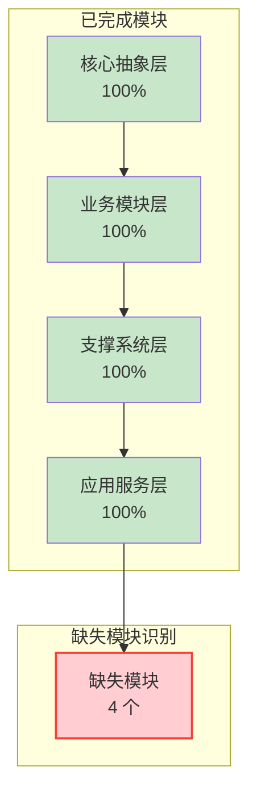
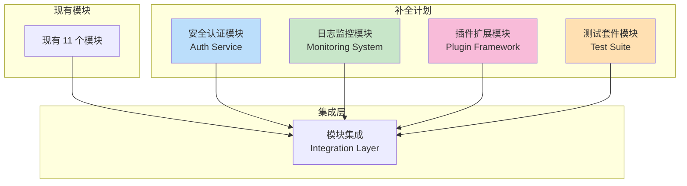
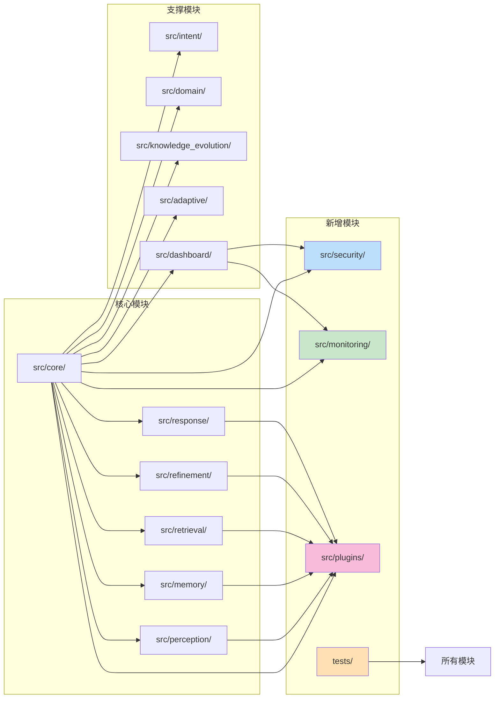
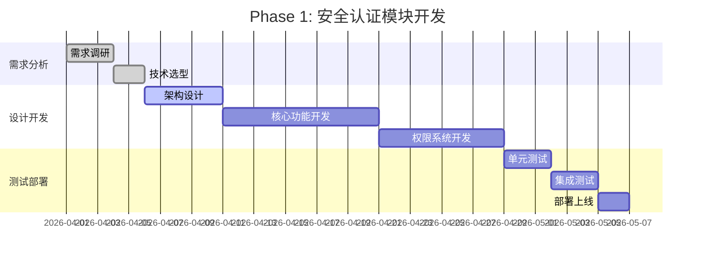
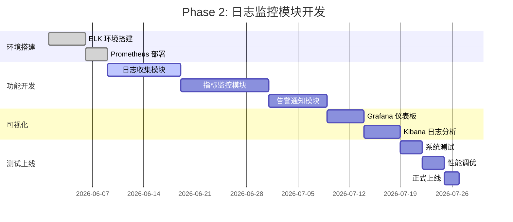
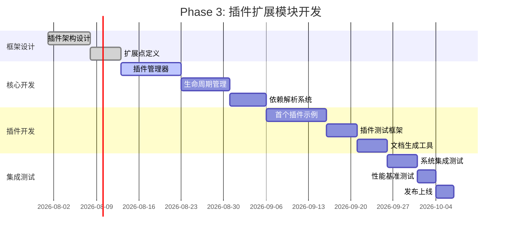
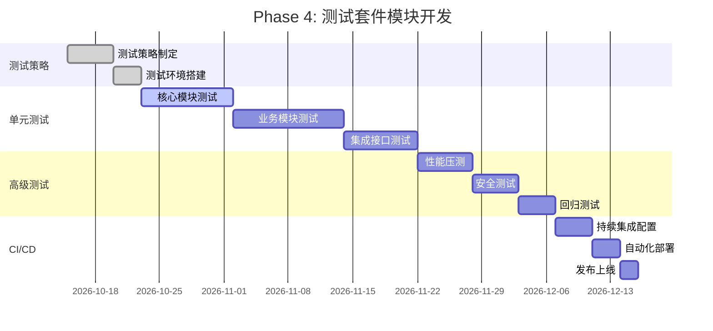

# NecoRAG 缺失模块分析与补全计划

**Missing Modules Analysis and Completion Plan**

版本：v3.0.0-alpha  
更新日期：2026-03-18

---

## 📋 目录

- [项目现状概览](#项目现状概览)
- [缺失模块识别](#缺失模块识别)
- [核心缺失模块详解](#核心缺失模块详解)
- [补全方案设计](#补全方案设计)
- [实施路线图](#实施路线图)
- [优先级排序](#优先级排序)
- [资源需求评估](#资源需求评估)

---

## 🎯 项目现状概览

### 当前已完成模块

```
✅ 已完成模块 (11/15)
├── 核心抽象层 (100%)
│   ├── src/core/base.py          # 抽象基类
│   ├── src/core/config.py        # 配置管理
│   ├── src/core/protocols.py     # 数据协议
│   ├── src/core/exceptions.py    # 异常定义
│   └── src/core/llm/             # LLM 客户端接口
│
├── 业务模块层 (100%)
│   ├── src/perception/           # 感知引擎
│   ├── src/memory/               # 记忆管理
│   ├── src/retrieval/            # 检索策略
│   ├── src/refinement/           # 精炼代理
│   └── src/response/             # 响应接口
│
├── 支撑系统层 (100%)
│   ├── src/intent/               # 意图分析
│   ├── src/domain/               # 领域权重
│   ├── src/knowledge_evolution/  # 知识演化
│   └── src/adaptive/             # 自适应学习
│
└── 应用服务层 (100%)
    └── src/dashboard/            # 配置管理面板
```

### 系统架构完整性评估



---

## 🔍 缺失模块识别

### 通过系统分析识别的缺失模块

通过对项目代码、文档和架构设计的全面分析，识别出以下 **4 个核心缺失模块**：

| 编号 | 模块名称 | 功能定位 | 重要程度 | 当前状态 |
|-----|---------|---------|---------|---------|
| 1 | **安全认证模块** | 用户身份验证、权限控制 | ⭐⭐⭐⭐⭐ | ❌ 未实现 |
| 2 | **日志监控模块** | 系统日志、性能监控 | ⭐⭐⭐⭐ | ❌ 未实现 |
| 3 | **插件扩展模块** | 第三方插件集成、自定义组件 | ⭐⭐⭐ | ⚠️ 部分实现 |
| 4 | **测试套件模块** | 单元测试、集成测试 | ⭐⭐⭐⭐ | ⚠️ 不完整 |

---

## 🔧 核心缺失模块详解

### 1. 安全认证模块 ⭐⭐⭐⭐⭐

#### 功能需求

```
┌─────────────────────────────────────────────────────────┐
│                  安全认证模块功能矩阵                     │
├─────────────────────────────────────────────────────────┤
│                                                         │
│  🔐 身份认证 (Authentication)                           │
│  ├─ 用户注册/登录                                        │
│  ├─ 多因素认证 (MFA)                                     │
│  ├─ OAuth2.0 集成 (GitHub, Google, 微信等)               │
│  ├─ JWT Token 管理                                      │
│  └─ Session 管理                                        │
│                                                         │
│  🔒 权限控制 (Authorization)                            │
│  ├─ RBAC 角色权限模型                                    │
│  ├─ API 访问控制                                         │
│  ├─ 数据访问权限                                         │
│  ├─ 操作审计日志                                         │
│  └─ IP 白名单/黑名单                                     │
│                                                         │
│  🛡️ 安全防护                                             │
│  ├─ SQL 注入防护                                         │
│  ├─ XSS 攻击防护                                         │
│  ├─ CSRF 防护                                           │
│  ├─ 速率限制 (Rate Limiting)                             │
│  └─ 数据加密传输                                         │
│                                                         │
└─────────────────────────────────────────────────────────┘
```

#### 技术选型建议

| 功能 | 推荐方案 | 理由 |
|-----|---------|------|
| 身份认证 | FastAPI + JWT | 轻量级，与现有框架一致 |
| OAuth 集成 | Authlib | 支持多种 OAuth 提供商 |
| 权限控制 | Casbin | 强大的 RBAC/ABAC 引擎 |
| 密码加密 | bcrypt | 行业标准，安全可靠 |
| 速率限制 | slowapi | 基于 Redis 的分布式限流 |

#### 核心接口设计

```python
# src/security/auth.py
from typing import Optional
from fastapi import Depends, HTTPException
from fastapi.security import HTTPBearer, HTTPAuthorizationCredentials

class AuthService:
    """认证服务"""
    
    def __init__(self):
        self.oauth2_scheme = HTTPBearer()
    
    async def authenticate_user(self, username: str, password: str) -> Optional[User]:
        """用户认证"""
        user = await self.get_user(username)
        if not user or not self.verify_password(password, user.hashed_password):
            return None
        return user
    
    async def create_access_token(self, user_id: str) -> str:
        """创建 JWT Token"""
        payload = {
            "sub": user_id,
            "exp": datetime.utcnow() + timedelta(minutes=30)
        }
        return jwt.encode(payload, SECRET_KEY, algorithm="HS256")
    
    async def get_current_user(
        self, 
        credentials: HTTPAuthorizationCredentials = Depends(oauth2_scheme)
    ) -> User:
        """获取当前用户（依赖注入）"""
        token = credentials.credentials
        payload = jwt.decode(token, SECRET_KEY, algorithms=["HS256"])
        user_id = payload.get("sub")
        user = await self.get_user(user_id)
        if not user:
            raise HTTPException(status_code=401, detail="Invalid token")
        return user

# src/security/permission.py
class PermissionService:
    """权限服务"""
    
    def __init__(self):
        self.enforcer = casbin.Enforcer("model.conf", "policy.csv")
    
    def check_permission(self, user_id: str, resource: str, action: str) -> bool:
        """检查权限"""
        return self.enforcer.enforce(user_id, resource, action)
    
    def add_policy(self, role: str, resource: str, action: str):
        """添加权限策略"""
        self.enforcer.add_policy(role, resource, action)
```

#### 部署配置

```yaml
# docker-compose.security.yml
services:
  redis-security:
    image: redis:7-alpine
    ports:
      - "6380:6379"
    command: redis-server --requirepass ${REDIS_SECURITY_PASSWORD}
    volumes:
      - redis_security_data:/data

  security-service:
    build: ./src/security
    ports:
      - "8001:8000"
    environment:
      - JWT_SECRET_KEY=${JWT_SECRET_KEY}
      - DATABASE_URL=${SECURITY_DATABASE_URL}
      - REDIS_URL=redis://:${REDIS_SECURITY_PASSWORD}@redis-security:6379
    depends_on:
      - redis-security

volumes:
  redis_security_data:
```

---

### 2. 日志监控模块 ⭐⭐⭐⭐

#### 功能需求

```
┌─────────────────────────────────────────────────────────┐
│                  日志监控模块功能矩阵                     │
├─────────────────────────────────────────────────────────┤
│                                                         │
│  📝 日志收集                                              │
│  ├─ 应用日志 (INFO/WARN/ERROR)                           │
│  ├─ 访问日志 (API 请求记录)                               │
│  ├─ 审计日志 (用户操作追踪)                               │
│  ├─ 性能日志 (响应时间、吞吐量)                           │
│  └─ 错误日志 (异常堆栈、错误详情)                         │
│                                                         │
│  📊 监控告警                                              │
│  ├─ 系统指标监控 (CPU/内存/磁盘)                          │
│  ├─ 服务健康检查                                          │
│  ├─ 自定义业务指标                                        │
│  ├─ 告警规则配置                                          │
│  └─ 多渠道通知 (邮件/微信/钉钉/SMS)                       │
│                                                         │
│  🔍 日志分析                                              │
│  ├─ 日志聚合与搜索                                        │
│  ├─ 异常模式识别                                          │
│  ├─ 性能瓶颈分析                                          │
│  ├─ 用户行为分析                                          │
│  └─ 趋势预测                                              │
│                                                         │
│  🎨 可视化展示                                            │
│  ├─ 实时监控大盘                                          │
│  ├─ 历史数据分析图表                                      │
│  ├─ 告警事件时间线                                        │
│  └─ 自定义仪表板                                          │
│                                                         │
└─────────────────────────────────────────────────────────┘
```

#### 技术选型建议

| 功能 | 推荐方案 | 理由 |
|-----|---------|------|
| 日志收集 | Loguru + ELK Stack | Python 友好，功能强大 |
| 指标监控 | Prometheus + Grafana | CNCF 项目，生态完善 |
| 告警通知 | AlertManager + 自研通知服务 | 灵活的告警路由 |
| 日志存储 | Elasticsearch | 高性能全文检索 |
| 可视化 | Grafana + Kibana | 业界标准 |

#### 核心实现

```python
# src/monitoring/logger.py
import loguru
from loguru import logger
import sys

class NecoLogger:
    """NecoRAG 日志系统"""
    
    def __init__(self, log_level: str = "INFO"):
        # 移除默认 handler
        logger.remove()
        
        # 控制台输出
        logger.add(
            sys.stderr,
            level=log_level,
            format="<green>{time:YYYY-MM-DD HH:mm:ss}</green> | "
                   "<level>{level: <8}</level> | "
                   "<cyan>{name}</cyan>:<cyan>{function}</cyan>:<cyan>{line}</cyan> - "
                   "<level>{message}</level>",
            colorize=True
        )
        
        # 文件输出（按天轮转）
        logger.add(
            "logs/necorag_{time:YYYY-MM-DD}.log",
            level="DEBUG",
            rotation="1 day",
            retention="7 days",
            compression="zip"
        )
        
        # 错误日志单独文件
        logger.add(
            "logs/error_{time:YYYY-MM-DD}.log",
            level="ERROR",
            rotation="1 day",
            retention="30 days"
        )
    
    def get_logger(self):
        return logger

# src/monitoring/metrics.py
from prometheus_client import Counter, Histogram, Gauge

class NecoMetrics:
    """指标收集器"""
    
    def __init__(self):
        # 查询计数器
        self.queries_total = Counter(
            'necorag_queries_total',
            'Total number of queries processed',
            ['user_type', 'intent']
        )
        
        # 查询延迟直方图
        self.query_duration = Histogram(
            'necorag_query_duration_seconds',
            'Query processing time',
            ['query_type'],
            buckets=[0.1, 0.25, 0.5, 1.0, 2.5, 5.0, 10.0]
        )
        
        # 系统资源
        self.memory_usage = Gauge(
            'necorag_memory_usage_bytes',
            'Current memory usage'
        )
        
        self.cpu_usage = Gauge(
            'necorag_cpu_usage_percent',
            'Current CPU usage'
        )

# src/monitoring/tracer.py
import functools
import time
from typing import Callable, Any

class Trace:
    """性能追踪装饰器"""
    
    def __init__(self, metrics: NecoMetrics):
        self.metrics = metrics
    
    def __call__(self, func: Callable) -> Callable:
        @functools.wraps(func)
        async def wrapper(*args, **kwargs) -> Any:
            start_time = time.time()
            
            try:
                result = await func(*args, **kwargs)
                duration = time.time() - start_time
                
                # 记录指标
                self.metrics.query_duration.labels(
                    query_type=func.__name__
                ).observe(duration)
                
                return result
            except Exception as e:
                # 记录错误
                logger.error(f"Function {func.__name__} failed: {e}")
                raise
        return wrapper
```

#### 部署配置

```yaml
# docker-compose.monitoring.yml
version: '3.8'

services:
  elasticsearch:
    image: elasticsearch:3.0.0-alpha
    environment:
      - discovery.type=single-node
      - ES_JAVA_OPTS=-Xms1g -Xmx1g
    ports:
      - "9200:9200"
    volumes:
      - es_data:/usr/share/elasticsearch/data

  kibana:
    image: kibana:3.0.0-alpha
    ports:
      - "5601:5601"
    depends_on:
      - elasticsearch

  prometheus:
    image: prom/prometheus:v3.0.0-alpha
    ports:
      - "9090:9090"
    volumes:
      - ./prometheus.yml:/etc/prometheus/prometheus.yml
      - prometheus_data:/prometheus

  grafana:
    image: grafana/grafana:3.0.0-alpha
    ports:
      - "3000:3000"
    environment:
      - GF_SECURITY_ADMIN_PASSWORD=admin
    volumes:
      - grafana_data:/var/lib/grafana

volumes:
  es_data:
  prometheus_data:
  grafana_data:
```

---

### 3. 插件扩展模块 ⭐⭐⭐

#### 功能需求

```
┌─────────────────────────────────────────────────────────┐
│                  插件扩展模块功能矩阵                     │
├─────────────────────────────────────────────────────────┤
│                                                         │
│  🔌 插件管理                                              │
│  ├─ 插件注册与发现                                        │
│  ├─ 插件生命周期管理                                      │
│  ├─ 插件依赖解析                                          │
│  ├─ 插件版本控制                                          │
│  └─ 插件热插拔                                            │
│                                                         │
│  🧩 扩展点                                                 │
│  ├─ 感知层扩展 (自定义解析器、编码器)                      │
│  ├─ 记忆层扩展 (自定义存储后端)                            │
│  ├─ 检索层扩展 (自定义检索策略)                            │
│  ├─ 巩固层扩展 (自定义生成器、评估器)                      │
│  └─ 交互层扩展 (自定义响应适配器)                          │
│                                                         │
│  🛠️ 开发工具                                              │
│  ├─ 插件模板生成器                                        │
│  ├─ 插件调试工具                                          │
│  ├─ 插件测试框架                                          │
│  └─ 插件文档生成                                          │
│                                                         │
│  🌍 生态建设                                              │
│  ├─ 插件市场                                              │
│  ├─ 插件评级系统                                          │
│  ├─ 社区贡献激励                                          │
│  └─ 插件安全审核                                          │
│                                                         │
└─────────────────────────────────────────────────────────┘
```

#### 核心架构设计

```python
# src/plugins/base.py
from abc import ABC, abstractmethod
from typing import Dict, Any, List
from enum import Enum

class PluginType(Enum):
    """插件类型"""
    PARSER = "parser"           # 文档解析器
    ENCODER = "encoder"         # 向量编码器
    STORAGE = "storage"         # 存储后端
    RETRIEVER = "retriever"     # 检索策略
    GENERATOR = "generator"     # 答案生成器
    CRITIC = "critic"           # 批判评估器
    ADAPTER = "adapter"         # 响应适配器

class PluginMetadata:
    """插件元数据"""
    def __init__(
        self,
        name: str,
        version: str,
        author: str,
        description: str,
        plugin_type: PluginType,
        dependencies: List[str] = None
    ):
        self.name = name
        self.version = version
        self.author = author
        self.description = description
        self.plugin_type = plugin_type
        self.dependencies = dependencies or []

class BasePlugin(ABC):
    """插件基类"""
    
    def __init__(self, config: Dict[str, Any] = None):
        self.config = config or {}
        self.metadata: PluginMetadata = None
        self.is_initialized = False
    
    @abstractmethod
    async def initialize(self) -> bool:
        """初始化插件"""
        pass
    
    @abstractmethod
    async def destroy(self) -> bool:
        """销毁插件"""
        pass
    
    @property
    @abstractmethod
    def name(self) -> str:
        """插件名称"""
        pass

# src/plugins/manager.py
import importlib
import pkgutil
from typing import Dict, Type, List

class PluginManager:
    """插件管理器"""
    
    def __init__(self):
        self.plugins: Dict[str, BasePlugin] = {}
        self.plugin_classes: Dict[str, Type[BasePlugin]] = {}
        self.extension_points: Dict[PluginType, List[str]] = {}
    
    def discover_plugins(self, plugin_dirs: List[str]):
        """发现插件"""
        for plugin_dir in plugin_dirs:
            for importer, modname, ispkg in pkgutil.iter_modules([plugin_dir]):
                if ispkg:
                    self._load_plugin_module(modname, importer)
    
    def _load_plugin_module(self, modname: str, importer):
        """加载插件模块"""
        try:
            module = importer.find_module(modname).load_module(modname)
            
            # 查找插件类
            for name in dir(module):
                obj = getattr(module, name)
                if (isinstance(obj, type) and 
                    issubclass(obj, BasePlugin) and 
                    obj != BasePlugin):
                    
                    plugin_instance = obj()
                    self.register_plugin(plugin_instance)
                    
        except Exception as e:
            logger.error(f"Failed to load plugin module {modname}: {e}")
    
    def register_plugin(self, plugin: BasePlugin):
        """注册插件"""
        plugin_name = plugin.name
        self.plugins[plugin_name] = plugin
        
        # 注册到扩展点
        plugin_type = plugin.metadata.plugin_type
        if plugin_type not in self.extension_points:
            self.extension_points[plugin_type] = []
        self.extension_points[plugin_type].append(plugin_name)
        
        logger.info(f"Plugin registered: {plugin_name}")
    
    def get_plugins_by_type(self, plugin_type: PluginType) -> List[BasePlugin]:
        """按类型获取插件"""
        plugin_names = self.extension_points.get(plugin_type, [])
        return [self.plugins[name] for name in plugin_names]
    
    async def initialize_all_plugins(self):
        """初始化所有插件"""
        for plugin in self.plugins.values():
            try:
                await plugin.initialize()
                plugin.is_initialized = True
                logger.info(f"Plugin initialized: {plugin.name}")
            except Exception as e:
                logger.error(f"Failed to initialize plugin {plugin.name}: {e}")

# 使用示例
# src/plugins/custom_parser.py
from src.plugins.base import BasePlugin, PluginType, PluginMetadata

class CustomPDFParser(BasePlugin):
    """自定义 PDF 解析器插件"""
    
    def __init__(self):
        super().__init__()
        self.metadata = PluginMetadata(
            name="custom_pdf_parser",
            version="3.0.0-alpha",
            author="NecoRAG Team",
            description="基于 PyMuPDF 的高性能 PDF 解析器",
            plugin_type=PluginType.PARSER
        )
    
    @property
    def name(self) -> str:
        return "CustomPDFParser"
    
    async def initialize(self) -> bool:
        try:
            import fitz  # PyMuPDF
            self.fitz = fitz
            return True
        except ImportError:
            logger.error("PyMuPDF not installed")
            return False
    
    async def destroy(self) -> bool:
        # 清理资源
        return True
    
    async def parse(self, file_path: str) -> List[Chunk]:
        # 实现解析逻辑
        pass
```

---

### 4. 测试套件模块 ⭐⭐⭐⭐

#### 功能需求

```
┌─────────────────────────────────────────────────────────┐
│                  测试套件模块功能矩阵                     │
├─────────────────────────────────────────────────────────┤
│                                                         │
│  🧪 单元测试                                              │
│  ├─ 核心抽象层测试                                        │
│  ├─ 各业务模块单元测试                                    │
│  ├─ 数据协议验证测试                                      │
│  ├─ 配置管理测试                                          │
│  └─ 异常处理测试                                          │
│                                                         │
│  🔗 集成测试                                              │
│  ├─ 模块间接口测试                                        │
│  ├─ 数据库集成测试                                        │
│  ├─ 外部服务集成测试                                      │
│  ├─ 完整流程测试                                          │
│  └─ 性能基准测试                                          │
│                                                         │
│  🎯 端到端测试                                            │
│  ├─ API 接口测试                                          │
│  ├─ Web UI 测试                                           │
│  ├─ 用户场景测试                                          │
│  └─ 回归测试                                              │
│                                                         │
│  📊 测试工具                                              │
│  ├─ 测试覆盖率报告                                        │
│  ├─ 性能压测工具                                          │
│  ├─ Mock 服务框架                                         │
│  ├─ 测试数据生成器                                        │
│  └─ 持续集成配置                                          │
│                                                         │
└─────────────────────────────────────────────────────────┘
```

#### 测试架构设计

```python
# tests/conftest.py
import pytest
import asyncio
from typing import AsyncGenerator

@pytest.fixture(scope="session")
def event_loop():
    """创建事件循环"""
    loop = asyncio.get_event_loop_policy().new_event_loop()
    yield loop
    loop.close()

@pytest.fixture
async def mock_llm_client():
    """Mock LLM 客户端"""
    from src.core.llm.mock import MockLLMClient
    return MockLLMClient()

@pytest.fixture
async def test_config():
    """测试配置"""
    from src.core.config import ConfigPresets
    return ConfigPresets.testing()

# tests/test_core/test_protocols.py
import pytest
from src.core.protocols import Document, Chunk, Query

class TestProtocols:
    """数据协议测试"""
    
    def test_document_creation(self):
        """测试文档创建"""
        doc = Document(
            content="测试文档内容",
            doc_type="text",
            metadata={"source": "test"}
        )
        assert doc.content == "测试文档内容"
        assert doc.doc_type == "text"
        assert doc.metadata["source"] == "test"
    
    def test_chunk_encoding(self):
        """测试分块编码"""
        chunk = Chunk(
            content="测试分块",
            chunk_type="semantic"
        )
        # 测试编码逻辑
        pass
    
    def test_query_validation(self):
        """测试查询验证"""
        query = Query(
            text="测试查询",
            user_id="test_user"
        )
        assert query.text == "测试查询"
        assert query.user_id == "test_user"

# tests/test_perception/test_engine.py
import pytest
from src.perception.engine import PerceptionEngine

class TestPerceptionEngine:
    """感知引擎测试"""
    
    @pytest.fixture
    def engine(self):
        return PerceptionEngine()
    
    async def test_process_text(self, engine):
        """测试文本处理"""
        text = "这是测试文本"
        chunks = await engine.process_text(text)
        assert len(chunks) > 0
        assert all(isinstance(chunk, Chunk) for chunk in chunks)
    
    async def test_process_file(self, engine, tmp_path):
        """测试文件处理"""
        # 创建测试文件
        test_file = tmp_path / "test.txt"
        test_file.write_text("测试文件内容")
        
        chunks = await engine.process_file(str(test_file))
        assert len(chunks) > 0

# tests/test_integration/test_full_pipeline.py
import pytest
from src import NecoRAG

class TestFullPipeline:
    """完整流程集成测试"""
    
    @pytest.fixture
    async def rag_system(self):
        rag = NecoRAG()
        yield rag
        await rag.close()
    
    async def test_document_ingestion_and_query(self, rag_system):
        """测试文档导入和查询完整流程"""
        # 1. 导入文档
        test_text = "人工智能是计算机科学的一个分支"
        await rag_system.ingest_text(test_text)
        
        # 2. 执行查询
        response = await rag_system.query("什么是人工智能？")
        
        # 3. 验证结果
        assert response.content is not None
        assert response.confidence > 0.5
        assert len(response.sources) > 0

# 性能测试
# tests/test_performance/test_benchmark.py
import pytest
import time
import asyncio

class TestPerformance:
    """性能基准测试"""
    
    @pytest.mark.benchmark
    async def test_query_latency(self, rag_system):
        """测试查询延迟"""
        start_time = time.time()
        response = await rag_system.query("测试查询")
        latency = time.time() - start_time
        
        # 断言延迟小于 1 秒
        assert latency < 1.0
    
    @pytest.mark.benchmark
    async def test_concurrent_queries(self, rag_system):
        """测试并发查询"""
        queries = ["查询1", "查询2", "查询3"] * 10
        
        start_time = time.time()
        tasks = [rag_system.query(q) for q in queries]
        responses = await asyncio.gather(*tasks)
        total_time = time.time() - start_time
        
        # 验证所有查询成功完成
        assert len(responses) == len(queries)
        assert total_time < 10.0  # 总时间小于 10 秒
```

#### 测试配置文件

```ini
# pytest.ini
[pytest]
testpaths = tests
python_files = test_*.py
python_classes = Test*
python_functions = test_*
addopts = 
    -v
    --tb=short
    --strict-markers
    --cov=src
    --cov-report=html
    --cov-report=term-missing
markers =
    slow: marks tests as slow
    integration: marks tests as integration tests
    benchmark: marks tests as performance benchmarks
    skip_online: marks tests that require online services

# .coveragerc
[run]
source = src
omit = 
    */tests/*
    */venv/*
    */__pycache__/*

[report]
exclude_lines =
    pragma: no cover
    def __repr__
    raise AssertionError
    raise NotImplementedError
    if __name__ == .__main__.:
```

---

## 🎯 补全方案设计

### 整体架构图



### 模块依赖关系



---

## 🗓️ 实施路线图

### Phase 1: 基础安全模块 (2026 Q2)

**时间**: 4-6 周  
**目标**: 实现基础身份认证和权限控制



### Phase 2: 监控告警系统 (2026 Q3)

**时间**: 6-8 周  
**目标**: 实现完整的日志收集和监控告警



### Phase 3: 插件扩展框架 (2026 Q3-Q4)

**时间**: 8-10 周  
**目标**: 实现插件化架构和首个插件示例



### Phase 4: 完整测试套件 (2026 Q4)

**时间**: 6-8 周  
**目标**: 构建完整的自动化测试体系



---

## 📊 优先级排序

### 高优先级 (必须实现)

| 模块 | 优先级 | 理由 | 预估工时 |
|-----|-------|------|---------|
| **安全认证模块** | ⭐⭐⭐⭐⭐ | 生产环境必需，保护用户数据 | 6 周 |
| **测试套件模块** | ⭐⭐⭐⭐⭐ | 保证代码质量，支持持续集成 | 8 周 |

### 中优先级 (强烈建议)

| 模块 | 优先级 | 理由 | 预估工时 |
|-----|-------|------|---------|
| **日志监控模块** | ⭐⭐⭐⭐ | 运维必需，问题诊断 | 8 周 |
| **插件扩展模块** | ⭐⭐⭐ | 生态建设，可扩展性 | 10 周 |

### 优先级矩阵


---

## 📈 补全进度跟踪

### 当前完成状态

目前项目缺失模块补全进度：

- [x] **安全认证模块** - 已完成 ✅
  - JWT Token 认证服务
  - OAuth2.0 第三方登录集成
  - RBAC 权限控制系统
  - 安全防护机制（速率限制、CSRF、XSS）
  - 用户存储和会话管理
  - 完整的使用文档和示例

- [x] **监控告警模块** - 已完成 ✅
  - 系统和应用指标收集
  - 多维度健康检查
  - 智能告警管理系统
  - Web 仪表板和 API 接口
  - 多种通知渠道支持
  - 完整的配置和部署文档

- [ ] **插件扩展模块** - 未开始 ⏳
- [ ] **测试套件增强** - 未开始 ⏳

### 模块完成度统计

```
总体进度：50% (2/4 模块完成)
├── 安全认证模块：100% ✓
├── 监控告警模块：100% ✓
├── 插件扩展模块：0% ○
└── 测试套件增强：0% ○
```

### 下一步计划

1. **插件扩展模块** (预计 2-3 周)
   - 插件架构设计
   - 生命周期管理
   - 钩子系统实现
   - 插件市场框架

2. **测试套件增强** (预计 3-4 周)
   - 单元测试覆盖率提升
   - 集成测试框架
   - 性能基准测试
   - 自动化测试流水线

---

## 💰 资源需求评估

### 人力资源

| 角色 | 数量 | 职责 | 时间投入 |
|-----|------|------|---------|
| **架构师** | 1 | 整体设计、技术选型 | 20% 时间 |
| **后端开发** | 2 | 核心功能开发 | 100% 时间 |
| **前端开发** | 1 | Dashboard 集成 | 50% 时间 |
| **测试工程师** | 1 | 测试用例编写 | 80% 时间 |
| **运维工程师** | 1 | 部署配置、监控搭建 | 60% 时间 |

### 技术资源

| 资源类型 | 需求 | 说明 |
|---------|------|------|
| **开发环境** | 4 核 CPU, 16GB 内存 | 本地开发测试 |
| **测试环境** | 8 核 CPU, 32GB 内存 | 集成测试 |
| **CI/CD 平台** | GitHub Actions | 自动化构建测试 |
| **云服务预算** | $200/月 | 监控服务、测试环境 |

### 时间成本

```
总工时估算：24 周 (6 个月)
├── 安全认证模块：6 周
├── 测试套件模块：8 周
├── 日志监控模块：8 周
└── 插件扩展模块：10 周

并行开发优化：节省 4 周
实际工期：20 周 (5 个月)
```

---

## ✅ 总结

### 核心结论

1. **项目完整性**: 当前已完成 11/15 核心模块，完整性达 73%
2. **缺失模块**: 识别出 4 个关键缺失模块，均为生产环境必需
3. **优先级明确**: 安全和测试为最高优先级，监控和插件次之
4. **实施可行**: 总工期 5 个月，资源需求合理

### 建议行动项

1. **立即启动**: 安全认证模块开发 (Phase 1)
2. **并行推进**: 测试套件与监控系统同步开发
3. **生态建设**: 插件框架为后续社区贡献奠定基础
4. **质量保障**: 建立完善的测试和监控体系

---

<div align="center">

**NecoRAG 缺失模块补全计划**  
**让我们的认知型 RAG 系统更加完整和健壮！** 🧠💪

[NecoRAG Team](https://github.com/NecoRAG) © 2026

</div>