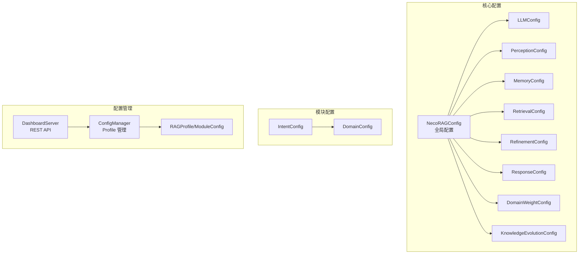
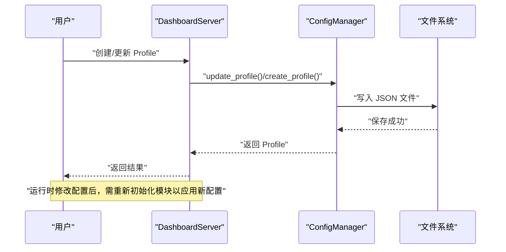
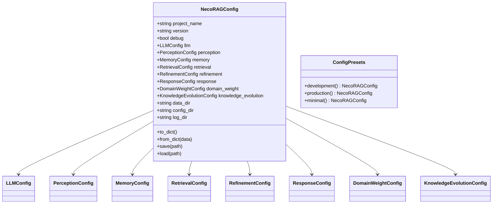
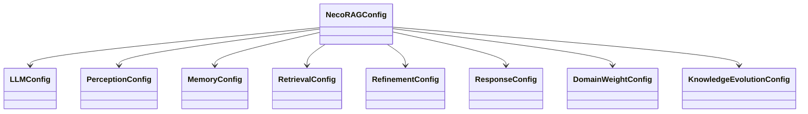
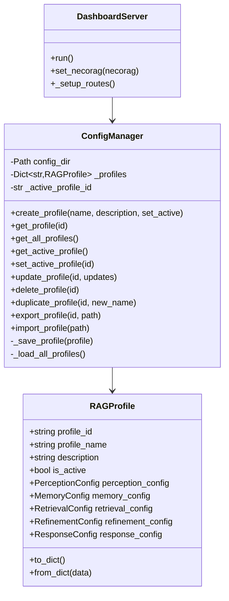
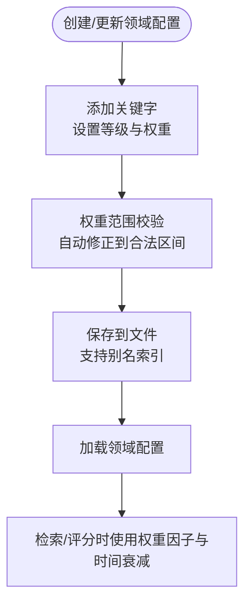
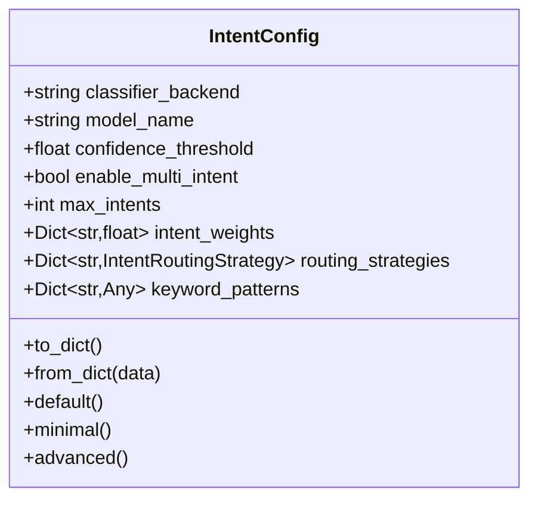
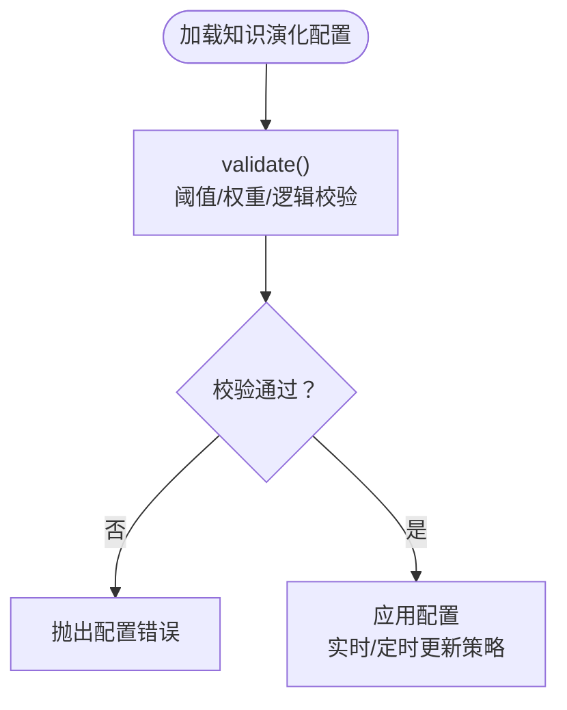
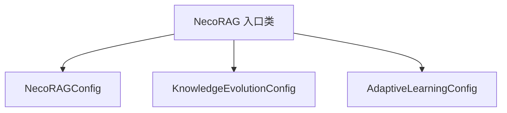

# 配置管理系统

<cite>
**本文档引用的文件**
- [src/core/config.py](file://src/core/config.py)
- [src/dashboard/config_manager.py](file://src/dashboard/config_manager.py)
- [src/dashboard/models.py](file://src/dashboard/models.py)
- [src/dashboard/server.py](file://src/dashboard/server.py)
- [src/domain/config.py](file://src/domain/config.py)
- [src/intent/config.py](file://src/intent/config.py)
- [src/knowledge_evolution/config.py](file://src/knowledge_evolution/config.py)
- [src/core/exceptions.py](file://src/core/exceptions.py)
- [src/necorag.py](file://src/necorag.py)
- [README.md](file://README.md)
- [src/dashboard/USAGE_GUIDE.md](file://src/dashboard/USAGE_GUIDE.md)
- [src/dashboard/README.md](file://src/dashboard/README.md)
</cite>

## 目录
1. [简介](#简介)
2. [项目结构](#项目结构)
3. [核心组件](#核心组件)
4. [架构总览](#架构总览)
5. [详细组件分析](#详细组件分析)
6. [依赖关系分析](#依赖关系分析)
7. [性能考虑](#性能考虑)
8. [故障排查指南](#故障排查指南)
9. [结论](#结论)
10. [附录](#附录)

## 简介
本文件面向 NecoRAG 配置管理系统，系统性阐述配置类的设计架构、预设配置模式、动态配置更新机制与验证策略。文档覆盖全局配置、模块配置、领域配置、意图配置、知识演化配置以及 Dashboard 的配置管理能力，并提供配置文件格式、环境变量支持、运行时修改方法、错误处理与配置迁移指南。

## 项目结构
NecoRAG 的配置体系由“核心配置类 + 模块配置类 + Dashboard 配置管理 + 领域/意图/知识演化专用配置”构成，形成“分层配置 + 统一加载 + 动态管理”的整体架构。

**图表来源**
- [src/core/config.py:266-322](file://src/core/config.py#L266-L322)
- [src/dashboard/config_manager.py:14-315](file://src/dashboard/config_manager.py#L14-L315)
- [src/dashboard/models.py:165-220](file://src/dashboard/models.py#L165-L220)
- [src/dashboard/server.py:48-484](file://src/dashboard/server.py#L48-L484)

**章节来源**
- [src/core/config.py:45-322](file://src/core/config.py#L45-L322)
- [src/dashboard/config_manager.py:14-315](file://src/dashboard/config_manager.py#L14-L315)
- [src/dashboard/models.py:165-220](file://src/dashboard/models.py#L165-L220)
- [src/dashboard/server.py:48-484](file://src/dashboard/server.py#L48-L484)

## 核心组件
- 全局配置类 NecoRAGConfig：聚合各层配置，提供 from_dict/保存/加载能力，支持环境变量覆盖。
- 模块配置类：LLMConfig、PerceptionConfig、MemoryConfig、RetrievalConfig、RefinementConfig、ResponseConfig、DomainWeightConfig、KnowledgeEvolutionConfig。
- 预设配置：ConfigPresets 提供 development/production/minimal 三种预设。
- Dashboard 配置管理：ConfigManager 支持 Profile 的创建/切换/更新/导入导出；DashboardServer 提供 REST API。
- 领域配置：DomainConfig/DomainConfigManager 支持领域权重、时间衰减、关键字管理与持久化。
- 意图配置：IntentConfig 提供分类器后端、路由策略、关键词模式与权重配置。
- 知识演化配置：KnowledgeEvolutionConfig 提供实时/定时更新、变更日志、健康度阈值、评分权重等。

**章节来源**
- [src/core/config.py:266-408](file://src/core/config.py#L266-L408)
- [src/dashboard/config_manager.py:14-315](file://src/dashboard/config_manager.py#L14-L315)
- [src/domain/config.py:54-161](file://src/domain/config.py#L54-L161)
- [src/intent/config.py:18-333](file://src/intent/config.py#L18-L333)
- [src/knowledge_evolution/config.py:15-222](file://src/knowledge_evolution/config.py#L15-L222)

## 架构总览
配置系统分为三层：
- 配置定义层：dataclass 配置类，统一序列化/反序列化与默认值。
- 配置加载层：load_config 支持文件 + 环境变量覆盖，ConfigPresets 提供预设。
- 配置管理层：Dashboard 提供运行时 Profile 管理与 API，支持导入导出与参数热更新。

**图表来源**
- [src/dashboard/server.py:106-328](file://src/dashboard/server.py#L106-L328)
- [src/dashboard/config_manager.py:135-167](file://src/dashboard/config_manager.py#L135-L167)

**章节来源**
- [src/dashboard/server.py:106-328](file://src/dashboard/server.py#L106-L328)
- [src/dashboard/config_manager.py:135-167](file://src/dashboard/config_manager.py#L135-L167)

## 详细组件分析

### 全局配置与预设
- NecoRAGConfig：聚合各层配置，提供 to_dict/from_dict/save/load；支持从文件加载与环境变量覆盖。
- ConfigPresets：提供 development/production/minimal 三类预设，分别面向开发调试、生产优化与最小化启动。
- 环境变量覆盖：load_config 通过 env_prefix 统一前缀映射，支持 debug、LLM 提供商、向量/图数据库提供商等关键字段。

**图表来源**
- [src/core/config.py:266-322](file://src/core/config.py#L266-L322)
- [src/core/config.py:378-408](file://src/core/config.py#L378-L408)

**章节来源**
- [src/core/config.py:266-322](file://src/core/config.py#L266-L322)
- [src/core/config.py:326-366](file://src/core/config.py#L326-L366)
- [src/core/config.py:378-408](file://src/core/config.py#L378-L408)

### 模块配置类
- LLMConfig：提供提供商、模型、API Key/URL、温度、最大 token、超时、嵌入模型与维度等。
- PerceptionConfig：分块策略、弹性分块参数、标签开关、支持的文件格式等。
- MemoryConfig：工作记忆 TTL/容量、向量/图数据库提供商与 URL、衰减参数等。
- RetrievalConfig：检索 top_k、向量/图权重、早停阈值、HyDE、重排序与新颖性惩罚等。
- RefinementConfig：迭代次数、置信度阈值、幻觉检测阈值、知识固化与修剪策略等。
- ResponseConfig：默认语气/详细级别、思维链可视化、输出格式等。
- DomainWeightConfig：关键字/时间/领域权重因子、时间衰减与常青知识开关。
- KnowledgeEvolutionConfig：实时/定时更新、变更日志、健康度阈值、评分权重、查询驱动积累等。

**图表来源**
- [src/core/config.py:82-281](file://src/core/config.py#L82-L281)

**章节来源**
- [src/core/config.py:82-281](file://src/core/config.py#L82-L281)

### Dashboard 配置管理
- ConfigManager：Profile 的创建/读取/更新/删除/复制/导入/导出、活动 Profile 切换与缓存。
- RAGProfile/ModuleConfig：定义五大模块的参数容器，支持参数字典化与反序列化。
- DashboardServer：提供 Profile 管理、模块参数管理、统计信息、知识演化相关 API。

**图表来源**
- [src/dashboard/config_manager.py:14-315](file://src/dashboard/config_manager.py#L14-L315)
- [src/dashboard/models.py:165-220](file://src/dashboard/models.py#L165-L220)
- [src/dashboard/server.py:48-484](file://src/dashboard/server.py#L48-L484)

**章节来源**
- [src/dashboard/config_manager.py:14-315](file://src/dashboard/config_manager.py#L14-L315)
- [src/dashboard/models.py:165-220](file://src/dashboard/models.py#L165-L220)
- [src/dashboard/server.py:48-484](file://src/dashboard/server.py#L48-L484)

### 领域配置与权重
- DomainConfig：关键字集合、领域相关性权重、时间衰减、领域间关系等。
- DomainConfigManager：领域配置的创建、加载、保存、活动领域设置。
- 关键字权重范围自动修正、别名索引、权重因子与时间衰减策略。

**图表来源**
- [src/domain/config.py:31-161](file://src/domain/config.py#L31-L161)

**章节来源**
- [src/domain/config.py:31-161](file://src/domain/config.py#L31-L161)

### 意图配置与路由
- IntentConfig：分类器后端、模型名、置信度阈值、多意图开关、意图权重、路由策略、关键词模式。
- 提供默认/最小化/高级三类预设，便于快速切换。

**图表来源**
- [src/intent/config.py:18-333](file://src/intent/config.py#L18-L333)

**章节来源**
- [src/intent/config.py:18-333](file://src/intent/config.py#L18-L333)

### 知识演化配置与验证
- KnowledgeEvolutionConfig：实时/定时更新、变更日志、健康度阈值、评分权重、查询驱动积累等。
- 提供默认/积极/保守/最小化四类预设，validate() 进行阈值、权重和逻辑一致性校验。

**图表来源**
- [src/knowledge_evolution/config.py:168-215](file://src/knowledge_evolution/config.py#L168-L215)

**章节来源**
- [src/knowledge_evolution/config.py:15-222](file://src/knowledge_evolution/config.py#L15-L222)

## 依赖关系分析
- NecoRAGConfig 依赖各模块配置类，形成“全局配置聚合”。
- Dashboard 依赖 ConfigManager 与 RAGProfile/ModuleConfig，提供运行时配置管理。
- 知识演化与自适应学习通过 NecoRAG 入口类按配置初始化相应组件。
- 异常体系统一由 NecoRAGError 及其子类提供一致的错误表达。

**图表来源**
- [src/necorag.py:111-183](file://src/necorag.py#L111-L183)

**章节来源**
- [src/necorag.py:111-183](file://src/necorag.py#L111-L183)
- [src/core/exceptions.py:10-455](file://src/core/exceptions.py#L10-L455)

## 性能考虑
- 配置缓存：ConfigManager 对已加载 Profile 进行内存缓存，避免频繁 IO。
- 参数验证：在更新前进行范围与逻辑校验，减少运行时异常开销。
- 批量操作：建议使用批量更新接口减少 API 调用次数。
- 环境变量覆盖：在容器化部署中通过环境变量快速覆盖关键配置，降低重启成本。

[本节为通用指导，无需特定文件引用]

## 故障排查指南
- 配置加载失败：检查配置文件 JSON 格式与字段类型，确认 from_dict/Enum 转换逻辑。
- 环境变量未生效：确认 env_prefix 与键名一致，注意布尔值转换。
- Dashboard 无法访问：检查端口占用与防火墙设置。
- 配置保存失败：确认配置目录权限与磁盘空间。
- 知识演化配置校验失败：根据 validate() 抛出的错误逐项修正阈值与权重之和。

**章节来源**
- [src/core/config.py:326-366](file://src/core/config.py#L326-L366)
- [src/dashboard/config_manager.py:289-315](file://src/dashboard/config_manager.py#L289-L315)
- [src/knowledge_evolution/config.py:168-215](file://src/knowledge_evolution/config.py#L168-L215)
- [src/core/exceptions.py:256-296](file://src/core/exceptions.py#L256-L296)

## 结论
NecoRAG 配置管理系统以 dataclass 为核心，结合文件与环境变量加载、Dashboard 运行时管理与多层预设策略，提供了灵活、可验证、可迁移的配置方案。通过清晰的层次结构与覆盖机制，用户可在开发、测试与生产环境中快速切换并持续优化系统行为。

[本节为总结性内容，无需特定文件引用]

## 附录

### 配置文件格式说明
- 全局配置：JSON，包含各模块配置字段与目录路径。
- Dashboard Profile：JSON，包含 profile_id/name/description/is_active 与五大模块参数。
- 领域配置：JSON，包含领域元数据、关键字字典与权重因子。

**章节来源**
- [src/core/config.py:66-77](file://src/core/config.py#L66-L77)
- [src/dashboard/models.py:179-220](file://src/dashboard/models.py#L179-L220)
- [src/domain/config.py:102-161](file://src/domain/config.py#L102-L161)

### 环境变量支持
- 前缀：NECORAG（可通过 load_config(env_prefix) 调整）
- 关键字段：debug、LLM 提供商/模型/API Key、向量/图数据库提供商/URL 等

**章节来源**
- [src/core/config.py:326-366](file://src/core/config.py#L326-L366)

### 运行时配置修改方法
- 通过 Dashboard UI 或 API 更新模块参数，保存后立即生效，需重新初始化模块以应用。
- 支持 Profile 导入导出，便于团队共享与版本管理。

**章节来源**
- [src/dashboard/server.py:195-228](file://src/dashboard/server.py#L195-L228)
- [src/dashboard/config_manager.py:230-278](file://src/dashboard/config_manager.py#L230-L278)
- [src/dashboard/USAGE_GUIDE.md:92-148](file://src/dashboard/USAGE_GUIDE.md#L92-L148)

### 配置验证机制与错误处理
- 配置验证：KnowledgeEvolutionConfig.validate() 校验阈值范围、权重之和与逻辑关系。
- 错误处理：统一的 NecoRAGError 及子类，提供错误码、消息与详细信息。

**章节来源**
- [src/knowledge_evolution/config.py:168-215](file://src/knowledge_evolution/config.py#L168-L215)
- [src/core/exceptions.py:10-455](file://src/core/exceptions.py#L10-L455)

### 配置迁移指南
- 从旧版配置升级：使用 NecoRAGConfig.from_dict 与各模块 from_dict，自动处理枚举与嵌套结构。
- 导出/导入：通过 ConfigManager.export_profile/import_profile 保持配置一致性。
- 预设迁移：使用 ConfigPresets.production/minimal 等预设快速对齐生产环境参数。

**章节来源**
- [src/core/config.py:292-322](file://src/core/config.py#L292-L322)
- [src/dashboard/config_manager.py:230-278](file://src/dashboard/config_manager.py#L230-L278)
- [src/core/config.py:378-408](file://src/core/config.py#L378-L408)