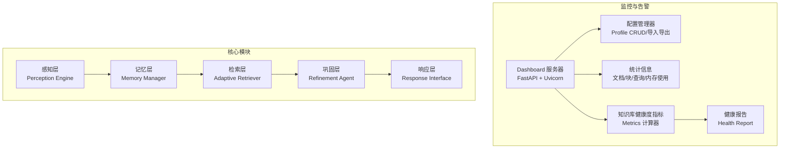
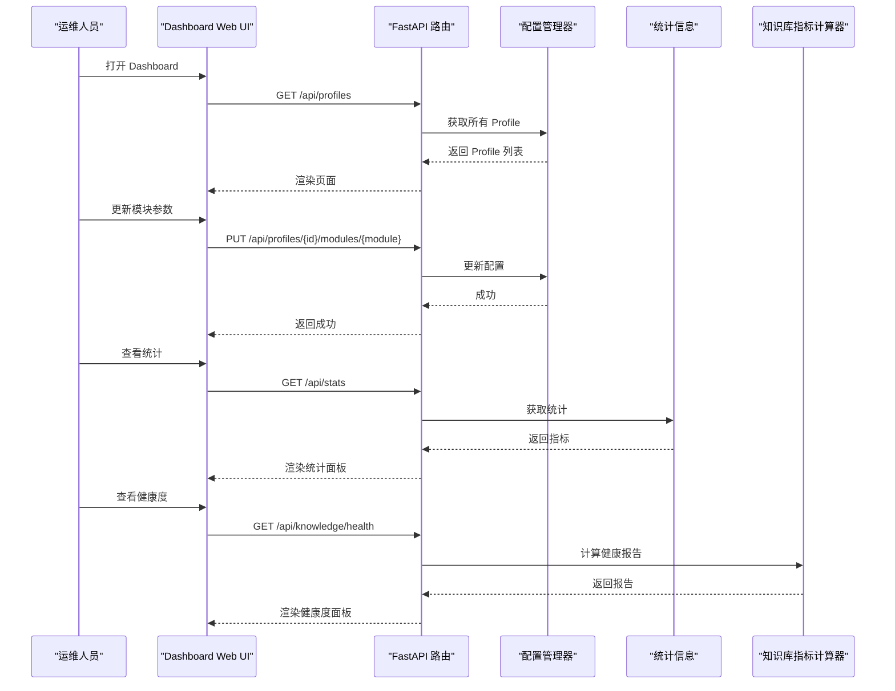
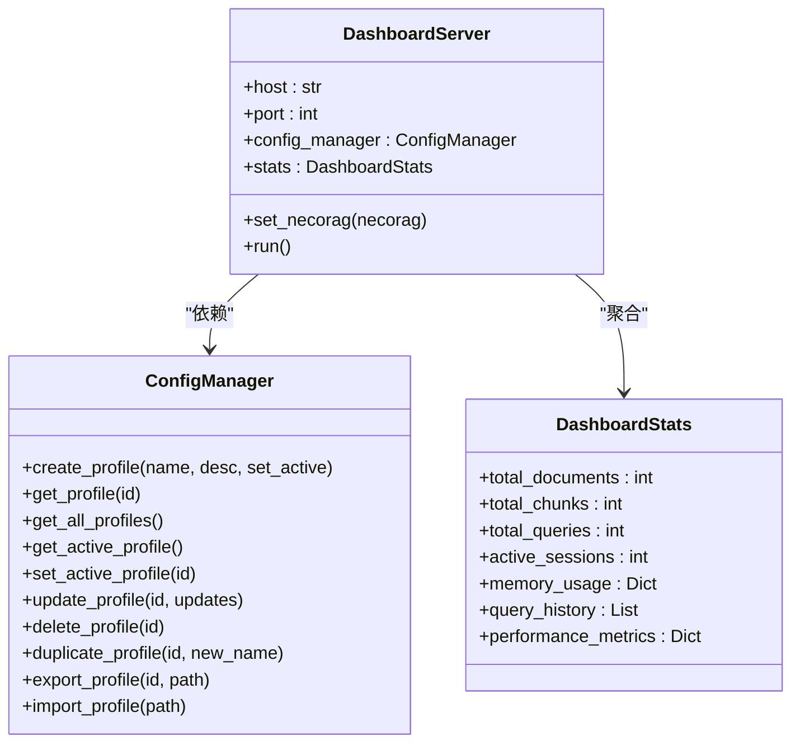
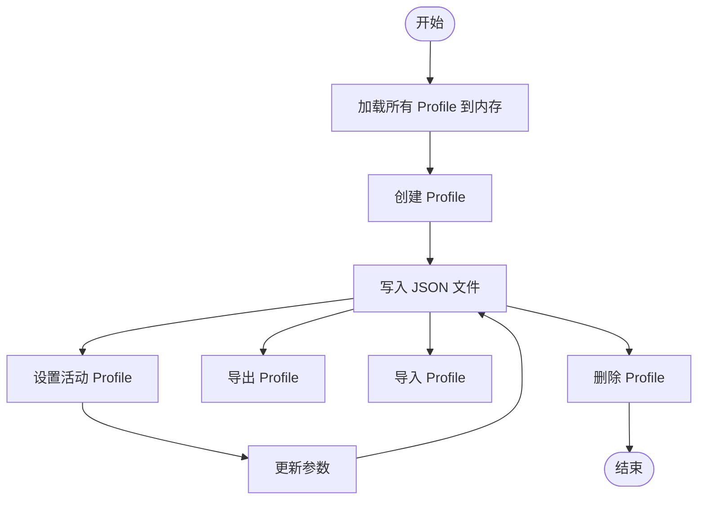
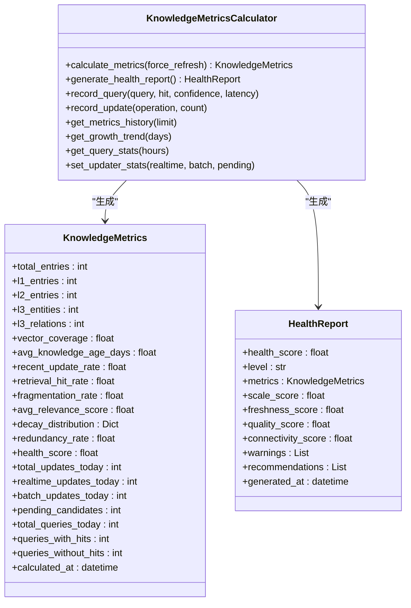
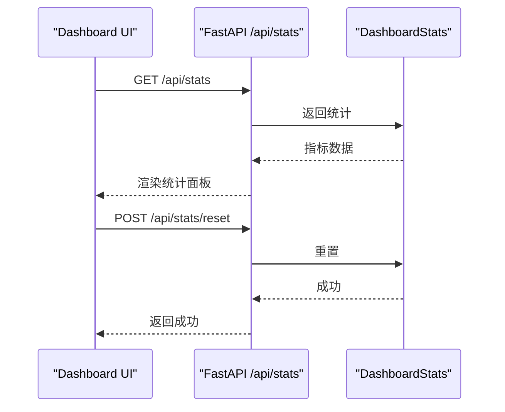
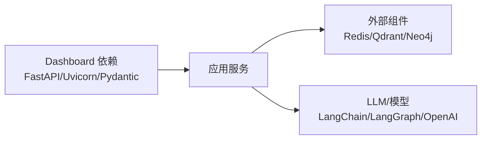

# 监控与告警

<cite>
**本文引用的文件**
- [README.md](file://README.md)
- [src/dashboard/USAGE_GUIDE.md](file://src/dashboard/USAGE_GUIDE.md)
- [src/dashboard/README.md](file://src/dashboard/README.md)
- [src/dashboard/server.py](file://src/dashboard/server.py)
- [src/dashboard/config_manager.py](file://src/dashboard/config_manager.py)
- [src/dashboard/models.py](file://src/dashboard/models.py)
- [src/knowledge_evolution/metrics.py](file://src/knowledge_evolution/metrics.py)
- [src/knowledge_evolution/models.py](file://src/knowledge_evolution/models.py)
- [src/core/config.py](file://src/core/config.py)
- [src/memory/manager.py](file://src/memory/manager.py)
- [src/retrieval/retriever.py](file://src/retrieval/retriever.py)
- [src/refinement/agent.py](file://src/refinement/agent.py)
- [requirements.txt](file://requirements.txt)
</cite>

## 目录
1. [引言](#引言)
2. [项目结构](#项目结构)
3. [核心组件](#核心组件)
4. [架构总览](#架构总览)
5. [详细组件分析](#详细组件分析)
6. [依赖分析](#依赖分析)
7. [性能考虑](#性能考虑)
8. [故障排查指南](#故障排查指南)
9. [结论](#结论)
10. [附录](#附录)

## 引言
本文件面向运维与平台工程团队，围绕 NecoRAG 的监控与告警体系提供系统化文档。内容涵盖：
- 监控指标设计与采集：应用性能指标、资源使用情况、业务关键指标
- 健康检查机制：容器健康状态、服务可用性、数据库连接状态
- 日志管理策略：日志级别、轮转与集中化收集
- 告警规则配置与通知：阈值设定、告警级别、通知渠道
- 监控仪表板搭建与可视化：Dashboard API 与前端界面
- 性能基准与容量规划：结合现有指标与配置参数给出实践建议

## 项目结构
NecoRAG 的监控与告警主要由“配置管理与仪表板”和“知识库健康度指标”两大模块构成：
- Dashboard 服务：提供 Web UI 与 REST API，用于配置 Profile、参数与实时统计
- 知识库健康度指标：持续计算知识库规模、新鲜度、质量、连通性与健康分，并生成健康报告

图表来源
- [src/dashboard/server.py:48-95](file://src/dashboard/server.py#L48-L95)
- [src/dashboard/config_manager.py:14-41](file://src/dashboard/config_manager.py#L14-L41)
- [src/knowledge_evolution/metrics.py:20-63](file://src/knowledge_evolution/metrics.py#L20-L63)

章节来源
- [README.md:380-433](file://README.md#L380-L433)
- [src/dashboard/README.md:1-85](file://src/dashboard/README.md#L1-L85)

## 核心组件
- Dashboard 服务器：提供 REST API 与 Web UI，支持 Profile 管理、模块参数配置、统计信息展示与知识库健康度 API
- 配置管理器：负责 Profile 的创建、更新、激活、导入导出与缓存
- 知识库健康度指标：计算规模、新鲜度、质量、连通性与健康分，生成健康报告
- 统计信息：聚合文档/块/查询/会话/内存使用等指标，支持重置

章节来源
- [src/dashboard/server.py:106-248](file://src/dashboard/server.py#L106-L248)
- [src/dashboard/config_manager.py:14-41](file://src/dashboard/config_manager.py#L14-L41)
- [src/knowledge_evolution/metrics.py:65-134](file://src/knowledge_evolution/metrics.py#L65-L134)
- [src/dashboard/models.py:222-232](file://src/dashboard/models.py#L222-L232)

## 架构总览
Dashboard 作为统一入口，承载配置与监控职责；知识库健康度指标独立计算并暴露 API，供 Dashboard 与外部系统消费。

图表来源
- [src/dashboard/server.py:111-167](file://src/dashboard/server.py#L111-L167)
- [src/dashboard/server.py:195-227](file://src/dashboard/server.py#L195-L227)
- [src/dashboard/server.py:231-247](file://src/dashboard/server.py#L231-L247)
- [src/dashboard/server.py:251-289](file://src/dashboard/server.py#L251-L289)

## 详细组件分析

### Dashboard 服务器与 API
- 支持 Profile 管理：创建、更新、激活、删除、复制、导入导出
- 支持模块参数管理：感知、记忆、检索、巩固、响应五个模块参数
- 支持统计信息：文档/块/查询/会话/内存使用/性能指标
- 支持知识库健康度 API：指标、健康报告、增长趋势、更新时间线、待审核候选、知识缺口

图表来源
- [src/dashboard/server.py:48-101](file://src/dashboard/server.py#L48-L101)
- [src/dashboard/config_manager.py:14-41](file://src/dashboard/config_manager.py#L14-L41)
- [src/dashboard/models.py:222-232](file://src/dashboard/models.py#L222-L232)

章节来源
- [src/dashboard/server.py:106-248](file://src/dashboard/server.py#L106-L248)
- [src/dashboard/README.md:86-203](file://src/dashboard/README.md#L86-L203)

### 配置管理器
- 负责 Profile 的持久化与缓存，支持批量更新与导入导出
- 提供活动 Profile 切换，便于运行时热更新

图表来源
- [src/dashboard/config_manager.py:290-315](file://src/dashboard/config_manager.py#L290-L315)
- [src/dashboard/config_manager.py:135-166](file://src/dashboard/config_manager.py#L135-L166)

章节来源
- [src/dashboard/config_manager.py:14-41](file://src/dashboard/config_manager.py#L14-L41)
- [src/dashboard/config_manager.py:135-166](file://src/dashboard/config_manager.py#L135-L166)

### 知识库健康度指标与报告
- 指标维度：规模、新鲜度、质量、连通性、健康分
- 报告维度：综合健康分、等级、维度评分、警告与建议
- 支持查询统计、增长趋势、更新时间线、待审核候选、知识缺口

图表来源
- [src/knowledge_evolution/metrics.py:20-134](file://src/knowledge_evolution/metrics.py#L20-L134)
- [src/knowledge_evolution/models.py:194-310](file://src/knowledge_evolution/models.py#L194-L310)

章节来源
- [src/knowledge_evolution/metrics.py:65-134](file://src/knowledge_evolution/metrics.py#L65-L134)
- [src/knowledge_evolution/models.py:194-310](file://src/knowledge_evolution/models.py#L194-L310)

### 统计信息与仪表板可视化
- DashboardStats 提供文档/块/查询/会话/内存使用/性能指标字段
- API 提供 /api/stats 与 /api/stats/reset
- Web UI 支持 Profile 列表、模块参数编辑、统计面板展示

图表来源
- [src/dashboard/server.py:231-247](file://src/dashboard/server.py#L231-L247)
- [src/dashboard/models.py:222-232](file://src/dashboard/models.py#L222-L232)

章节来源
- [src/dashboard/server.py:231-247](file://src/dashboard/server.py#L231-L247)
- [src/dashboard/models.py:222-232](file://src/dashboard/models.py#L222-L232)

### 健康检查机制与可用性监控
- 服务可用性：Dashboard 通过 FastAPI/Uvicorn 提供 HTTP 服务，可通过健康端点与日志观测
- 数据库连接状态：知识库健康度指标依赖记忆层（Working/L2/L3），需结合实际外部组件状态进行联动监控
- 建议：在生产环境为 Dashboard 增加存活探针与就绪探针，结合外部组件（Redis/Qdrant/Neo4j）的连接状态指标

章节来源
- [src/dashboard/server.py:470-483](file://src/dashboard/server.py#L470-L483)
- [src/memory/manager.py:16-47](file://src/memory/manager.py#L16-L47)

### 日志管理策略
- 日志级别：建议使用 INFO/DEBUG/WARNING/ERROR 分层，生产环境默认 INFO，问题定位临时提升至 DEBUG
- 日志轮转：建议使用标准库或第三方库（如 logging.handlers.RotatingFileHandler）按大小轮转
- 集中式收集：建议通过 Filebeat/Fluent Bit 收集日志，发送至 ELK/EFK 或 Loki/Grafana

章节来源
- [requirements.txt:8-11](file://requirements.txt#L8-L11)

### 告警规则配置与通知机制
- 阈值设置：健康分低于阈值触发预警；检索命中率、平均相关性、碎片率、冗余度异常触发告警
- 告警级别：健康分低为预警，命中率显著下降为严重
- 通知渠道：邮件、IM（企业微信/钉钉）、Webhook（集成 Prometheus Alertmanager）

章节来源
- [src/knowledge_evolution/metrics.py:507-571](file://src/knowledge_evolution/metrics.py#L507-L571)
- [src/knowledge_evolution/models.py:275-310](file://src/knowledge_evolution/models.py#L275-L310)

### 监控仪表板搭建与可视化
- Dashboard UI：提供 Profile 列表、模块参数编辑、统计面板
- API：/api/profiles、/api/profiles/{id}/modules/{module}、/api/stats、/api/knowledge/*
- 可视化建议：结合 Grafana/前端图表库展示健康度趋势、查询统计、增长曲线

章节来源
- [src/dashboard/README.md:86-203](file://src/dashboard/README.md#L86-L203)
- [src/dashboard/server.py:106-248](file://src/dashboard/server.py#L106-L248)

## 依赖分析
- Dashboard 依赖：FastAPI、Uvicorn、Pydantic
- 外部组件：Redis（L1）、Qdrant/Milvus（L2）、Neo4j/NebulaGraph（L3）
- LLM/模型：LangChain/LangGraph、OpenAI/Claude、BGE 系列模型

图表来源
- [requirements.txt:8-11](file://requirements.txt#L8-L11)
- [requirements.txt:18-28](file://requirements.txt#L18-L28)
- [requirements.txt:33-37](file://requirements.txt#L33-L37)
- [requirements.txt:29-31](file://requirements.txt#L29-L31)

章节来源
- [requirements.txt:1-71](file://requirements.txt#L1-L71)

## 性能考虑
- 配置缓存：Dashboard 配置管理器缓存 Profile，避免频繁 IO
- 指标缓存：知识库指标计算器内置缓存与历史记录，限制历史长度
- 参数验证：建议在更新参数前进行范围校验，防止异常配置影响性能
- 批量操作：大量参数更新建议使用批量接口减少 API 调用

章节来源
- [src/dashboard/README.md:328-338](file://src/dashboard/README.md#L328-L338)
- [src/knowledge_evolution/metrics.py:65-63](file://src/knowledge_evolution/metrics.py#L65-L63)

## 故障排查指南
- Dashboard 无法启动：检查端口占用与配置目录权限
- API 返回 404：确认 Profile ID 存在，或先获取列表
- 配置保存失败：检查配置目录写权限
- 健康度异常：根据健康报告中的警告与建议进行参数调优与数据治理

章节来源
- [src/dashboard/README.md:381-412](file://src/dashboard/README.md#L381-L412)
- [src/dashboard/server.py:117-123](file://src/dashboard/server.py#L117-L123)

## 结论
NecoRAG 的监控与告警体系以 Dashboard 为核心入口，结合知识库健康度指标，形成“配置—监控—告警—可视化”的闭环。通过合理的阈值与通知策略、完善的日志与轮转方案，以及仪表板的可视化呈现，可有效保障系统稳定运行与持续优化。

## 附录

### 监控指标清单与采集建议
- 应用性能指标
  - 首字延迟、平均延迟、吞吐量（QPS）
  - 检索命中率、平均相关性、重排序耗时
- 资源使用情况
  - CPU/内存/磁盘使用率
  - 外部组件连接数与队列长度（Redis/Qdrant/Neo4j）
- 业务关键指标
  - 文档/块总量、查询总量、活动会话数
  - 知识库健康分、规模/新鲜度/质量/连通性评分

章节来源
- [src/dashboard/models.py:222-232](file://src/dashboard/models.py#L222-L232)
- [src/knowledge_evolution/models.py:194-273](file://src/knowledge_evolution/models.py#L194-L273)

### 健康检查与数据库连接监控
- Dashboard 健康：存活探针访问 /docs 或根路径
- 外部组件：通过 SDK/客户端状态与错误计数进行健康上报
- 建议：在 Prometheus 中暴露自定义指标，结合 Grafana 做统一监控

章节来源
- [src/dashboard/server.py:470-483](file://src/dashboard/server.py#L470-L483)
- [src/memory/manager.py:16-47](file://src/memory/manager.py#L16-L47)

### 日志级别与轮转配置建议
- 级别：INFO（生产）/DEBUG（问题定位）
- 轮转：按大小轮转，保留最近 N 份
- 集中化：Filebeat/Fluent Bit → ELK/EFK 或 Loki/Grafana

章节来源
- [requirements.txt:8-11](file://requirements.txt#L8-L11)

### 告警规则与通知渠道
- 规则：健康分 < 预警阈值；命中率 < 阈值；碎片率/冗余度 > 阈值
- 级别：预警/严重
- 通知：邮件/IM/Webhook

章节来源
- [src/knowledge_evolution/metrics.py:507-571](file://src/knowledge_evolution/metrics.py#L507-L571)
- [src/knowledge_evolution/models.py:275-310](file://src/knowledge_evolution/models.py#L275-L310)

### 仪表板搭建与可视化
- UI：Profile 列表、模块参数编辑、统计面板
- API：RESTful 接口与 /docs
- 可视化：Grafana/前端图表库展示趋势与分布

章节来源
- [src/dashboard/README.md:79-85](file://src/dashboard/README.md#L79-L85)
- [src/dashboard/server.py:106-248](file://src/dashboard/server.py#L106-L248)

### 性能基准与容量规划
- 基准：参考 README 中的性能目标（召回率、幻觉率、延迟、上下文压缩）
- 调参：分块大小、top_k、扑击阈值、衰减速率、重排序开关
- 容量：根据文档/块/查询增长趋势与健康度评分进行扩容与优化

章节来源
- [README.md:465-474](file://README.md#L465-L474)
- [src/dashboard/USAGE_GUIDE.md:281-287](file://src/dashboard/USAGE_GUIDE.md#L281-L287)
- [src/core/config.py:105-132](file://src/core/config.py#L105-L132)
- [src/core/config.py:136-156](file://src/core/config.py#L136-L156)
- [src/core/config.py:159-181](file://src/core/config.py#L159-L181)
- [src/core/config.py:184-204](file://src/core/config.py#L184-L204)
- [src/core/config.py:208-222](file://src/core/config.py#L208-L222)