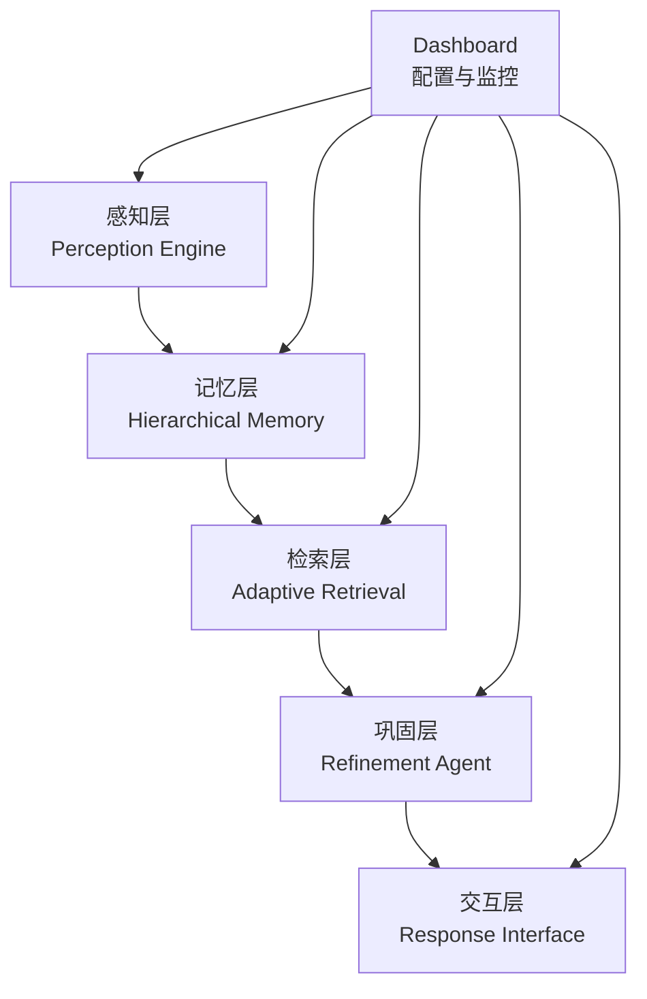
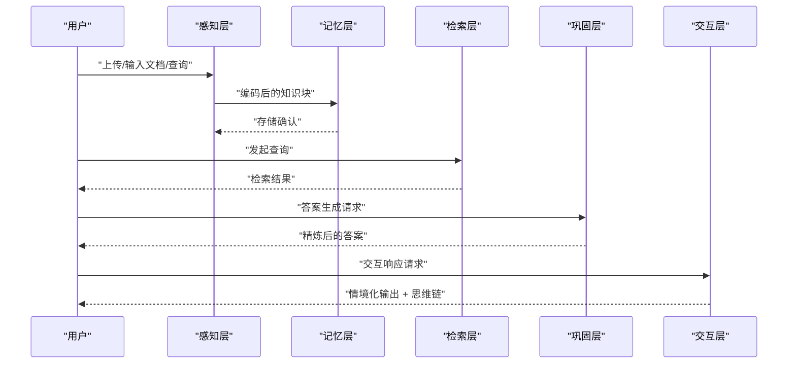
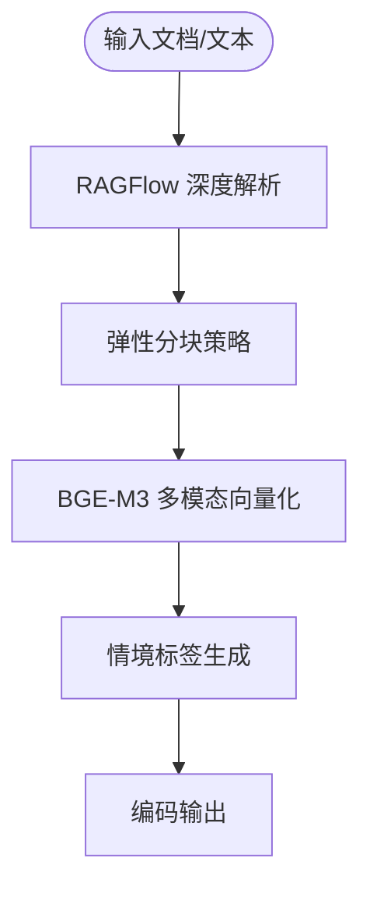
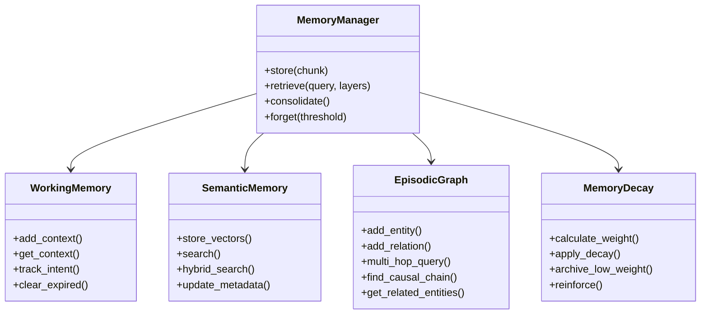
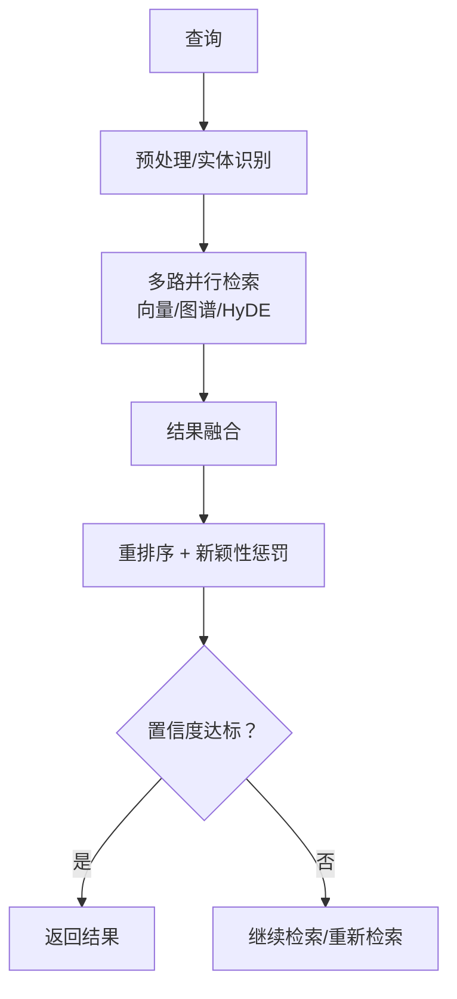
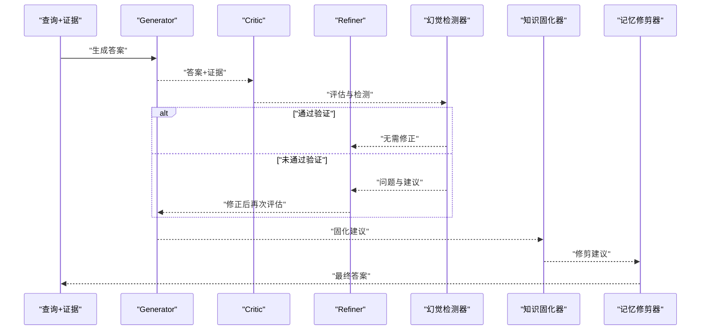
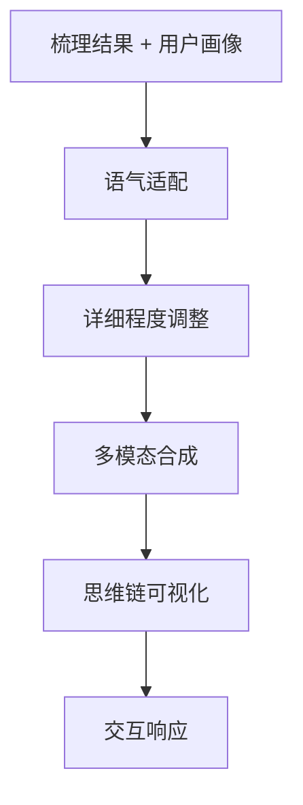
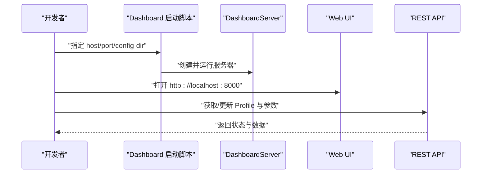
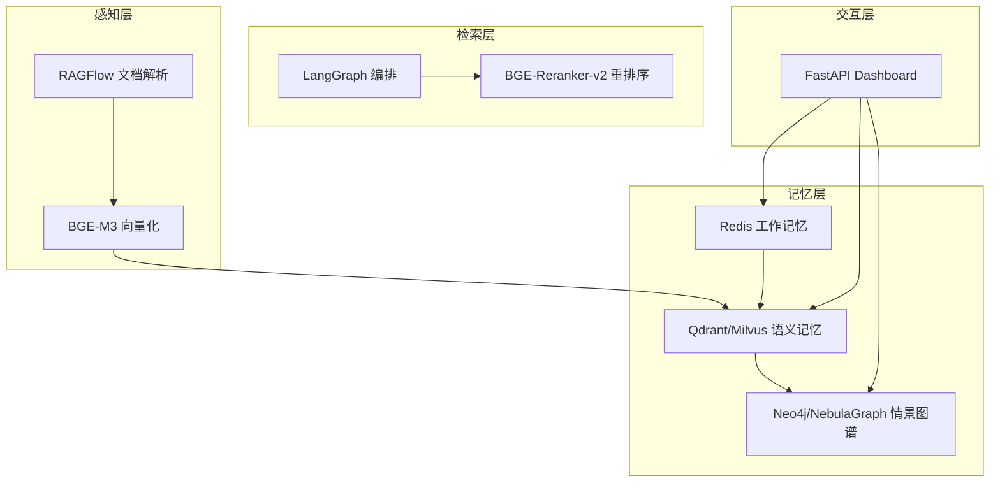

# 开发路线图与未来规划

<cite>
**本文引用的文件**
- [README.md](file://README.md)
- [design.md](file://design/design.md)
- [docs/README.md](file://docs/README.md)
- [pyproject.toml](file://pyproject.toml)
- [requirements.txt](file://requirements.txt)
- [src/necorag.py](file://src/necorag.py)
- [src/dashboard/dashboard.py](file://src/dashboard/dashboard.py)
- [src/perception/README.md](file://src/perception/README.md)
- [src/memory/README.md](file://src/memory/README.md)
- [src/retrieval/README.md](file://src/retrieval/README.md)
- [src/refinement/README.md](file://src/refinement/README.md)
- [src/response/README.md](file://src/response/README.md)
- [CONTRIBUTING.md](file://CONTRIBUTING.md)
</cite>

## 目录
1. [引言](#引言)
2. [项目结构](#项目结构)
3. [核心组件](#核心组件)
4. [架构总览](#架构总览)
5. [详细组件分析](#详细组件分析)
6. [依赖分析](#依赖分析)
7. [性能考量](#性能考量)
8. [故障排查指南](#故障排查指南)
9. [结论](#结论)
10. [附录](#附录)

## 引言
本文件面向 NecoRAG 的开发与生态建设，系统化梳理项目从 MVP 到生态演化的三阶段路线图，明确各阶段目标、已完成工作与预期成果，并解释技术栈选型理由与关键组件应用场景。同时给出社区建设、插件市场与开源生态策略，以及版本发布时间表与里程碑事件。

## 项目结构
NecoRAG 采用“五层认知”架构，围绕感知层、记忆层、检索层、巩固层与交互层展开，配合 Dashboard 配置管理与可视化调试能力，形成从数据到交互的完整闭环。

**图示来源**
- [README.md:35-85](file://README.md#L35-L85)
- [design.md:591-602](file://design/design.md#L591-L602)

**章节来源**
- [README.md:35-85](file://README.md#L35-L85)
- [docs/README.md:38-54](file://docs/README.md#L38-L54)

## 核心组件
- 感知层（Whiskers Engine）：文档解析、多模态编码、情境标签生成，为后续检索与推理提供高质量语义表示。
- 记忆层（Nine-Lives Memory）：三层记忆系统（L1 工作记忆、L2 语义记忆、L3 情景图谱），并实现动态权重衰减与主动遗忘。
- 检索层（Pounce Strategy）：混合检索（向量/关键词/图谱/HyDE）与重排序，结合早停机制（Pounce）提升效率。
- 巩固层（Grooming Agent）：基于 LangGraph 的 Generator-Critic-Refiner 闭环，实现幻觉自检、知识固化与记忆修剪。
- 交互层（Purr Interface）：情境自适应生成、多模态合成与思维链可视化，提升可解释性与用户体验。
- Dashboard：Web 配置管理与实时监控，支持 Profile 管理、参数编辑与统计信息展示。

**章节来源**
- [src/perception/README.md:1-158](file://src/perception/README.md#L1-L158)
- [src/memory/README.md:1-244](file://src/memory/README.md#L1-L244)
- [src/retrieval/README.md:1-352](file://src/retrieval/README.md#L1-L352)
- [src/refinement/README.md:1-428](file://src/refinement/README.md#L1-L428)
- [src/response/README.md:1-398](file://src/response/README.md#L1-L398)
- [README.md:380-433](file://README.md#L380-L433)

## 架构总览
五层架构与关键流程如下：

**图示来源**
- [README.md:103-136](file://README.md#L103-L136)
- [src/necorag.py:351-459](file://src/necorag.py#L351-L459)

## 详细组件分析

### 感知层（Whiskers Engine）
- 功能要点：深度文档解析（RAGFlow）、多维度向量化（BGE-M3：稠密/稀疏/实体三元组）、情境标签生成（时间/情感/重要性/主题）。
- 创新点：弹性文档分块策略，保证语义完整性；情境标签为后续检索与路由提供丰富上下文。
- 使用示例与参数见模块文档。

**图示来源**
- [src/perception/README.md:29-55](file://src/perception/README.md#L29-L55)

**章节来源**
- [src/perception/README.md:1-158](file://src/perception/README.md#L1-L158)

### 记忆层（Nine-Lives Memory）
- 三层架构：L1（Redis 工作记忆，TTL 过期）、L2（Qdrant/Milvus 向量检索）、L3（Neo4j/NebulaGraph 图谱推理）。
- 创新点：动态权重衰减（时间衰减 × 访问频率），模拟生物记忆巩固与遗忘；支持主动遗忘与归档。
- 使用示例与配置见模块文档。

**图示来源**
- [src/memory/README.md:82-147](file://src/memory/README.md#L82-L147)

**章节来源**
- [src/memory/README.md:1-244](file://src/memory/README.md#L1-L244)

### 检索层（Pounce Strategy）
- 混合检索：向量检索、关键词检索、图谱检索、HyDE 增强；结果融合与重排序（BGE-Reranker-v2）。
- 创新点：Pounce 机制（早停），一旦置信度达标立即终止冗余检索；多跳联想检索（扩散激活）。
- 使用示例与参数见模块文档。

**图示来源**
- [src/retrieval/README.md:11-41](file://src/retrieval/README.md#L11-L41)

**章节来源**
- [src/retrieval/README.md:1-352](file://src/retrieval/README.md#L1-L352)

### 巩固层（Grooming Agent）
- LangGraph 闭环：Generator → Critic → Refiner，配合幻觉检测器，实现预测误差最小化与答案验证。
- 异步知识固化：分析高频未命中查询，自动补充知识缺口、合并碎片化知识、更新图谱连接。
- 记忆修剪：识别噪声、低质量与过时信息，执行清理与强化。

**图示来源**
- [src/refinement/README.md:9-42](file://src/refinement/README.md#L9-L42)

**章节来源**
- [src/refinement/README.md:1-428](file://src/refinement/README.md#L1-L428)

### 交互层（Purr Interface）
- 情境自适应：基于用户画像（专业程度、交互风格、偏好领域）动态调整语气与详细程度。
- 可解释性输出：思维链可视化（检索路径、证据来源、推理过程）。
- 多模态合成：文本、图表与语音输出。

**图示来源**
- [src/response/README.md:11-46](file://src/response/README.md#L11-L46)

**章节来源**
- [src/response/README.md:1-398](file://src/response/README.md#L1-L398)

### Dashboard（配置与监控）
- 功能：Profile 管理、模块参数配置、实时统计监控、RESTful API。
- 使用：命令行启动、Web UI 界面、API 文档。

**图示来源**
- [src/dashboard/dashboard.py:10-26](file://src/dashboard/dashboard.py#L10-L26)

**章节来源**
- [README.md:380-433](file://README.md#L380-L433)

## 依赖分析
- 核心组件选型理由：
  - LangGraph：支持复杂循环状态机，完美实现“检索-反思-校正”闭环。
  - RAGFlow：业界最强的深度文档解析能力，支持复杂布局还原。
  - BGE-M3/BGE-Reranker-v2：多语言、长文本、稠密/稀疏混合嵌入与中文优化重排序。
  - Qdrant/Milvus：高性能向量检索，支持混合搜索与索引优化。
  - Neo4j/NebulaGraph：成熟的图谱存储与查询语言，便于多跳推理。
  - Redis：极低延迟缓存，适合工作记忆与会话上下文。
  - FastAPI：高性能 Web 框架，用于 Dashboard 服务。
- 依赖清单与可选组件见 requirements.txt 与 pyproject.toml。

**图示来源**
- [design.md:724-744](file://design/design.md#L724-L744)
- [requirements.txt:1-71](file://requirements.txt#L1-L71)
- [pyproject.toml:27-63](file://pyproject.toml#L27-L63)

**章节来源**
- [design.md:724-744](file://design/design.md#L724-L744)
- [requirements.txt:1-71](file://requirements.txt#L1-L71)
- [pyproject.toml:27-63](file://pyproject.toml#L27-L63)

## 性能考量
- 目标指标（来自 README 与设计文档）：
  - 检索准确率（Recall@K）+20%
  - 幻觉率 < 5%
  - 简单查询延迟 < 800ms（首字延迟）
  - 复杂查询延迟 < 1500ms（多跳+重排）
  - 上下文压缩率 -40%（通过记忆衰减）
- 优化策略：
  - 早停机制（Pounce）减少冗余检索
  - 动态权重衰减与主动遗忘控制上下文规模
  - 多跳检索与新颖性重排序提升相关性
  - 分层存储与索引优化（HNSW、图谱修剪）

**章节来源**
- [README.md:465-474](file://README.md#L465-L474)
- [src/retrieval/README.md:329-337](file://src/retrieval/README.md#L329-L337)
- [src/memory/README.md:223-229](file://src/memory/README.md#L223-L229)

## 故障排查指南
- 环境与依赖
  - 确认 Python 版本与依赖安装（基础与 Dashboard 依赖）。
  - 如需集成真实组件（RAGFlow、Qdrant、Neo4j、LangGraph 等），在 requirements.txt 中取消注释相应行。
- Dashboard 启动
  - 使用命令行参数指定 host/port/config-dir，或通过模块方式运行。
- 常见问题定位
  - 导入测试：运行 test_imports.py 确认模块可用。
  - 快速示例：参考 example_usage.py 与 src/dashboard/USAGE_GUIDE.md。
  - 贡献流程：遵循 CONTRIBUTING.md 的开发与提交规范。

**章节来源**
- [requirements.txt:1-71](file://requirements.txt#L1-L71)
- [src/dashboard/dashboard.py:10-26](file://src/dashboard/dashboard.py#L10-L26)
- [CONTRIBUTING.md:127-138](file://CONTRIBUTING.md#L127-L138)

## 结论
NecoRAG 以“五层认知”架构为核心，结合类脑记忆机制与认知科学原理，构建从感知到交互的完整闭环。通过三阶段路线图，项目将依次完成骨架搭建（MVP）、大脑注入（核心功能完善）与进化与生态（生态系统建设），并在每个阶段明确目标、完成度与成果。技术栈选型兼顾性能、可扩展性与易用性，配合 Dashboard 与可视化调试能力，为开发者与用户提供良好的工程体验。

## 附录

### 开发路线图与里程碑
- Phase 1：骨架搭建（MVP）- 2026 Q2
  - 完成感知层与记忆层基础对接
  - 实现基本 Vector + Graph 混合检索
  - 发布 NecoRAG Core SDK（Python）
  - 确定 Logo 与基础 UI 风格
- Phase 2：大脑注入（核心功能完善）- 2026 Q3
  - 集成 LangGraph 实现 Refinement Agent（自检与校正）
  - 实现动态重排序与 Novelty 检测
  - 实现知识库实时更新引擎与查询驱动知识积累
  - 实现自适应学习引擎基础框架与用户行为追踪
  - 发布 NecoRAG Server（Docker 一键部署）
  - Dashboard 实时监控增强
- Phase 3：进化与生态（生态系统建设）- 2026 Q4
  - 实现异步知识固化与自动遗忘机制
  - 知识库量化指标体系与健康仪表盘
  - 定时批量更新与增量同步引擎
  - 检索策略自优化与集体智慧聚合引擎
  - 推出可视化调试面板（NecoRAG Dashboard），展示“思维路径”
  - 建立插件市场，支持自定义“感知器”和“记忆策略”
  - 社区运营：举办“NecoRAG Hackathon”，鼓励开发者构建专属智能 Agent

**章节来源**
- [README.md:475-495](file://README.md#L475-L495)
- [design.md:764-791](file://design/design.md#L764-L791)

### 技术栈选型与组件应用场景
- 编排引擎：LangGraph（实现 Refinement Agent 闭环）
- 文档解析：RAGFlow（深度文档解析）
- 向量数据库：Qdrant（向量检索与混合搜索）
- 图数据库：Neo4j（图谱推理与多跳）
- 缓存：Redis（工作记忆与会话上下文）
- 嵌入模型：BGE-M3（多模态向量化）
- 重排序：BGE-Reranker-v2（中文优化）
- Web 框架：FastAPI（Dashboard 服务）

**章节来源**
- [README.md:496-510](file://README.md#L496-L510)
- [design.md:724-744](file://design/design.md#L724-L744)

### 社区建设与开源生态策略
- 社区运营
  - 通过 Issues 与 Discussions 收集反馈与创意
  - 举办 NecoRAG Hackathon，鼓励开发者贡献插件与应用
- 插件市场
  - 支持自定义“感知器”（解析器/分块策略/标签生成器/向量编码器）
  - 支持自定义“记忆策略”（权重衰减/主动遗忘/归档规则）
- 开源治理
  - 遵循 CONTRIBUTING.md 的开发与提交规范
  - 保持 MIT 许可证，促进广泛采用与二次开发

**章节来源**
- [CONTRIBUTING.md:1-179](file://CONTRIBUTING.md#L1-L179)
- [README.md:490-494](file://README.md#L490-L494)