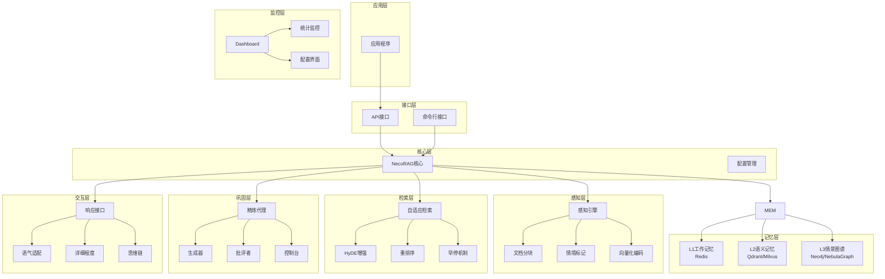
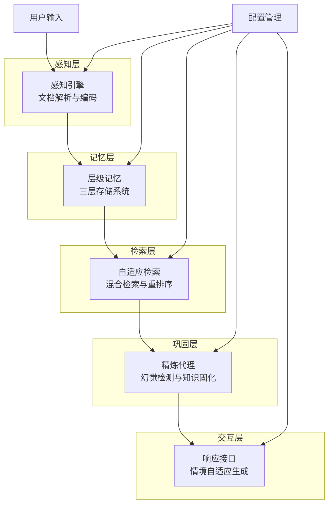
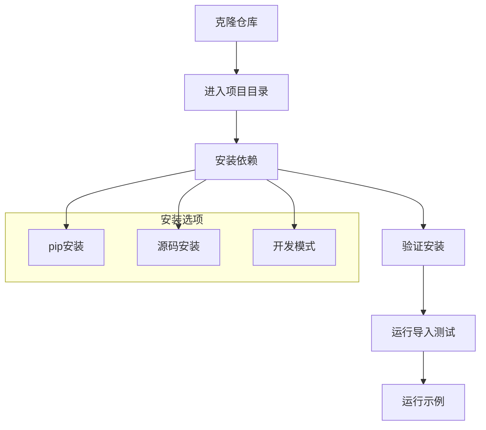
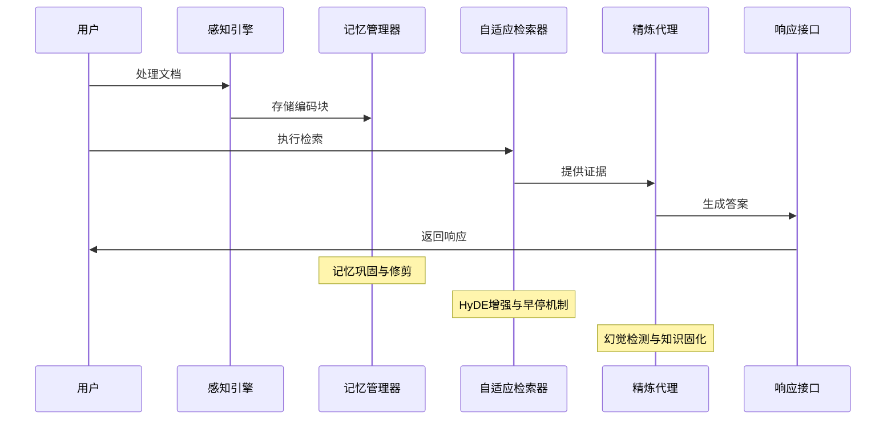
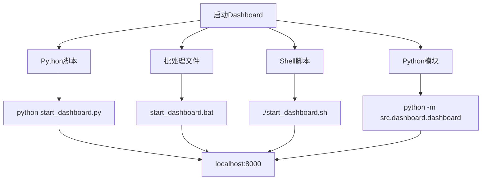
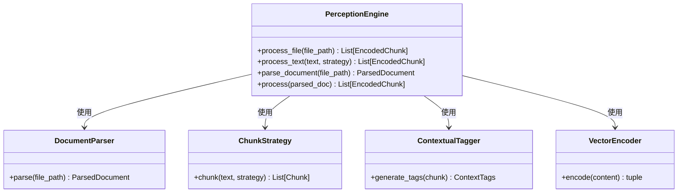
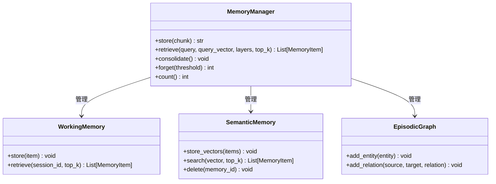
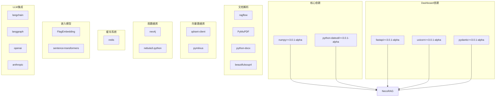

# 快速开始指南

<cite>
**本文档引用的文件**
- [README.md](file://README.md)
- [QUICKSTART.md](file://QUICKSTART.md)
- [requirements.txt](file://requirements.txt)
- [pyproject.toml](file://pyproject.toml)
- [example_usage.py](file://example/example_usage.py)
- [domain_weight_example.py](file://example/domain_weight_example.py)
- [start_dashboard.py](file://tools/start_dashboard.py)
- [start_dashboard.sh](file://tools/start_dashboard.sh)
- [start_dashboard.bat](file://tools/start_dashboard.bat)
- [test_imports.py](file://tools/test_imports.py)
- [src/necorag.py](file://src/necorag.py)
- [src/core/config.py](file://src/core/config.py)
- [src/perception/engine.py](file://src/perception/engine.py)
- [src/memory/manager.py](file://src/memory/manager.py)
- [src/dashboard/dashboard.py](file://src/dashboard/dashboard.py)
</cite>

## 目录
1. [简介](#简介)
2. [项目结构](#项目结构)
3. [核心组件](#核心组件)
4. [架构概览](#架构概览)
5. [详细组件分析](#详细组件分析)
6. [依赖分析](#依赖分析)
7. [性能考虑](#性能考虑)
8. [故障排除指南](#故障排除指南)
9. [结论](#结论)
10. [附录](#附录)

## 简介

NecoRAG是一个创新的认知型RAG框架，模拟人脑的双系统记忆理论和神经认知科学原理。通过五层架构设计，实现了从感知到交互的完整认知闭环。

### 核心特性
- 🧠 **类脑记忆结构**：三层记忆系统（工作记忆 L1 + 语义记忆 L2 + 情景图谱 L3）
- ⚡ **智能早停机制**：Early Termination 策略精准捕捉关键信息
- 🔄 **自我反思能力**：Refinement Agent 幻觉自检与知识进化
- 🎨 **可解释性输出**：思维链可视化，展示推理过程
- ⚙️ **配置管理系统**：Web Dashboard 实时配置和监控

## 项目结构

NecoRAG采用模块化的五层架构设计：



**图表来源**
- [src/necorag.py:37-122](file://src/necorag.py#L37-L122)
- [src/core/config.py:266-282](file://src/core/config.py#L266-L282)

**章节来源**
- [README.md:35-85](file://README.md#L35-L85)
- [QUICKSTART.md:69-84](file://QUICKSTART.md#L69-L84)

## 核心组件

### 1. Perception Engine - 感知引擎
多模态数据的高精度编码与情境标记，支持弹性切割、语义切割等多种模式。

**核心能力**：
- 深度文档解析（集成 RAGFlow）
- 多维度向量化（BGE-M3：稠密向量 + 稀疏向量 + 实体三元组）
- 情境标签生成（时间、情感、重要性、主题）

### 2. Hierarchical Memory - 层级记忆存储
分层存储，模拟短期工作记忆与长期结构化记忆。

**三层架构**：
- **L1 工作记忆** (Redis)：当前会话上下文、用户意图轨迹，TTL自动过期
- **L2 语义记忆** (Qdrant/Milvus)：高维向量存储，模糊匹配与直觉检索
- **L3 情景图谱** (Neo4j/NebulaGraph)：实体关系网络，多跳推理

### 3. Adaptive Retrieval - 自适应检索
基于扩散激活理论的混合检索与重排序。

**核心特性**：
- 多跳联想检索（实体 A → B → C）
- HyDE 增强（解决提问模糊问题）
- Novelty Re-ranker（抑制重复，优先新颖知识）
- 早停机制（一旦置信度超过阈值，立即终止检索）

### 4. Refinement Agent - 精炼代理
异步知识固化、幻觉自检与记忆修剪。

**核心闭环**：
```
Generator → Critic → Refiner
    ↓
HallucinationDetector
    ↓
KnowledgeConsolidator + MemoryPruner
```

### 5. Response Interface - 响应接口
情境自适应生成与可解释性输出。

**核心特性**：
- 用户画像适配（专业程度、交互风格、偏好领域）
- Tone 适配（专业严谨/亲切友好/幽默轻松）
- Detail Level 调整（4 级详细程度）
- 思维链可视化（检索路径 + 证据来源 + 推理过程）

**章节来源**
- [README.md:160-377](file://README.md#L160-L377)

## 架构概览

NecoRAG采用"五层认知"分层架构，每一层对应人脑认知机制的不同阶段：



**图表来源**
- [README.md:37-85](file://README.md#L37-L85)
- [src/necorag.py:37-122](file://src/necorag.py#L37-L122)

## 详细组件分析

### 安装与环境配置

#### 基础安装步骤



**图表来源**
- [README.md:89-101](file://README.md#L89-L101)
- [QUICKSTART.md:5-13](file://QUICKSTART.md#L5-L13)

#### 依赖安装

**基础依赖**：
- numpy>=3.0.1-alpha
- python-dateutil>=3.0.1-alpha

**Dashboard 依赖**：
- fastapi>=3.0.1-alpha
- uvicorn[standard]>=3.0.1-alpha
- pydantic>=3.0.1-alpha

**完整依赖安装**：
```bash
pip install -r requirements.txt
```

**章节来源**
- [README.md:511-522](file://README.md#L511-L522)
- [requirements.txt:1-71](file://requirements.txt#L1-L71)

### 基础使用示例

#### 完整工作流程演示



**图表来源**
- [example/example_usage.py:218-252](file://example/example_usage.py#L218-L252)
- [src/necorag.py:177-275](file://src/necorag.py#L177-L275)

#### 初始化各个组件

**组件初始化示例**：
```python
from src import PerceptionEngine, MemoryManager, AdaptiveRetriever, RefinementAgent, ResponseInterface

# 1. 初始化组件
engine = PerceptionEngine(chunk_size=512)
memory = MemoryManager()
retriever = AdaptiveRetriever(memory=memory)
refinement = RefinementAgent(memory=memory)
interface = ResponseInterface(memory=memory)
```

**章节来源**
- [README.md:103-137](file://README.md#L103-L137)
- [example/example_usage.py:12-48](file://example/example_usage.py#L12-L48)

### Dashboard 启动方法

#### 多种启动方式



**图表来源**
- [README.md:138-152](file://README.md#L138-L152)
- [QUICKSTART.md:50-61](file://QUICKSTART.md#L50-L61)

#### Dashboard 启动脚本

**Python脚本启动**：
```bash
python start_dashboard.py
```

**Windows批处理启动**：
```bash
start_dashboard.bat
```

**Linux/Mac Shell脚本启动**：
```bash
./start_dashboard.sh
```

**Python模块启动**：
```bash
python -m src.dashboard.dashboard
```

**章节来源**
- [tools/start_dashboard.py:16-56](file://tools/start_dashboard.py#L16-L56)
- [tools/start_dashboard.sh:1-26](file://tools/start_dashboard.sh#L1-L26)
- [tools/start_dashboard.bat:1-30](file://tools/start_dashboard.bat#L1-L30)
- [src/dashboard/dashboard.py:10-31](file://src/dashboard/dashboard.py#L10-L31)

### 完整代码示例

#### 感知引擎示例



**图表来源**
- [src/perception/engine.py:15-174](file://src/perception/engine.py#L15-L174)

#### 记忆管理器示例



**图表来源**
- [src/memory/manager.py:16-195](file://src/memory/manager.py#L16-L195)

**章节来源**
- [example/example_usage.py:12-252](file://example/example_usage.py#L12-L252)

## 依赖分析

### 核心依赖关系



**图表来源**
- [requirements.txt:1-71](file://requirements.txt#L1-L71)
- [pyproject.toml:27-63](file://pyproject.toml#L27-L63)

### 可选依赖配置

**意图分类依赖**：
- jieba>=3.0.1-alpha（中文分词）
- transformers>=3.0.1-alpha（深度学习模型）
- torch>=3.0.1-alpha（PyTorch）

**任务调度依赖**：
- apscheduler>=3.0.1-alpha（定时任务）
- celery>=3.0.1-alpha（分布式任务队列）
- redis>=3.0.1-alpha（Celery broker）

**章节来源**
- [requirements.txt:43-56](file://requirements.txt#L43-L56)
- [pyproject.toml:41-63](file://pyproject.toml#L41-L63)

## 性能考虑

### 性能指标目标

| 指标 | 目标值 | 说明 |
|------|--------|------|
| 检索准确率 (Recall@K) | +20% | 相比传统 Vector RAG |
| 幻觉率 | < 5% | 通过 Refinement Agent |
| 简单查询延迟 | < 800ms | 首字延迟 |
| 复杂查询延迟 | < 1500ms | 多跳+重排 |
| 上下文压缩率 | -40% | 通过记忆衰减 |

### 优化建议

1. **内存优化**：合理配置工作记忆TTL和衰减参数
2. **向量检索优化**：选择合适的向量数据库和索引策略
3. **并发处理**：利用异步机制提升批量处理性能
4. **缓存策略**：合理使用Redis缓存热点数据

## 故障排除指南

### 常见问题排查

#### 1. 依赖安装问题

**问题**：pip安装失败
**解决方案**：
```bash
# 清理pip缓存
pip cache purge

# 使用国内镜像源
pip install -r requirements.txt -i https://pypi.tuna.tsinghua.edu.cn/simple/

# 升级pip版本
python -m pip install --upgrade pip
```

#### 2. Dashboard启动失败

**问题**：端口被占用
**解决方案**：
```bash
# Windows
netstat -ano | findstr :8000

# Linux/Mac
lsof -i :8000

# 更换端口
python start_dashboard.py --port 8080
```

#### 3. 模块导入失败

**问题**：无法导入NecoRAG模块
**解决方案**：
```bash
# 运行导入测试
python tools/test_imports.py

# 检查Python路径
python -c "import sys; print(sys.path)"

# 确认安装模式
pip list | grep necorag
```

#### 4. 配置文件问题

**问题**：配置文件加载失败
**解决方案**：
```python
from src.core.config import NecoRAGConfig

# 检查配置文件
config = NecoRAGConfig.load('./configs/necorag.json')

# 验证配置
print(config.to_dict())
```

**章节来源**
- [QUICKSTART.md:237-277](file://QUICKSTART.md#L237-L277)
- [tools/test_imports.py:7-64](file://tools/test_imports.py#L7-L64)

## 结论

NecoRAG提供了一个完整的认知型RAG框架，通过五层架构实现了从感知到交互的完整认知闭环。其核心优势在于：

1. **类脑记忆结构**：模拟人脑的三层记忆系统
2. **智能检索机制**：结合HyDE增强和早停机制
3. **知识巩固能力**：通过精炼代理实现幻觉检测和知识进化
4. **可解释性输出**：思维链可视化展示推理过程
5. **灵活配置管理**：Dashboard提供实时配置和监控

建议用户根据具体需求选择合适的依赖组合，并参考示例代码进行快速集成。

## 附录

### 配置管理

#### 环境变量配置

```bash
# LLM配置
export MOCK_API_KEY="your-api-key"
export MOCK_MODEL_NAME="mock-model"

# 数据库配置
export NECORAG_VECTOR_DB="qdrant"
export NECORAG_VECTOR_DB_URL="http://localhost:6333"
export NECORAG_GRAPH_DB="neo4j"
export NECORAG_GRAPH_DB_URL="bolt://localhost:7687"
```

#### 配置文件示例

```json
{
    "llm": {
        "provider": "mock",
        "model_name": "mock-model",
        "temperature": 0.7,
        "max_tokens": 2048
    },
    "memory": {
        "working_memory_ttl": 3600,
        "vector_db_provider": "memory",
        "graph_db_provider": "memory"
    },
    "retrieval": {
        "default_top_k": 10,
        "enable_early_termination": true,
        "confidence_threshold": 0.85
    }
}
```

### API接口参考

#### Dashboard API

```bash
# 获取所有Profiles
GET /api/profiles

# 创建Profile
POST /api/profiles

# 更新模块参数
PUT /api/profiles/{id}/modules/retrieval

# 获取统计信息
GET /api/stats
```

**章节来源**
- [README.md:417-432](file://README.md#L417-L432)
- [src/core/config.py:321-371](file://src/core/config.py#L321-L371)